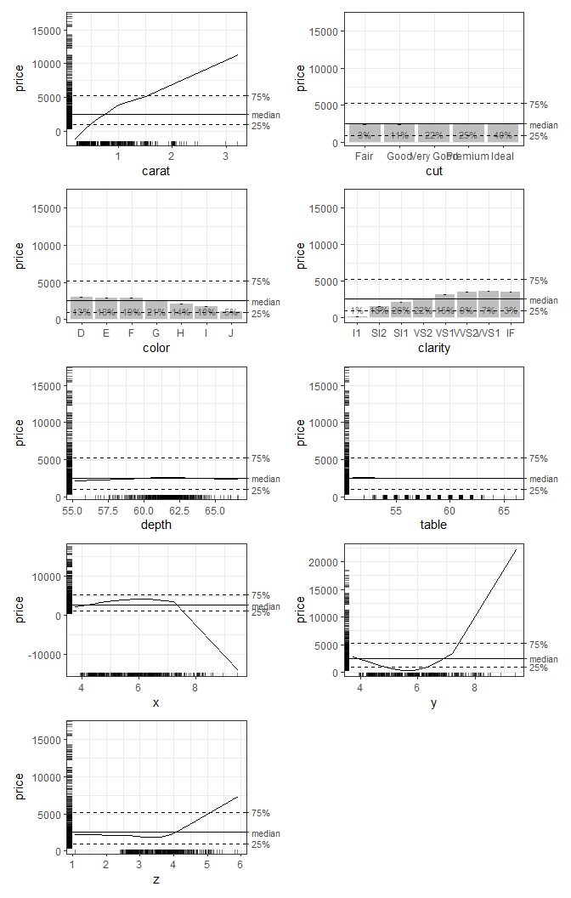
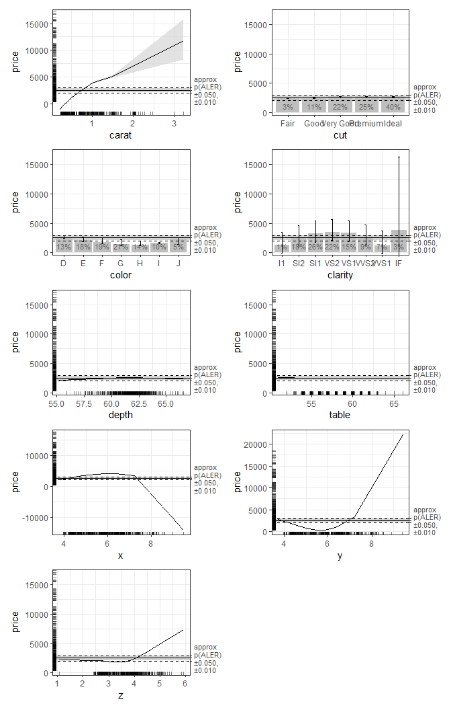
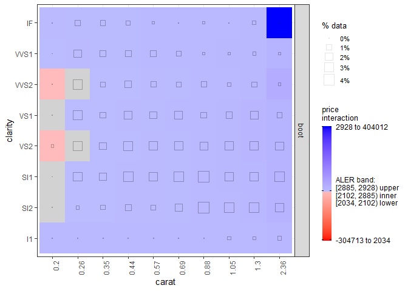

# ale: An R package for interpretable machine learning and statistical
inference with accumulated local effects (ALE)
Chitu Okoli
2025-04-28

# Summary

Machine learning (ML) models, particularly those referred to as
“black-box” models, achieve high predictive accuracy at the cost of
interpretability. Interpretable Machine Learning (IML) aims to provide
tools to understand these complex models. The Accumulated Local Effects
(ALE) methodology, introduced by Apley and Zhu (2020), has emerged as a
powerful, model-agnostic IML technique to visualize and interpret
black-box model predictions. Unlike alternative methods such as Partial
Dependence Plots (PDP) or SHapley Additive exPlanations (SHAP), ALE
plots clearly represent variable effects independent of interaction
complexities and computationally scale better with large datasets.

The **ale** package for R provides advanced implementations of ALE,
addressing existing limitations and introducing critical statistical
inference tools to enhance interpretability. It offers robust
bootstrapped confidence intervals for ALE plots, effect size measures on
both outcome-variable and normalized scales, and intuitive visualization
methods, empowering users to draw statistically sound inferences from
their models. First published in 2023, its current version is 0.5.0.

## Statement of Need

While ALE methods hold considerable promise, their effective application
faces three main challenges:

1.  **Reliability in small datasets:** Typical machine learning
    techniques, including ALE, assume large datasets capable of
    supporting training-test splits for validation. However, statistical
    analyses frequently involve smaller datasets (fewer than 2,000
    observations), posing risks of overfitting and limiting the
    generalizability of results. The **ale** package implements
    specialized bootstrapped confidence intervals adapted for small
    datasets, ensuring that ALE results remain reliable across diverse
    research contexts.

2.  **Intuitive characterization of variable effects:** Existing IML
    methods often lack intuitive, interpretable effect-size metrics that
    summarize the overall impact of predictor variables clearly and
    meaningfully. The **ale** package introduces novel ALE effect size
    measures (ALE Deviation (ALED), ALE Range (ALER), Normalized ALE
    Deviation (NALED), and Normalized ALE Range (NALER)), explicitly
    designed for ease of interpretation and comparability across
    different datasets and models.

3.  **Robust statistical inference with ML:** Traditional statistical
    inference typically relies on parametric assumptions and linear
    models. However, ML models frequently violate these assumptions due
    to their inherent flexibility. By integrating rigorous bootstrapping
    methods and effect-size-based inference mechanisms, **ale** bridges
    ML flexibility with the rigor of classical statistical methods. The
    package clearly delineates statistically significant effects,
    distinguishing meaningful relationships from random variations via
    carefully constructed confidence intervals and p-value
    distributions.

# Software implementations of ALE

In the following table, we list some key characteristics of alternative
software implementations of ALE, contrasting them with some of the key
unique features of the **ale** package.

**Software packages that implement ALE**

<table style="width:97%;">

<colgroup>

<col style="width: 8%" />

<col style="width: 27%" />

<col style="width: 8%" />

<col style="width: 7%" />

<col style="width: 11%" />

<col style="width: 11%" />

<col style="width: 22%" />

</colgroup>

<thead>

<tr>

<th>

Primary focus
</th>

<th>

Package
</th>

<th style="text-align: right;">

Latest release
</th>

<th>

Language
</th>

<th>

Confidence intervals
</th>

<th>

Bootstrap type
</th>

<th>

ALE statistics
</th>

</tr>

</thead>

<tbody>

<tr>

<td>

ALE
</td>

<td>

<strong>ALEPlot</strong> <span class="citation"
data-cites="apley2018">(Apley 2018)</span>
</td>

<td style="text-align: right;">

2018
</td>

<td>

R
</td>

<td>

No
</td>

<td>

N/A
</td>

<td>

None
</td>

</tr>

<tr>

<td>

ALE
</td>

<td>

<strong>ALEPython</strong> <span class="citation"
data-cites="jumelle2020">(Jumelle, Kuhn-Regnier, and Rajaratnam
2020)</span>
</td>

<td style="text-align: right;">

2020
</td>

<td>

Python
</td>

<td>

Monte Carlo
</td>

<td>

data-only
</td>

<td>

None
</td>

</tr>

<tr>

<td>

IML
</td>

<td>

<strong>iml</strong> <span class="citation"
data-cites="molnar2022a">(Molnar and Schratz 2022)</span>
</td>

<td style="text-align: right;">

2025
</td>

<td>

R
</td>

<td>

No
</td>

<td>

N/A
</td>

<td>

None
</td>

</tr>

<tr>

<td>

IML
</td>

<td>

<strong>DALEX</strong> <span class="citation"
data-cites="biecek2023">(Biecek, Maksymiuk, and Baniecki 2023)</span>
</td>

<td style="text-align: right;">

2023
</td>

<td>

R and Python
</td>

<td>

No
</td>

<td>

N/A
</td>

<td>

None
</td>

</tr>

<tr>

<td>

ALE
</td>

<td>

<strong>PyALE</strong> <span class="citation"
data-cites="jomar2023">(Jomar 2023)</span>
</td>

<td style="text-align: right;">

2024
</td>

<td>

Python
</td>

<td>

T-statistic
</td>

<td>

N/A
</td>

<td>

None
</td>

</tr>

<tr>

<td>

IML
</td>

<td>

<strong>Interpretation</strong> <span class="citation"
data-cites="rapidminer2023">(RapidMiner 2023)</span>
</td>

<td style="text-align: right;">

2024
</td>

<td>

RapidMiner
</td>

<td>

No
</td>

<td>

N/A
</td>

<td>

None
</td>

</tr>

<tr>

<td>

IML
</td>

<td>

<strong>Alibi</strong> <span class="citation"
data-cites="seldontechnologies2023">(Seldon Technologies 2023)</span>
</td>

<td style="text-align: right;">

2024
</td>

<td>

Python
</td>

<td>

No
</td>

<td>

N/A
</td>

<td>

None
</td>

</tr>

<tr>

<td>

IML
</td>

<td>

<strong>scikit-explain</strong> <span class="citation"
data-cites="flora2023">(Flora 2023)</span>
</td>

<td style="text-align: right;">

2023
</td>

<td>

Python
</td>

<td>

Bootstrap
</td>

<td>

data-only
</td>

<td>

<ul>

<li>

<p>

Friedman H-statistic for interactions
</p>

</li>

<li>

<p>

Interaction strength (IAS)
</p>

</li>

<li>

<p>

Main effect complexity (MEC)
</p>

</li>

</ul>

</td>

</tr>

<tr>

<td>

ALE
</td>

<td>

<strong>ale (introduced in this article)</strong>
</td>

<td style="text-align: right;">

2025
</td>

<td>

R
</td>

<td>

Bootstrap
</td>

<td>

data-only and model
</td>

<td>

<ul>

<li>

<p>

ALE deviation (ALED)
</p>

</li>

<li>

<p>

ALE range (ALER)
</p>

</li>

<li>

<p>

Normalized ALED (NALED)
</p>

</li>

<li>

<p>

Normalized ALER (NALER)
</p>

</li>

</ul>

</td>

</tr>

</tbody>

</table>

# Simple demonstration

To demonstrate some capabilities of the package, we will give two
demonstrations: first, a simple demonstration of ALE plots, and second,
a more sophisticated demonstration suitable for statistical inference
with p-values. For both demonstrations, we begin by fitting a GAM model.
We assume that this is a final deployment model that needs to be fitted
to the entire dataset.

``` r
library(ale)
```

    Attaching package: 'ale'

    The following object is masked from 'package:base':

        get

``` r
# Sample 1000 rows from the ggplot2::diamonds dataset (for a simple example).
set.seed(0)
diamonds_sample <- ggplot2::diamonds[sample(nrow(ggplot2::diamonds), 1000), ]

# Create a GAM model with flexible curves to predict diamond price.
# Smooth all numeric variables and include all other variables.
# Build model on training data, not on the full dataset.
gam_diamonds <- mgcv::gam(
  price ~ s(carat) + s(depth) + s(table) + s(x) + s(y) + s(z) +
    cut + color + clarity +
    ti(carat, by = clarity),  # a 2D interaction
  data = diamonds_sample
)
```

First, we directly create ALE data with the `ALE()` constructor and then
plot the `ggplot` plot objects.

``` r
# Create ALE data
ale_gam_diamonds <- ALE(gam_diamonds, data = diamonds_sample)

# Plot the ALE data
plot(ale_gam_diamonds) |> 
  print(ncol = 2)
```



To demonstrate the ALE statistics functionality, we need to create a
p-value distribution object so that the ALE statistics can be properly
distinguished from random effects.

``` r
# Create p_value distribution object

# # To generate the code, uncomment the following lines.
# # But it is slow because it retrains the model 100 times, so this vignette loads a pre-created p_value distribution object.
# gam_diamonds_p_readme <- ALEpDist(
#   gam_diamonds, diamonds_sample,
#   # Normally should be default 1000, but just 100 for quicker demo
#   rand_it = 100
# )
# saveRDS(gam_diamonds_p_readme, file.choose())
gam_diamonds_p_readme <- 
  url('https://github.com/tripartio/ale/raw/main/download/gam_diamonds_p_readme.0.5.0.rds') |> 
  readRDS()
```

Now we can create bootstrapped ALE data and see some of the differences
in the plots of bootstrapped ALE with p-values:

``` r
# Create ALE data
ale_gam_diamonds_stats_readme <- ALE(
  gam_diamonds,
  # generate all for all 1D variables and the carat:clarity 2D interaction
  x_cols = list(d1 = TRUE, d2 = 'carat:clarity'),
  data = diamonds_sample,
  p_values = gam_diamonds_p_readme,
  # Usually at least 100 bootstrap iterations, but just 10 here for a faster demo
  boot_it = 10
)

# Create an ALEPlots object for fine-tuned plotting
ale_plots <- plot(ale_gam_diamonds_stats_readme)

# Plot 1D ALE plots 
ale_plots |> 
  # Only select 1D ALE plots.
  # Use subset() instead of get() to keep the special ALEPlots object 
  # plot and print functionality.
  subset(list(d1 = TRUE)) |> 
  print(ncol = 2)
```



``` r
# Plot a selected 2D plot
ale_plots |> 
  # get() retrieves a specific desired plot
  get('carat:clarity') 
```



# Scientific basis

The scientific basis of the **ale** package is best described in a
working paper that describes ALE statistics in detail and introduces
ALE-based inference (Okoli 2023). This research has been presented at
Okoli (2024) and Okoli (2024-10-20/2024-10-23).

# References

<div id="refs" class="references csl-bib-body hanging-indent"
entry-spacing="0">

<div id="ref-apley2018" class="csl-entry">

Apley, Daniel W. 2018. “ALEPlot: Accumulated Local Effects (ALE) Plots
and Partial Dependence (PD) Plots.”
<https://doi.org/10.32614/cran.package.aleplot>.

</div>

<div id="ref-apley2020" class="csl-entry">

Apley, Daniel W., and Jingyu Zhu. 2020. “Visualizing the Effects of
Predictor Variables in Black Box Supervised Learning Models.” *Journal
of the Royal Statistical Society Series B: Statistical Methodology* 82
(4): 1059–86. <https://doi.org/10.1111/rssb.12377>.

</div>

<div id="ref-biecek2023" class="csl-entry">

Biecek, Przemyslaw, Szymon Maksymiuk, and Hubert Baniecki. 2023. “DALEX:
<span class="nocase">moDel Agnostic Language</span> for Exploration and
<span class="nocase">eXplanation</span>.”
<https://doi.org/10.32614/cran.package.dalex>.

</div>

<div id="ref-flora2023" class="csl-entry">

Flora, Montgomery. 2023. “Scikit-Explain: A User-Friendly Python Package
for Computing and Plotting Machine Learning Explainability Output.”

</div>

<div id="ref-jomar2023" class="csl-entry">

Jomar, Dana. 2023. “PyALE: ALE Plots with Python.”

</div>

<div id="ref-jumelle2020" class="csl-entry">

Jumelle, Maxime, Alexander Kuhn-Regnier, and Sanjif Rajaratnam. 2020.
“ALEPython.” Blent.ai.

</div>

<div id="ref-molnar2022a" class="csl-entry">

Molnar, Christoph, and Patrick Schratz. 2022. “Iml: Interpretable
Machine Learning.”

</div>

<div id="ref-okoli2024a" class="csl-entry">

Okoli, Chitu. 2024-10-20/2024-10-23. “Reliable Inference from
Human-Centred Datasets with Accumulated Local Effects.” In *2024 INFORMS
Annual Meeting*. Seattle, USA: INFORMS.

</div>

<div id="ref-okoli2023b" class="csl-entry">

———. 2023. “Statistical Inference Using Machine Learning and Classical
Techniques Based on Accumulated Local Effects (ALE).” arXiv.
<https://doi.org/10.48550/arXiv.2310.09877>.

</div>

<div id="ref-okoli2024" class="csl-entry">

———. 2024. “Model-Agnostic Interpretability: Effect Size Measures from
Accumulated Local Effects (ALE).” In *INFORMS Workshop on Data Science
2024*. Seattle, USA: INFORMS.

</div>

<div id="ref-rapidminer2023" class="csl-entry">

RapidMiner. 2023. “Interpretation.” RapidMiner.

</div>

<div id="ref-seldontechnologies2023" class="csl-entry">

Seldon Technologies. 2023. “Alibi: Algorithms for Monitoring and
Explaining Machine Learning Models.”

</div>

</div>
