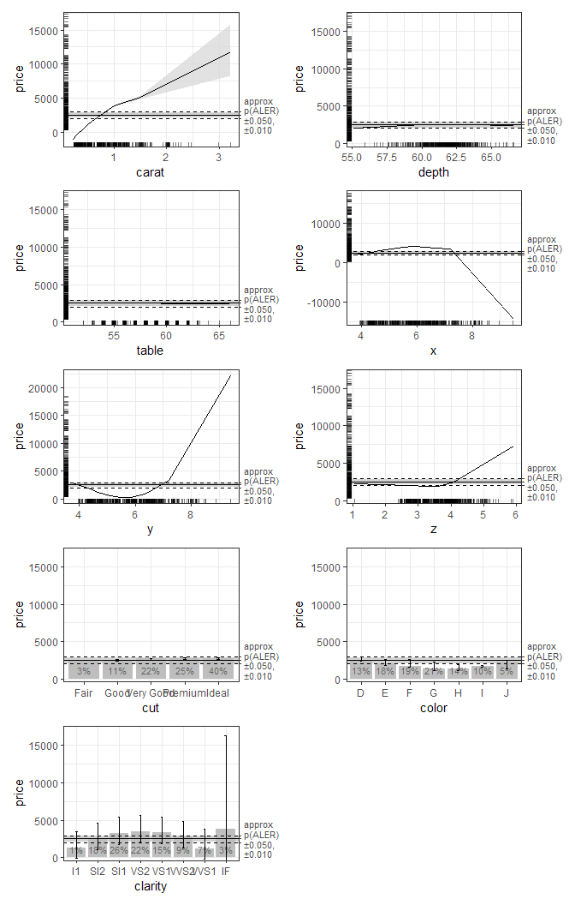

<!-- README.md is generated from README.Rmd. Please edit that file -->

# ale <a href="https://tripartio.github.io/ale/"></a>

<!-- badges: start -->

[](https://CRAN.R-project.org/package=ale)
[](https://lifecycle.r-lib.org/articles/stages.html#experimental)
[](https://github.com/tripartio/ale/actions/workflows/R-CMD-check.yaml)
<!-- badges: end -->

Accumulated Local Effects (ALE) were initially developed as a
[model-agnostic approach for global explanations of the results of
black-box machine learning
algorithms](https://www.doi.org/10.1111/rssb.12377 "Apley, Daniel W., and Jingyu Zhu. 'Visualizing the effects of predictor variables in black box supervised learning models.' Journal of the Royal Statistical Society Series B: Statistical Methodology 82.4 (2020): 1059-1086").
ALE has two primary advantages over other approaches like partial
dependency plots (PDP) and SHapley Additive exPlanations (SHAP): its
values are not affected by the presence of interactions among variables
in a model and its computation is relatively rapid. This package
rewrites the original code from the [`{ALEPlot}`
package](https://CRAN.r-project.org/package=ALEPlot) for calculating ALE
data and it completely reimplements the plotting of ALE values. It also
extends the original ALE concept to add bootstrap-based confidence
intervals and ALE-based statistics that can be used for statistical
inference.

For more details, see Okoli, Chitu. 2023. “Statistical Inference Using
Machine Learning and Classical Techniques Based on Accumulated Local
Effects (ALE).” arXiv. <https://doi.org/10.48550/arXiv.2310.09877>.

The `{ale}` package currently presents three main functions:

- `ale()`: create data and plots for one-way ALE (single variables). ALE
  values may be bootstrapped.
- `ale_ixn()`: create data and plots for two-way ALE interactions.
  Bootstrapping of the interaction ALE values has not yet been
  implemented.
- `model_bootstrap()`: bootstrap an entire model, not just the ALE
  values. This function returns the bootstrapped model statistics and
  coefficients as well as the bootstrapped ALE values. This is the
  appropriate approach for small samples.

## Documentation

You can obtain direct help for any of the package’s user-facing
functions with the R `help()` function, e.g., `help(ale)`. However, the
most detailed documentation is found in the **[website for the most
recent development version](https://tripartio.github.io/ale/)**. There
you can find several articles. We particularly recommend:

- [Introduction to the `ale`
  package](https://tripartio.github.io/ale/articles/ale-intro.html)
- [ALE-based statistics for statistical inference and effect
  sizes](https://tripartio.github.io/ale/articles/ale-statistics.html)

## Installation

You can obtain the official releases from
[CRAN](https://CRAN.R-project.org/package=ale):

``` r
install.packages('ale')
```

The CRAN releases are extensively tested and should have relatively few
bugs. However, note that this package is still in beta stage. For the
`{ale}` package, that means that there will occasionally be new features
with changes in the function interface that might break the
functionality of earlier versions. Please excuse us for this as we move
towards a stable version that flexibly meets the needs of the broadest
user base.

To get the most recent features, you can install the development version
of ale from [GitHub](https://github.com/tripartio/ale) with:

``` r
# install.packages('pak')
pak::pak('tripartio/ale')
```

The development version in the main branch of GitHub is always
thoroughly checked. However, the documentation might not be fully
up-to-date with the functionality.

There is one more optional but recommended setup option. To enable
**progress bars** to see how long procedures will take, you should run
the following code at the beginning of your R session:

``` r
# Run this in an R console; it will not work directly within an R Markdown or Quarto block
progressr::handlers(global = TRUE)
progressr::handlers('cli')
```

The `{ale}` package will normally run this automatically for you the
first time you execute a function from the package in an R session. To
see how to configure this permanently, see `help(ale)`.

## Usage

We will give two demonstrations of how to use the package: first, a
simple demonstration of ALE plots, and second, a more sophisticated
demonstration suitable for statistical inference with p-values. For both
demonstrations, we begin by fitting a GAM model. We assume that this is
a final deployment model that needs to be fitted to the entire dataset.

``` r
library(ale)

# Sample 1000 rows from the ggplot2::diamonds dataset (for a simple example).
set.seed(0)
diamonds_sample <- ggplot2::diamonds[sample(nrow(ggplot2::diamonds), 1000), ]

# Create a GAM model with flexible curves to predict diamond price
# Smooth all numeric variables and include all other variables
# Build model on training data, not on the full dataset.
gam_diamonds <- mgcv::gam(
  price ~ s(carat) + s(depth) + s(table) + s(x) + s(y) + s(z) +
    cut + color + clarity,
  data = diamonds_sample
)
```

### Simple demonstration

For the simple demonstration, we directly create ALE data with the
`ale()` function and then plot the `ggplot` plot objects.

``` r
# Create ALE data
ale_gam_diamonds <- ale(diamonds_sample, gam_diamonds)

# Plot the ALE data
patchwork::wrap_plots(ale_gam_diamonds$plots, ncol = 2)
```


For an explanation of these basic features, see the [introductory
vignette](https://tripartio.github.io/ale/articles/ale-intro.html).

### Statistical inference with ALE

The statistical functionality of the `{ale}` package is rather slow
because it typically involves 100 bootstrap iterations and sometimes a
1,000 random simulations. Even though most functions in the package
implement parallel processing by default, such procedures still take
some time. So, this statistical demonstration gives you downloadable
objects for a rapid demonstration.

First, we need to create a p-value functions object so that the ALE
statistics can be properly distinguished from random effects.

``` r
# Create p-funs object
# # To generate the code, uncomment the following lines.
# # But it is slow because it retrains the model 100 times,
# # so this vignette loads a pre-created p-values object.
# gam_diamonds_p_funs_readme <- create_p_funs(
#   diamonds_sample, gam_diamonds,
#   # Normally should be default 1000, but just 100 for quicker demo
#   rand_it = 100
#   )
# saveRDS(gam_diamonds_p_funs_readme, file.choose())
gam_diamonds_p_funs_readme <- url('https://github.com/tripartio/ale/raw/main/download/gam_diamonds_p_funs_readme.rds') |> 
  readRDS()
```

Now we can create bootstrapped ALE data and see some of the differences
in the plots of bootstrapped ALE with p-values:

``` r
# Create ALE data
# # To generate the code, uncomment the following lines.
# # But it is slow because it bootstraps the ALE data 100 times,
# # so this vignette loads a pre-created ALE object.
# ale_gam_diamonds_stats_readme <- ale(
#   diamonds_sample, gam_diamonds,
#   p_values = gam_diamonds_p_funs_readme,
#   boot_it = 100
# )
# saveRDS(ale_gam_diamonds_stats_readme, file.choose())
ale_gam_diamonds_stats_readme <- url('https://github.com/tripartio/ale/raw/main/download/ale_gam_diamonds_stats_readme.rds') |> 
  readRDS()

# Plot the ALE data
patchwork::wrap_plots(ale_gam_diamonds_stats_readme$plots, ncol = 2)
```



For a detailed explanation of how to interpret these plots, see the
vignette on [ALE-based statistics for statistical inference and effect
sizes](https://tripartio.github.io/ale/articles/ale-statistics.html).

## Getting help

If you find a bug, please report it on
[GitHub](https://github.com/tripartio/ale/issues). If you have a
question about how to use the package, you can post it on [Stack
Overflow with the “ale”
tag](https://stackoverflow.com/questions/tagged/ale). I will follow that
tag, so I will try my best to respond quickly. However, be sure to
always include a minimal reproducible example for your usage requests.
If you cannot include your own dataset in the question, then use one of
the built-in datasets to frame your help request: `var_cars` or
`census`. You may also use `ggplot2::diamonds` for a larger sample.
