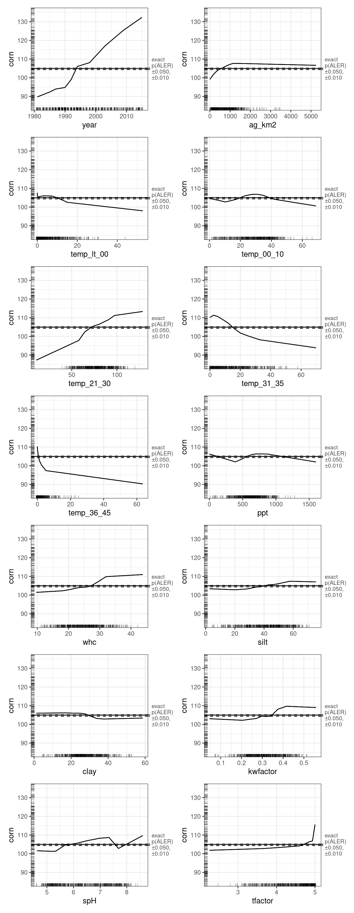
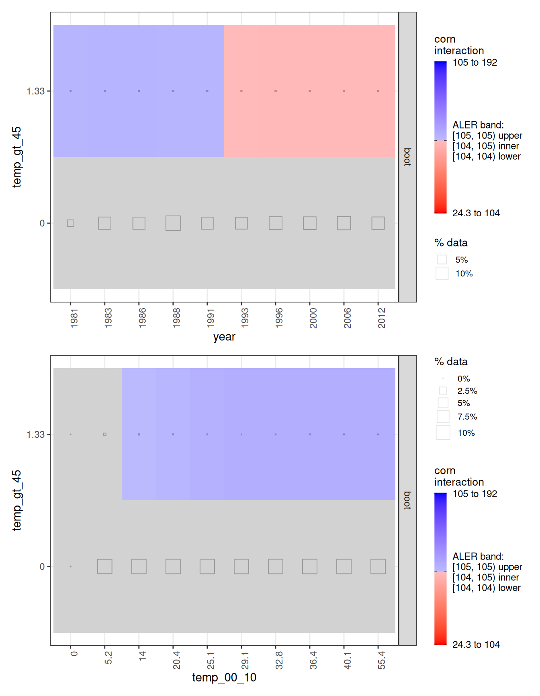
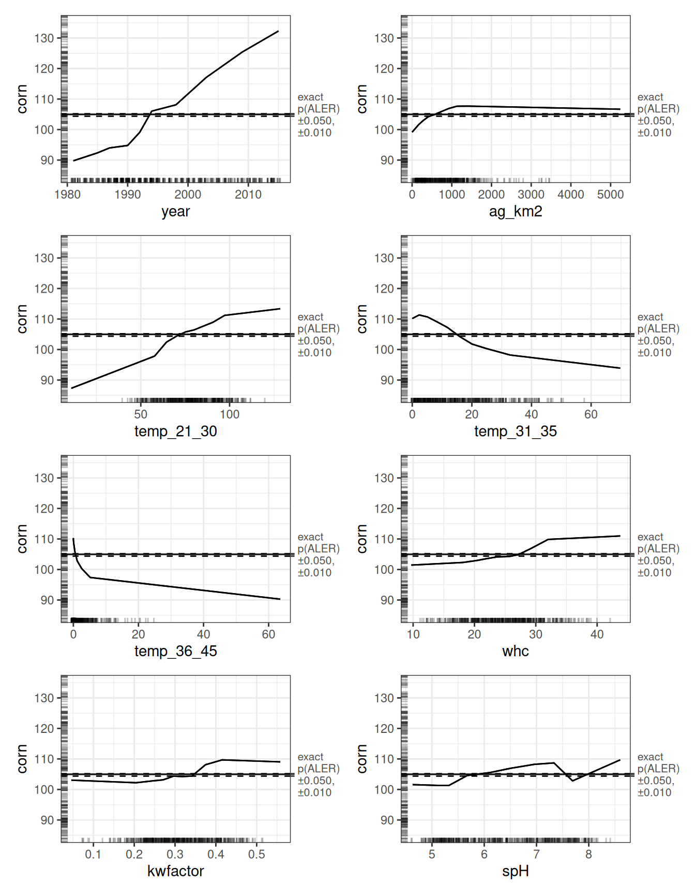

# Analyzing a Large Corn Yield Dataset with ALE-Based Inference

## 1 Introduction

In this article, we analyze the **Agro-Climatic Data by County (ACDC)**
dataset (Yun & Gramig 2017, licensed CC-BY), a county-level panel for
the 48 contiguous U.S. states spanning 1981–2015, designed for
agricultural production and climate research. It combines crop yields
with key agro-climatic drivers, notably growing season degree days,
total precipitation, and major soil characteristics, all preprocessed to
focus on agricultural production areas.

Our focus here is predicting county-level corn yield per year (measured
in bushels per acre) and then interpreting the factors that contribute
to this prediction. The dataset’s structure matches the standard
agro-climatic production framing, where output depends on temperature,
precipitation, soils, and other controls.

## 2 Setup R environment

We begin by loading the packages used throughout the analysis. If any
are not installed locally, the next step is to install them before
running the rest of the document.

Note that the **{ale}** package is on CRAN, but for a few features used
here we install the current development version from GitHub (the code
shows how, via {pak}).

``` r
library(dplyr)  # data manipulation
library(purrr)  # functional programming
library(ranger)  # random forests
library(tictoc)  # performance timing
library(staccuracy)  # performance metrics
library(rsample)  # cross-validation

# Other packages accessed with :: direct access but not loaded (install them if needed):
# * stringr: string processing
# * readr: input CSV files
# * tidyr: data manipulation
# * cli: command line interface printing

# Accumulated Local Effects: ale package
# Install the development version of ale for this workshop, which is more recent than the current CRAN version.
# If needed, first install the pak package manager to easily install a GitHub package:
# install.packages('pak')
# pak::pak('tripartio/ale')
library(ale)  # load the ale package only after installing the development version
```

``` r
# For speed, these examples use retrieve_rds() to load precreated objects 
# from an online repository.
# To run the code yourself, execute the code blocks directly.  
serialized_objects_site <- "https://github.com/tripartio/ale/raw/main/download/corn_objects"
```

## 3 Dataset: ACDC corn yields

### 3.1 Corn data preparation

We work with the Agro-Climatic Data by County (ACDC), 1981–2015 (Yun &
Gramig 2017). Rather than reproducing the full compilation code here, we
summarize the key transformations used to assemble the analysis-ready
dataset.

The ACDC data arrive in several components and require harmonization.
First, agricultural land area is reported on grids measured in different
years. We normalize these measures to the county-year level and express
agricultural land area as square kilometres (`ag_km2`).

Temperature is the most involved transformation. ACDC stores
temperatures as counts of days falling within one-degree Celsius bins
(e.g., 2–3°C, 4–5°C, etc.). For modelling, we aggregate these bins into
temperature ranges that are meaningful for corn (maize) growth, creating
variables that count, for each county-year, how many days fall within
each selected range. The data description below defines these ranges and
notes why they are agronomically relevant.

When defining “in-season” windows, we restrict attention to months that
align with typical crop calendars. The table below records the windows
used in this analysis (initially chosen based on quick background
guidance).

| Crop    | Recommended Window                                      |
|---------|---------------------------------------------------------|
| Corn    | Mar–Aug                                                 |
| Soybean | Mar–Aug                                                 |
| Cotton  | Apr–Oct                                                 |
| Wheat   | Usually Apr–Oct (but depends if winter vs spring wheat) |

Soil composition variables come from county-level surveys conducted in
1992, 2001, 2006, and 2011. We carry those soil attributes forward to
the county-year panel and merge them with annual corn yield, measured as
bushels per acre (`corn`). Because this is a U.S. dataset, we report
values in bushels per acre and provide a metric conversion alongside
them.

After assembling the dataset, we inspect its structure (e.g., with
[`glimpse()`](https://pillar.r-lib.org/reference/glimpse.html)) to
verify variable types and to see sample rows. We also compute summary
statistics (min, max, mean, and interquartile values) for each variable.
All variables used here are numeric; the next section defines each
variable explicitly. The outcome of interest is `corn`, the corn yield
(bushels per acre) for a given county in a given year.

``` r
corn_data <- serialized_objects_site |> 
  file.path("corn_data.rds") |>
  url() |> 
  readRDS()
```

### 3.2 Data description

``` r
corn_data |> glimpse()
```

    Rows: 90,010
    Columns: 22
    $ stco       <fct> 1001, 1003, 1005, 1009, 1011, 1013, 1015, 1019, 1021, 1023,…
    $ year       <int> 1981, 1981, 1981, 1981, 1981, 1981, 1981, 1981, 1981, 1981,…
    $ corn       <dbl> 17.3, 101.4, 37.9, 53.8, 22.1, 50.5, 46.6, 65.5, 31.8, 45.9…
    $ ag_km2     <dbl> 317.4507, 1000.1241, 429.0003, 447.9057, 266.2884, 187.1748…
    $ temp_lt_00 <dbl> 1.252724e-03, 1.334438e-04, 2.644859e-02, 5.219093e-01, 2.0…
    $ temp_00_10 <dbl> 9.108736, 5.825083, 9.556071, 16.302810, 10.703252, 9.11353…
    $ temp_11_20 <dbl> 42.16270, 37.20385, 42.41642, 46.73110, 43.30999, 41.31729,…
    $ temp_21_30 <dbl> 94.14356, 104.18624, 93.96831, 92.51842, 91.61782, 94.43539…
    $ temp_31_35 <dbl> 34.43768, 35.64974, 34.00982, 26.71666, 34.06262, 34.72649,…
    $ temp_36_45 <dbl> 4.14606767, 1.13495440, 4.02292888, 1.20910496, 4.28570742,…
    $ temp_gt_45 <dbl> 0, 0, 0, 0, 0, 0, 0, 0, 0, 0, 0, 0, 0, 0, 0, 0, 0, 0, 0, 0,…
    $ ppt        <dbl> 620.8656, 679.8329, 567.0682, 652.4704, 551.0441, 540.4134,…
    $ whc        <dbl> 24.78343, 23.53884, 21.48367, 18.28257, 22.58728, 24.71647,…
    $ sand       <dbl> 59.68140, 59.09199, 61.74435, 37.50056, 39.39067, 50.83622,…
    $ silt       <dbl> 20.04843, 21.80517, 16.41010, 33.40470, 25.92334, 21.17595,…
    $ clay       <dbl> 20.27016, 19.10284, 21.84554, 29.09474, 34.68599, 27.98784,…
    $ om         <dbl> 111.80678, 185.66755, 88.42968, 79.91542, 120.90292, 71.662…
    $ kwfactor   <dbl> 0.2230648, 0.2503898, 0.2123219, 0.2454282, 0.2304381, 0.21…
    $ kffactor   <dbl> 0.2263995, 0.2561335, 0.2123997, 0.2962476, 0.2328219, 0.21…
    $ spH        <dbl> 5.139626, 4.940044, 5.127343, 4.914515, 5.529810, 5.031030,…
    $ slope      <dbl> 51.03629, 106.22105, 65.98003, 32.14657, 46.05617, 63.86830…
    $ tfactor    <dbl> 4.950716, 4.936530, 4.926214, 3.174986, 4.988563, 4.889981,…

``` r
corn_data |> summary()
```

          stco            year           corn           ag_km2
     1049   :   45   Min.   :1981   Min.   :  0.0   Min.   :   0.4806
     1077   :   45   1st Qu.:1988   1st Qu.: 80.0   1st Qu.: 316.7863
     1079   :   45   Median :1993   Median :105.0   Median : 663.9057
     1083   :   45   Mean   :1995   Mean   :106.0   Mean   : 767.3234
     1089   :   45   3rd Qu.:2002   3rd Qu.:131.9   3rd Qu.:1076.1543
     5021   :   45   Max.   :2015   Max.   :238.8   Max.   :5242.2723
     (Other):89740
       temp_lt_00       temp_00_10          temp_11_20        temp_21_30
     Min.   : 0.000   Min.   : 0.000576   Min.   :  8.025   Min.   : 10.85
     1st Qu.: 1.006   1st Qu.:19.224752   1st Qu.: 47.998   1st Qu.: 65.89
     Median : 4.248   Median :29.188436   Median : 55.020   Median : 77.60
     Mean   : 6.241   Mean   :27.847689   Mean   : 54.521   Mean   : 77.61
     3rd Qu.: 9.698   3rd Qu.:37.250469   3rd Qu.: 62.071   3rd Qu.: 89.24
     Max.   :52.734   Max.   :68.807006   Max.   :131.138   Max.   :128.56

       temp_31_35       temp_36_45        temp_gt_45             ppt
     Min.   : 0.000   Min.   : 0.0000   Min.   :0.0000000   Min.   :   0.9432
     1st Qu.: 5.813   1st Qu.: 0.0000   1st Qu.:0.0000000   1st Qu.: 507.3542
     Median :13.841   Median : 0.2692   Median :0.0000000   Median : 629.2561
     Mean   :15.924   Mean   : 1.8541   Mean   :0.0007444   Mean   : 630.1739
     3rd Qu.:23.581   3rd Qu.: 2.1338   3rd Qu.:0.0000000   3rd Qu.: 756.9606
     Max.   :69.766   Max.   :63.5800   Max.   :2.6532670   Max.   :1601.6897

          whc              sand             silt            clay
     Min.   : 9.696   Min.   : 4.212   Min.   : 2.63   Min.   : 1.174
     1st Qu.:20.826   1st Qu.:17.634   1st Qu.:29.97   1st Qu.:21.886
     Median :24.658   Median :30.088   Median :40.92   Median :26.693
     Mean   :24.834   Mean   :33.193   Mean   :39.77   Mean   :27.039
     3rd Qu.:28.602   3rd Qu.:44.467   3rd Qu.:50.00   3rd Qu.:32.724
     Max.   :43.765   Max.   :93.499   Max.   :75.53   Max.   :58.713

           om             kwfactor         kffactor           spH
     Min.   :  22.62   Min.   :0.0458   Min.   :0.0458   Min.   :4.630
     1st Qu.:  91.74   1st Qu.:0.2511   1st Qu.:0.2788   1st Qu.:5.392
     Median : 139.98   Median :0.3075   Median :0.3317   Median :6.287
     Mean   : 180.11   Mean   :0.3082   Mean   :0.3280   Mean   :6.362
     3rd Qu.: 210.54   3rd Qu.:0.3654   3rd Qu.:0.3875   3rd Qu.:7.241
     Max.   :1888.36   Max.   :0.5579   Max.   :0.5579   Max.   :8.602

         slope            tfactor
     Min.   :  1.522   Min.   :2.259
     1st Qu.: 42.695   1st Qu.:4.089
     Median : 55.488   Median :4.519
     Mean   : 61.019   Mean   :4.394
     3rd Qu.: 67.398   3rd Qu.:4.820
     Max.   :850.000   Max.   :5.000
                                      

Each of the 90,010 rows of data is the record of one county in one year.
Only county-years are recorded which produced corn in the specified
year. All data is encoded as numeric except for `stco` (factor) and
`year` (integer). The soil variables come from the Gridded Soil Survey
Geographic Database (gSSURGO). Full details can be obtained in the
manual provided in Yun & Gramig (2017).

- `stco`: State-county code for 3,070 counties in the continental United
  States.
- `year`: Year: 1981–2015
- `corn`: corn yields in bushels per acre (bu/ac)
- `ag_km2`: total agricultural land in the county in km², calculated
  from data in the ACDC “gridInfo.csv” file
- `temp_lt_00`: growing season degree days (°C·days) for temperature
  interval below 0°C, constructed from 1°C intervals between −60°C and
  +60°C
- `temp_00_10`: growing season degree days (°C·days) for 0°C to 10°C
  interval, aggregated from 1°C bins
- `temp_11_20`: growing season degree days (°C·days) for 11°C to 20°C
  interval, aggregated from 1°C bins
- `temp_21_30`: growing season degree days (°C·days) for 21°C to 30°C
  interval, aggregated from 1°C bins
- `temp_31_35`: growing season degree days (°C·days) for 31°C to 35°C
  interval, aggregated from 1°C bins
- `temp_36_45`: growing season degree days (°C·days) for 36°C to 45°C
  interval, aggregated from 1°C bins
- `temp_gt_45`: growing season degree days (°C·days) for temperature
  interval above 45°C, aggregated from 1°C bins
- `ppt`: total precipitation during growing season (mm)
- `whc`: water holding capacity (cm/cm) (awc in gSSURGO)
- `sand`: sand proportion (%) (sandtotal in gSSURGO)
- `silt`: silt proportion (%) (silttotal in gSSURGO)
- `clay`: clay proportion (%) (claytotal in gSSURGO)
- `om`: organic matter in 2 mm top soil (%) (om in gSSURGO)
- `kwfactor`: soil erodibility factor by water adjusted for rock
  fragments (kwfact in gSSURGO)
- `kffactor`: soil erodibility factor by water (kffact in gSSURGO)
- `spH`: soil pH (ph1to1h2o_r in gSSURGO)
- `slope`: slope (m) (slopelenusle in gSSURGO)
- `tfactor`: soil loss tolerance factor (tons/acre/yr) (tfact in
  gSSURGO)

The target outcome variable, `corn` (maize), is measured in bushels of
corn per acre (bu/ac, American units), where 1 bu/ac of corn is 62.8
kilograms per hectare (kg/ha) and 1 kg/ha is 0.016 bu/ac of corn. In
this dataset, there is a mean of 106 bu/ac and a mean absolute deviation
(mad) of 30.2 bu/ac.

### 3.3 Removal of county identifier

One consequential preprocessing choice is that we exclude the county
identifier (`stco`) from the modelling dataset. In the raw data, county
is represented by a state-county code spanning 3,070 counties across the
48 contiguous U.S. states. We initially included county as a predictor,
but this created substantial computational problems with little benefit.
In GLM-style models, treating county as a factor with 3,070 levels
expands the design matrix dramatically (thousands of dummy variables)
and can make estimation impractically slow, sometimes requiring
mixed-model machinery and sparse-matrix handling. In our experiments,
this slowed GLM estimation by orders of magnitude without improving
predictive performance. Random forests, by contrast, performed
essentially the same with or without county. For clarity and
tractability, we therefore omit county, given that it neither improved
performance in our best-performing model nor justified the computational
cost in the GLM models.

``` r
# stco processing is problematic for GLM models like OLS,
# yet is not needed for the random forest model.
corn_data$stco <- NULL
```

## 4 Model evaluation

We evaluate models on a dataset with roughly 90,000 county-year
observations. At this scale, bootstrapping becomes prohibitively slow,
while cross-validation is both feasible and reliable. We therefore use
10-fold cross-validation throughout.

To keep evaluation consistent across models, we use a dedicated
cross-validation function written for this analysis. It computes mean
absolute error (MAE) and standardized accuracy on the same folds, so
differences across models reflect modelling choices rather than
differences in resampling.

### 4.1 Cross-validation function

``` r
# Cross validate a model and calculate MAE and staccuracy
cv_mae_sa <- function(data, y_col, folds, fit_fn, pred_fn) {
  
  fold_results <- folds |>
    mutate(
      metrics = splits |> 
        map(\(it.split) {
          it.id <- it.split$id
          cli::cli_alert_info("Analyzing {it.id}...")
          
          it.train <- analysis(it.split)
          it.test  <- assessment(it.split)
          
          it.fit  <- fit_fn(it.train)
          it.pred <- pred_fn(it.fit, it.test) |> as.numeric()
          
          it.mae <- mae(actual = it.test[[y_col]], pred = it.pred)
          it.sa  <- sa_wmae_mad(actual = it.test[[y_col]], pred = it.pred)
          
          cli::cli_alert_info("MAE: {it.mae |> round(3)} | SA: {round(it.sa * 100, 1)}%")
          
          tibble(
            mae = it.mae,
            sa  = it.sa
          )
        })
    ) |>
    tidyr::unnest(metrics)
  
  summary <- fold_results |>
    summarise(
      mean_mae = mean(mae),
      sd_mae   = sd(mae),
      mean_sa  = mean(sa),
      sd_sa    = sd(sa)
    )
  
  list(
    fold_results = fold_results,
    summary = summary
  )
}


# Create folds for 10-fold cross-validation (used across all models)
set.seed(0)
corn_folds <- vfold_cv(corn_data, v = 10)
```

## 5 OLS regression

We begin with a standard ordinary least squares (OLS) regression using
[`lm()`](https://rdrr.io/r/stats/lm.html), predicting `corn` from all
available covariates. This gives us a familiar GLM baseline to compare
against the machine-learning model later.

A central limitation of GLM approaches like OLS is that they do not
“discover” interactions. If interactions matter, we must anticipate them
and include them explicitly. In our setting, that is tricky because (a)
we have limited guidance about which interactions are truly important,
and (b) adding interactions can make estimation dramatically slower.

Given the panel structure of the data, one interaction is especially
natural: county (`stco`) by year. This allows each county to have its
own time trend, effectively fitting separate time-specific effects for
each of the 3,070 counties.

In exploratory analyses not shown here, we also experimented with
including the county identifier more directly (`stco`). Accuracy was
reasonably strong (about 78.2% standardized accuracy), but the model is
extremely slow: with the county-year interaction, it takes roughly an
hour to run on our machine. The bottleneck is the hyper-cardinality of
`stco`. As a factor, it generates 3,069 dummy variables even before we
add an interaction term. For comparison, modelling all variables without
the interaction took “only” about 17 minutes. In short, GLM methods
struggle when a predictor has thousands of levels, and interactions can
make that struggle explode.

Although the county-year interaction substantially improved accuracy (by
roughly 12 percentage points of standardized accuracy), because it did
so at an unacceptable computational cost, we do not report the full
OLS-with-interaction output here. Instead, we summarize the timing and
accuracy in the comparison table in the conclusion and focus
interpretation on the better-performing, more tractable models.

``` r
tic()
lm_corn <- lm(corn ~ ., data = corn_data)
toc()  # 0.14 sec (with county 3539.29 sec elapsed (59 minutes = 1 hour))
```

    0.541 sec elapsed

``` r
summary(lm_corn)
```

    Call:
    lm(formula = corn ~ ., data = corn_data)

    Residuals:
         Min       1Q   Median       3Q      Max
    -160.420  -16.282    1.204   17.656  166.706

    Coefficients: (1 not defined because of singularities)
                  Estimate Std. Error t value Pr(>|t|)
    (Intercept) -6.401e+03  1.384e+03  -4.626 3.74e-06 ***
    year         1.643e+00  1.057e-02 155.335  < 2e-16 ***
    ag_km2       4.286e-03  2.016e-04  21.263  < 2e-16 ***
    temp_lt_00   1.498e+01  7.520e+00   1.992 0.046394 *
    temp_00_10   1.621e+01  7.520e+00   2.155 0.031168 *
    temp_11_20   1.647e+01  7.520e+00   2.190 0.028515 *
    temp_21_30   1.693e+01  7.520e+00   2.252 0.024327 *
    temp_31_35   1.499e+01  7.520e+00   1.994 0.046159 *
    temp_36_45   1.578e+01  7.520e+00   2.098 0.035892 *
    temp_gt_45   4.853e+01  8.264e+00   5.873 4.29e-09 ***
    ppt         -4.950e-03  6.298e-04  -7.860 3.88e-15 ***
    whc          4.685e-01  3.185e-02  14.710  < 2e-16 ***
    sand         9.197e-01  1.495e-02  61.534  < 2e-16 ***
    silt         1.439e+00  3.166e-02  45.447  < 2e-16 ***
    clay                NA         NA      NA       NA
    om           2.959e-03  7.658e-04   3.864 0.000112 ***
    kwfactor    -3.990e+01  3.323e+00 -12.009  < 2e-16 ***
    kffactor     1.472e+01  4.070e+00   3.617 0.000298 ***
    spH          1.297e+01  1.565e-01  82.898  < 2e-16 ***
    slope        3.162e-02  2.478e-03  12.764  < 2e-16 ***
    tfactor      6.285e+00  2.799e-01  22.456  < 2e-16 ***
    ---
    Signif. codes:  0 '***' 0.001 '**' 0.01 '*' 0.05 '.' 0.1 ' ' 1

    Residual standard error: 28.18 on 89990 degrees of freedom
    Multiple R-squared:  0.4352,    Adjusted R-squared:  0.435
    F-statistic:  3649 on 19 and 89990 DF,  p-value: < 2.2e-16

In GLM output, it is tempting to focus on coefficient p-values. For a
dataset this large, that approach is mostly a distraction. With around
90,000 observations, essentially everything becomes statistically
significant, so “significance” mainly tells us the estimates are stable,
not that the effects are practically important.

``` r
# Descriptive metrics (on the entire dataset; these evaluations overfit)
sa_lm_corn  <- sa_wmae_mad(corn_data$corn, predict(lm_corn))  # 0.6466406 (with county 0.7823067)
mae_lm_corn <- mae(corn_data$corn, predict(lm_corn))  # 21.36306

# More realistic predictive MAE by cross-validation
cv_lm <- cv_mae_sa(
  data = corn_data, y_col = "corn", folds = corn_folds,
  fit_fn = \(train) lm(corn ~ ., data = corn_data),
  pred_fn = \(fit, newdata) predict(fit, newdata)
)
cv_lm$summary
```

    # A tibble: 1 × 4
      mean_mae sd_mae mean_sa   sd_sa
         <dbl>  <dbl>   <dbl>   <dbl>
    1     21.4  0.178   0.647 0.00452

``` r
# $summary
# # A tibble: 1 × 4
#   mean_mae sd_mae mean_sa   sd_sa
#      <dbl>  <dbl>   <dbl>   <dbl>
# 1     21.4  0.178   0.647 0.00452
```

Before trying to interpret the coefficients, we check whether the model
predicts well enough to be worth interpreting. The adjusted R-squared is
0.435, which is hard to evaluate in isolation, so we rely on our
preferred accuracy metrics. With this large dataset, descriptive and
cross-validated metrics are very similar, indicating little overfitting.
The OLS model has a mean absolute error (MAE) of 21.4 bushels per acre
(SD 0.178) and a standardized accuracy of 64.7% (SD 0.005). That is
respectable, but it is clearly outperformed by the random forest model,
so we do not pursue ALE-based interpretation for OLS.

## 6 Random forest

We next fit a random forest using
[ranger](https://imbs-hl.github.io/ranger/). In principle, the first
step is to tune hyperparameters to the dataset. We tested the
{tuneRanger} package for this purpose. In our case, tuning produced only
marginal accuracy gains, while slowing training substantially. Given
that downstream interpretation is computationally heavy, we prioritize
speed.

We therefore use the default ranger settings with one key adjustment: we
reduce the number of trees from the default 500 to 50. On a dataset of
this size, that change yields an almost identical level of accuracy
while cutting training time by roughly an order of magnitude.

Training and prediction speed matter here for two reasons. First,
estimating p-value distributions requires retraining the model with
1,000 refits. Second, ALE computation with bootstrapping and many
variables requires thousands of full-dataset predictions. A faster model
turns these steps from “nope” into “doable.”

In the final model we report here, the defining choices are the reduced
forest size (50 trees) along with ranger’s default settings (e.g.,
`mtry = 4`, `min.node.size = 5`, and the variance split rule). The only
deviation from defaults is the tree count.

``` r
# Default ranger model
tic()
rf_corn <- ranger(
  corn ~ ., data = corn_data,
  # 50 trees are much faster than default 500 trees, with almost identical accuracy on such a large dataset
  num.trees = 50,
  # Warning: original ranger object trained in other serialized data for this
  # article did not use this seed. So, your version might randomly not match
  # some details in this article.
  seed = 1  
)
toc()  # 7.92  sec elapsed
```

    22.916 sec elapsed

``` r
# default 500 trees: 86.52 sec elapsed
# saveRDS(rf_corn, file.choose())
```

``` r
# Descriptive metrics (on the entire dataset; these evaluations overfit)
sa_rf_corn  <- sa_wmae_mad(corn_data$corn, predict(rf_corn, corn_data)$predictions)  # 0.9305763
mae_rf_corn <- mae(corn_data$corn, predict(rf_corn, corn_data)$predictions)  # 4.197151

rf_corn
```

    Ranger result

    Call:
     ranger(corn ~ ., data = corn_data, num.trees = 50, seed = 1)

    Type:                             Regression
    Number of trees:                  50
    Sample size:                      90010
    Number of independent variables:  20
    Mtry:                             4
    Target node size:                 5
    Variable importance mode:         none
    Splitrule:                        variance
    OOB prediction error (MSE):       202.3054
    R squared (OOB):                  0.8560274 

Whenever procedures are slow in this demonstration, the code blocks are
commented out and presaved objects are loaded instead, so the document
runs quickly.

``` r
# SLOW: uncomment to run yourself; load the saved object for rapid execution

# # More realistic predictive MAE by cross-validation
# tic()
# cv_rf <- cv_mae_sa(
#   data = corn_data, y_col = "corn", folds = corn_folds,
#   fit_fn = \(train) ranger(corn ~ ., data = corn_data, num.trees = 50),
#   pred_fn = \(fit, newdata) ranger:::predict.ranger(fit, newdata)$predictions
# )
# toc()  # 79.86 sec elapsed
# # saveRDS(cv_rf, file.choose())
# $summary
# # A tibble: 1 × 4
#   mean_mae sd_mae mean_sa   sd_sa
#      <dbl>  <dbl>   <dbl>   <dbl>
# 1     4.14 0.0565   0.931 0.00123

cv_rf <- serialized_objects_site |> 
  file.path("cv_rf.rds") |>
  url() |> 
  readRDS()

cv_rf$summary
```

    # A tibble: 1 × 4
      mean_mae sd_mae mean_sa   sd_sa
         <dbl>  <dbl>   <dbl>   <dbl>
    1     4.19 0.0545   0.931 0.00106

The [ranger](https://imbs-hl.github.io/ranger/) package reports
out-of-bag MSE and R² internally, but we evaluate with our
cross-validated metrics for consistency. The random forest achieves a
mean MAE of 4.1 bushels per acre (SD 0.05) and a mean standardized
accuracy of 93.1%. Descriptive and cross-validated values are virtually
identical, so even with only 50 trees the model does not overfit.

On our machine, training is fast enough for repeated resampling runs
(roughly on the order of 10 seconds per training round). Notably,
including the county variable in additional tests yielded essentially
the same cross-validated performance, reinforcing that we can proceed
without it.

With this level of performance, we treat the random forest as our
primary model for interpretation, and we use it as the basis for the ALE
analysis that follows

## 7 ALE analysis

We now turn to the ALE analysis. The data set contains one outcome
variable and 20 predictors. That structure immediately determines the
scope of the exercise.

### 7.1 Full ALE results: all main effects and interactions

First, we estimate the 20 main effects, one for each predictor. That
part is straightforward. The computational weight comes from the
interactions. With 20 predictors, the number of unique pairwise
combinations is 190, giving a total of 210 ALE calculations. This takes
the random forest around 17 minutes.

It is worth emphasizing why this works in practice. Under the default
`ranger` settings (500 trees), the same task would take roughly ten
times longer; our reduction to 50 trees (feasible with such a large
dataset) renders this type of comprehensive interaction analysis
feasible.

``` r
# SLOW: uncomment to run yourself; load the saved object for rapid execution

# # ALE for all 1D and 2D variables
# tic()
# ale_single_rf_corn <- ALE(
#   rf_corn,
#   # d1=TRUE: all 1D variables (main effects): d2=TRUE: all 2D interactions
#   x_cols = list(d1 = TRUE, d2 = TRUE),
#   data = corn_data,
#   parallel = 0
# )
# toc()  
# # 21 1D ALE + 210 2D ALE: 1032.01 sec elapsed (17.2 minutes)
# # saveRDS(ale_single_rf_corn, file.choose())

ale_single_rf_corn <- serialized_objects_site |> 
  file.path("ale_single_rf_corn.rds") |>
  url() |> 
  readRDS()

summary(ale_single_rf_corn)
```

    # A tibble: 210 × 7
        term                     aled aler_min aler_max  naled naler_min naler_max
        <chr>                   <dbl>    <dbl>    <dbl>  <dbl>     <dbl>     <dbl>
      1 year                  10.9     -15.2     27.4   11.2     -16.5      25.5
      2 ag_km2                 2.01     -5.85     2.68   2.40     -6.41      2.89
      3 temp_lt_00             1.36     -7.00     2.66   1.69     -7.37      2.89
      4 temp_00_10             1.28     -4.40     1.86   1.72     -4.56      2.09
      5 temp_11_20             0.750    -4.49     1.73   1.12     -4.60      2.04
      6 temp_21_30             4.20    -17.7      8.39   4.61    -18.5       8.63
      7 temp_31_35             4.57    -11.1      6.33   4.91    -12.0       6.85
      8 temp_36_45             4.75    -14.7      5.31   5.38    -15.2       5.92
      9 temp_gt_45             0        -1.74     1.74   0        -2.03      2.04
     10 ppt                    1.05     -3.00     1.31   1.50     -3.05      1.87
     11 whc                    2.15     -3.55     5.99   2.56     -3.79      6.20
     12 sand                   0.166    -0.751    1.21   0.583    -1.09      1.83
     13 silt                   1.27     -2.18     2.39   1.57     -2.67      2.78
     14 clay                   1.10     -2.13     1.14   1.49     -2.67      1.80
     15 om                     0.786    -2.20     1.56   1.27     -2.67      1.93
     16 kwfactor               2.12     -2.80     4.69   2.51     -3.01      4.75
     17 kffactor               0.292    -0.746    1.08   0.817    -1.09      1.74
     18 spH                    2.07     -3.70     4.69   2.40     -3.84      4.75
     19 slope                  0.825    -1.36     2.63   1.30     -1.85      2.89
     20 tfactor                1.92     -3.15    10.6    2.30     -3.61     10.8
     21 year:ag_km2            0.484    -1.40     1.30   0.957    -1.85      1.83
     22 year:temp_lt_00        0.707    -4.07     2.90   1.10     -4.45      3.04
     23 year:temp_00_10        0.484    -1.24     1.20   0.955    -1.82      1.80
     24 year:temp_11_20        0.616    -4.26     2.13   1.07     -4.53      2.70
     25 year:temp_21_30        0.443    -1.20     2.04   0.897    -1.75      2.65
     26 year:temp_31_35        0.824    -3.10     2.05   1.26     -3.56      2.65
     27 year:temp_36_45        0.602    -4.72     1.73   1.07     -4.75      2.04
     28 year:temp_gt_45        1.63     -1.99     1.93   1.99     -2.11      2.15
     29 year:ppt               0.581    -3.49     1.52   1.01     -3.74      1.93
     30 year:whc               0.254    -1.20     0.612  0.699    -1.82      1.06
     31 year:sand              0.348    -2.08     1.12   0.765    -2.61      1.80
     32 year:silt              0.140    -0.583    0.416  0.532    -1.01      0.965
     33 year:clay              0.139    -0.573    0.349  0.486    -1.01      0.930
     34 year:om                0.290    -0.958    1.07   0.746    -1.16      1.74
     35 year:kwfactor          0.265    -0.733    0.946  0.672    -1.09      1.20
     36 year:kffactor          0.195    -0.760    0.554  0.602    -1.09      1.01
     37 year:spH               0.578    -2.94     1.57   1.00     -3.05      1.93
     38 year:slope             0.518    -2.48     2.18   0.915    -2.81      2.70
     39 year:tfactor           0.336    -1.09     1.03   0.797    -1.70      1.74
     40 ag_km2:temp_lt_00      0.207    -0.535    1.88   0.627    -1.01      2.09
     41 ag_km2:temp_00_10      0.152    -0.592    0.55   0.496    -1.01      1.01
     42 ag_km2:temp_11_20      0.195    -1.23     0.736  0.534    -1.82      1.10
     43 ag_km2:temp_21_30      0.199    -1.08     1.59   0.555    -1.70      1.93
     44 ag_km2:temp_31_35      0.236    -1.08     0.679  0.655    -1.70      1.06
     45 ag_km2:temp_36_45      0.203    -0.545    0.985  0.649    -1.01      1.20
     46 ag_km2:temp_gt_45      0.512    -0.940    0.514  0.985    -1.16      1.01
     47 ag_km2:ppt             0.144    -1.25     0.473  0.27     -1.82      0.965
     48 ag_km2:whc             0.236    -0.832    1.15   0.631    -1.11      1.80
     49 ag_km2:sand            0.142    -0.393    0.551  0.484    -0.921     1.01
     50 ag_km2:silt            0.183    -0.462    0.834  0.533    -0.957     1.15
     51 ag_km2:clay            0.150    -0.484    0.604  0.488    -0.957     1.06
     52 ag_km2:om              0.191    -0.416    2.42   0.551    -0.957     2.81
     53 ag_km2:kwfactor        0.122    -0.564    0.394  0.494    -1.01      0.930
     54 ag_km2:kffactor        0.220    -0.709    1.18   0.610    -1.09      1.80
     55 ag_km2:spH             0.205    -0.527    1.46   0.613    -1.01      1.89
     56 ag_km2:slope           0.128    -0.739    0.657  0.352    -1.09      1.06
     57 ag_km2:tfactor         0.186    -0.846    0.903  0.545    -1.11      1.20
     58 temp_lt_00:temp_00_10  0.200    -1.37     2.93   0.668    -1.85      3.04
     59 temp_lt_00:temp_11_20  0.240    -0.431    1.75   0.699    -0.957     2.04
     60 temp_lt_00:temp_21_30  0.317    -0.620    1.88   0.788    -1.05      2.09
     61 temp_lt_00:temp_31_35  0.120    -2.34     2.52   0.426    -2.77      2.86
     62 temp_lt_00:temp_36_45  0.173    -0.555    1.88   0.546    -1.01      2.09
     63 temp_lt_00:temp_gt_45  0.546    -0.496    1.32   1.06     -0.957     1.87
     64 temp_lt_00:ppt         0.324    -1.54     2.46   0.722    -1.93      2.81
     65 temp_lt_00:whc         0.106    -0.676    0.362  0.359    -1.05      0.930
     66 temp_lt_00:sand        0.0843   -0.455    0.622  0.233    -0.957     1.06
     67 temp_lt_00:silt        0.0951   -0.204    0.724  0.259    -0.876     1.10
     68 temp_lt_00:clay        0.155    -0.551    0.878  0.445    -1.01      1.15
     69 temp_lt_00:om          0.125    -0.349    1.90   0.417    -0.921     2.15
     70 temp_lt_00:kwfactor    0.123    -0.262    0.612  0.424    -0.876     1.06
     71 temp_lt_00:kffactor    0.101    -0.360    0.585  0.258    -0.921     1.01
     72 temp_lt_00:spH         0.228    -0.567    1.96   0.662    -1.01      2.15
     73 temp_lt_00:slope       0.0907   -0.271    0.405  0.266    -0.876     0.965
     74 temp_lt_00:tfactor     0.0978   -0.551    0.345  0.353    -1.01      0.930
     75 temp_00_10:temp_11_20  0.160    -0.404    2.48   0.442    -0.957     2.81
     76 temp_00_10:temp_21_30  0.261    -1.05     3.11   0.760    -1.70      3.62
     77 temp_00_10:temp_31_35  0.168    -0.662    2.37   0.598    -1.05      2.78
     78 temp_00_10:temp_36_45  0.274    -1.45     2.02   0.739    -1.90      2.65
     79 temp_00_10:temp_gt_45  1.68     -0.255    2.50   2.03     -0.876     2.86
     80 temp_00_10:ppt         0.224    -0.616    2.20   0.616    -1.05      2.75
     81 temp_00_10:whc         0.0818   -0.371    0.468  0.245    -0.921     0.965
     82 temp_00_10:sand        0.135    -0.495    1.01   0.415    -0.957     1.74
     83 temp_00_10:silt        0.226    -0.970    1.02   0.527    -1.16      1.74
     84 temp_00_10:clay        0.205    -1.12     0.704  0.630    -1.75      1.10
     85 temp_00_10:om          0.0836   -0.565    0.508  0.245    -1.01      1.01
     86 temp_00_10:kwfactor    0.177    -0.604    0.714  0.616    -1.05      1.10
     87 temp_00_10:kffactor    0.125    -0.565    0.728  0.302    -1.01      1.10
     88 temp_00_10:spH         0.151    -0.352    0.771  0.554    -0.921     1.10
     89 temp_00_10:slope       0.106    -0.362    0.393  0.311    -0.921     0.930
     90 temp_00_10:tfactor     0.105    -0.91     0.435  0.286    -1.16      0.965
     91 temp_11_20:temp_21_30  0.304    -1.87     1.21   0.745    -2.06      1.83
     92 temp_11_20:temp_31_35  0.208    -1.52     3.38   0.629    -1.93      3.69
     93 temp_11_20:temp_36_45  0.193    -1.22     2.83   0.598    -1.82      2.99
     94 temp_11_20:temp_gt_45  0.419    -0.797    0.546  0.869    -1.09      1.01
     95 temp_11_20:ppt         0.162    -1.31     0.577  0.428    -1.85      1.01
     96 temp_11_20:whc         0.204    -0.934    2.04   0.537    -1.16      2.65
     97 temp_11_20:sand        0.123    -0.385    0.358  0.426    -0.921     0.930
     98 temp_11_20:silt        0.098    -0.382    0.551  0.297    -0.921     1.01
     99 temp_11_20:clay        0.0908   -0.604    0.361  0.295    -1.05      0.930
    100 temp_11_20:om          0.297    -1.38     0.831  0.774    -1.85      1.15
    # ℹ 110 more rows

    # A tibble: 420 × 7
        statistic term                  estimate conf.low    mean  median conf.high
        <ord>     <chr>                    <dbl>    <dbl>   <dbl>   <dbl>     <dbl>
      1 aled      year                   10.9     10.9    10.9    10.9      10.9
      2 aled      ag_km2                  2.01     2.01    2.01    2.01      2.01
      3 aled      temp_lt_00              1.36     1.36    1.36    1.36      1.36
      4 aled      temp_00_10              1.28     1.28    1.28    1.28      1.28
      5 aled      temp_11_20              0.750    0.750   0.750   0.750     0.750
      6 aled      temp_21_30              4.20     4.20    4.20    4.20      4.20
      7 aled      temp_31_35              4.57     4.57    4.57    4.57      4.57
      8 aled      temp_36_45              4.75     4.75    4.75    4.75      4.75
      9 aled      temp_gt_45              0        0       0       0         0
     10 aled      ppt                     1.05     1.05    1.05    1.05      1.05
     11 aled      whc                     2.15     2.15    2.15    2.15      2.15
     12 aled      sand                    0.166    0.166   0.166   0.166     0.166
     13 aled      silt                    1.27     1.27    1.27    1.27      1.27
     14 aled      clay                    1.10     1.10    1.10    1.10      1.10
     15 aled      om                      0.786    0.786   0.786   0.786     0.786
     16 aled      kwfactor                2.12     2.12    2.12    2.12      2.12
     17 aled      kffactor                0.292    0.292   0.292   0.292     0.292
     18 aled      spH                     2.07     2.07    2.07    2.07      2.07
     19 aled      slope                   0.825    0.825   0.825   0.825     0.825
     20 aled      tfactor                 1.92     1.92    1.92    1.92      1.92
     21 aled      year:ag_km2             0.484    0.484   0.484   0.484     0.484
     22 aled      year:temp_lt_00         0.707    0.707   0.707   0.707     0.707
     23 aled      year:temp_00_10         0.484    0.484   0.484   0.484     0.484
     24 aled      year:temp_11_20         0.616    0.616   0.616   0.616     0.616
     25 aled      year:temp_21_30         0.443    0.443   0.443   0.443     0.443
     26 aled      year:temp_31_35         0.824    0.824   0.824   0.824     0.824
     27 aled      year:temp_36_45         0.602    0.602   0.602   0.602     0.602
     28 aled      year:temp_gt_45         1.63     1.63    1.63    1.63      1.63
     29 aled      year:ppt                0.581    0.581   0.581   0.581     0.581
     30 aled      year:whc                0.254    0.254   0.254   0.254     0.254
     31 aled      year:sand               0.348    0.348   0.348   0.348     0.348
     32 aled      year:silt               0.140    0.140   0.140   0.140     0.140
     33 aled      year:clay               0.139    0.139   0.139   0.139     0.139
     34 aled      year:om                 0.290    0.290   0.290   0.290     0.290
     35 aled      year:kwfactor           0.265    0.265   0.265   0.265     0.265
     36 aled      year:kffactor           0.195    0.195   0.195   0.195     0.195
     37 aled      year:spH                0.578    0.578   0.578   0.578     0.578
     38 aled      year:slope              0.518    0.518   0.518   0.518     0.518
     39 aled      year:tfactor            0.336    0.336   0.336   0.336     0.336
     40 aled      ag_km2:temp_lt_00       0.207    0.207   0.207   0.207     0.207
     41 aled      ag_km2:temp_00_10       0.152    0.152   0.152   0.152     0.152
     42 aled      ag_km2:temp_11_20       0.195    0.195   0.195   0.195     0.195
     43 aled      ag_km2:temp_21_30       0.199    0.199   0.199   0.199     0.199
     44 aled      ag_km2:temp_31_35       0.236    0.236   0.236   0.236     0.236
     45 aled      ag_km2:temp_36_45       0.203    0.203   0.203   0.203     0.203
     46 aled      ag_km2:temp_gt_45       0.512    0.512   0.512   0.512     0.512
     47 aled      ag_km2:ppt              0.144    0.144   0.144   0.144     0.144
     48 aled      ag_km2:whc              0.236    0.236   0.236   0.236     0.236
     49 aled      ag_km2:sand             0.142    0.142   0.142   0.142     0.142
     50 aled      ag_km2:silt             0.183    0.183   0.183   0.183     0.183
     51 aled      ag_km2:clay             0.150    0.150   0.150   0.150     0.150
     52 aled      ag_km2:om               0.191    0.191   0.191   0.191     0.191
     53 aled      ag_km2:kwfactor         0.122    0.122   0.122   0.122     0.122
     54 aled      ag_km2:kffactor         0.220    0.220   0.220   0.220     0.220
     55 aled      ag_km2:spH              0.205    0.205   0.205   0.205     0.205
     56 aled      ag_km2:slope            0.128    0.128   0.128   0.128     0.128
     57 aled      ag_km2:tfactor          0.186    0.186   0.186   0.186     0.186
     58 aled      temp_lt_00:temp_00_10   0.200    0.200   0.200   0.200     0.200
     59 aled      temp_lt_00:temp_11_20   0.240    0.240   0.240   0.240     0.240
     60 aled      temp_lt_00:temp_21_30   0.317    0.317   0.317   0.317     0.317
     61 aled      temp_lt_00:temp_31_35   0.120    0.120   0.120   0.120     0.120
     62 aled      temp_lt_00:temp_36_45   0.173    0.173   0.173   0.173     0.173
     63 aled      temp_lt_00:temp_gt_45   0.546    0.546   0.546   0.546     0.546
     64 aled      temp_lt_00:ppt          0.324    0.324   0.324   0.324     0.324
     65 aled      temp_lt_00:whc          0.106    0.106   0.106   0.106     0.106
     66 aled      temp_lt_00:sand         0.0843   0.0843  0.0843  0.0843    0.0843
     67 aled      temp_lt_00:silt         0.0951   0.0951  0.0951  0.0951    0.0951
     68 aled      temp_lt_00:clay         0.155    0.155   0.155   0.155     0.155
     69 aled      temp_lt_00:om           0.125    0.125   0.125   0.125     0.125
     70 aled      temp_lt_00:kwfactor     0.123    0.123   0.123   0.123     0.123
     71 aled      temp_lt_00:kffactor     0.101    0.101   0.101   0.101     0.101
     72 aled      temp_lt_00:spH          0.228    0.228   0.228   0.228     0.228
     73 aled      temp_lt_00:slope        0.0907   0.0907  0.0907  0.0907    0.0907
     74 aled      temp_lt_00:tfactor      0.0978   0.0978  0.0978  0.0978    0.0978
     75 aled      temp_00_10:temp_11_20   0.160    0.160   0.160   0.160     0.160
     76 aled      temp_00_10:temp_21_30   0.261    0.261   0.261   0.261     0.261
     77 aled      temp_00_10:temp_31_35   0.168    0.168   0.168   0.168     0.168
     78 aled      temp_00_10:temp_36_45   0.274    0.274   0.274   0.274     0.274
     79 aled      temp_00_10:temp_gt_45   1.68     1.68    1.68    1.68      1.68
     80 aled      temp_00_10:ppt          0.224    0.224   0.224   0.224     0.224
     81 aled      temp_00_10:whc          0.0818   0.0818  0.0818  0.0818    0.0818
     82 aled      temp_00_10:sand         0.135    0.135   0.135   0.135     0.135
     83 aled      temp_00_10:silt         0.226    0.226   0.226   0.226     0.226
     84 aled      temp_00_10:clay         0.205    0.205   0.205   0.205     0.205
     85 aled      temp_00_10:om           0.0836   0.0836  0.0836  0.0836    0.0836
     86 aled      temp_00_10:kwfactor     0.177    0.177   0.177   0.177     0.177
     87 aled      temp_00_10:kffactor     0.125    0.125   0.125   0.125     0.125
     88 aled      temp_00_10:spH          0.151    0.151   0.151   0.151     0.151
     89 aled      temp_00_10:slope        0.106    0.106   0.106   0.106     0.106
     90 aled      temp_00_10:tfactor      0.105    0.105   0.105   0.105     0.105
     91 aled      temp_11_20:temp_21_30   0.304    0.304   0.304   0.304     0.304
     92 aled      temp_11_20:temp_31_35   0.208    0.208   0.208   0.208     0.208
     93 aled      temp_11_20:temp_36_45   0.193    0.193   0.193   0.193     0.193
     94 aled      temp_11_20:temp_gt_45   0.419    0.419   0.419   0.419     0.419
     95 aled      temp_11_20:ppt          0.162    0.162   0.162   0.162     0.162
     96 aled      temp_11_20:whc          0.204    0.204   0.204   0.204     0.204
     97 aled      temp_11_20:sand         0.123    0.123   0.123   0.123     0.123
     98 aled      temp_11_20:silt         0.098    0.098   0.098   0.098     0.098
     99 aled      temp_11_20:clay         0.0908   0.0908  0.0908  0.0908    0.0908
    100 aled      temp_11_20:om           0.297    0.297   0.297   0.297     0.297
    # ℹ 320 more rows

    # A tibble: 0 × 0

The initial ALE run produces a large set of results (about 210 terms),
so the immediate practical problem is triage: which effects are large
enough to justify deeper inspection and bootstrapping? On a dataset this
big, the non-bootstrapped results are often close to the bootstrapped
ones, but for any analysis we want to stand behind, we still need
bootstrapping.

The catch is compute time. Even 100 bootstrap iterations (a bare minimum
for stable inference, and still modest for publication) multiplies
runtime by roughly 100. If a single pass takes on the order of minutes,
blindly bootstrapping every term is not practical, especially when many
effects are visibly tiny.

This is where ALE summary statistics earn their keep. Instead of paging
through 210 plots and guessing what matters, we use effect-size
summaries of ALE deviation (ALED) to identify the small number of terms
that are plausibly meaningful. We explain this and other [ALE statistics
in detail in another
article](https://tripartio.github.io/ale/articles/ale-statistics.html).

### 7.2 Statistical reliability vs practical importance

``` r
# SLOW: uncomment to run yourself; load the saved object for rapid execution

# # p-value distribution
# # Default 1000 iterations for exact p-values
# tic()
# pd_rf_corn <- ALEpDist(
#   rf_corn, corn_data, 
#   rand_it = 1000,
#   parallel = 0
# )
# toc()
# # My timing here is inaccurate because my computer kept on going to sleep.
# # 33482.34 sec elapsed (558 minutes = 9.3 hours)
# # It should probably have taken around 3 hours on my computer.
# # saveRDS(pd_rf_corn, file.choose())

pd_rf_corn <- serialized_objects_site |> 
  file.path("pd_rf_corn.rds") |>
  url() |> 
  readRDS()
```

``` r
lsd_rf <-  pd_rf_corn@rand_stats$corn |> 
  ale:::p_to_random_value('aled', 0.05) |>
  unname()

lsd_vars <- ale_single_rf_corn |> 
  get(stats = 'estimate') |> 
  bind_rows() |> 
  filter(aled >= lsd_rf) |> 
  pull(term)
```

At this stage, the usual “is it statistically significant?” question is
the wrong tool. With roughly 90,000 observations, most estimated effects
will be statistically reliable (and therefore often statistically
significant) whether or not they matter in the real world. Reliability
tells us the estimate is stable; it does not tell us it is important.

What we actually need is an effect-size yardstick. For corn yield, the
managerial question is simple and stubborn: how large does a change in
yield (in bushels per acre) have to be before we care? Is a 1
bushel/acre swing meaningful, or do we need something like 5
bushels/acre before it rises above the noise of real decisions? That is
not something a p-value can answer.

A common attempt to dodge this decision is the “least significant
difference” (LSD) idea: translate a p-value threshold (often 0.05) into
an equivalent difference on the y-scale. In large samples, this
typically produces a vanishingly small threshold, which is
mathematically consistent and practically useless. For example, the LSD
for our 90,000-row `corn_data` dataset for the `rf_corn` model at the
0.05 p-value level is a piddling 0.07 bu/ac. In other words, it
re-labels statistical reliability as “importance” without solving the
real problem. Using the LSD as the criterion for our dataset would
result in selecting 205out of 210 variables.

In the end, domain expertise has to set the practical threshold. Our
role here is to provide effect-size estimates that are interpretable on
the original scale (bushels per acre), so experts can decide what counts
as meaningful.

In our case, we will somewhat arbitrarily assume that a threshold of 2
bu/ac (125.5 kg/ha) is a practically meaningful threshold. Since
non-bootstrapped ALE results are not precise, we will use a cut-off of
half that value (that is, 1 bu/ac) as the ALED for variables that we
select for further analysis. This cutoff focuses on 14 main effects and
2 interactions.

### 7.3 Data-only bootstrapped ALE results on focal variables

Statistical results (ALE or otherwise) are generally not reliable until
we bootstrap them. Because our dataset is very large and training and
ALE calculation times are lengthy, we use data-only bootstrapping, the
faster approach that resamples only the ALE calculation data without
retraining the model. This is the appropriate approach for very large
datasets and very slow models that have already been validated by
cross-validation, which is our case. We explain the difference between
bootstrap approaches in [an article on ALE statistics and
inference](https://tripartio.github.io/ale/articles/ale-statistics.html).

By default, we use 100 bootstrap iterations. For publication, we could
increase that number, but for analysis, 100 iterations are typically
sufficient and lead to the same conclusions, especially for such a large
dataset.

Before bootstrapping, let’s first generate an ALE p-value distribution.
This is the slowest step in ALE analysis because it relies on simulation
rather than parametric assumptions.

We can then use the p-value distribution for the data-only bootstrapping
procedure from the {ale} package, specifying the `boot_it` argument of
the [`ALE()`](https://tripartio.github.io/ale/reference/ALE.md)
constructor. We specifically request ALE for the filtered set of
variables that meet our 1 bu/ac threshold for ALED. Only after this
bootstrap process do the ALE results become reliable.

``` r
# Create variable lists to focus on
vars_aled_1 <- ale_single_rf_corn |> 
  get(stats = 'estimate') |> 
  bind_rows() |> 
  filter(aled >= 1) |> 
  pull(term)
```

``` r
# SLOW: uncomment to run yourself; load the saved object for rapid execution

# # Data-only bootstrapping for a slow-training, cross-validated model.
# # ALE only for focal variables
# tic()
# ale_boot_rf_corn <- ALE(
#   rf_corn,
#   # Compute ALE for terms (1D and 2D) with ALED >= 1
#   x_cols = vars_aled_1,
#   data = corn_data,
#   p_values = pd_rf_corn,
#   boot_it = 100,  # bootstrap iterations
#   silent = FALSE,
#   parallel = 0
# )
# toc()  # 6021.25 sec elapsed (100 minutes)
# # saveRDS(ale_boot_rf_corn, file.choose())

ale_boot_rf_corn <- serialized_objects_site |> 
  file.path("ale_boot_rf_corn.rds") |>
  url() |> 
  readRDS()

summary(ale_boot_rf_corn)
```

    # A tibble: 16 × 7
       term                   aled aler_min aler_max naled naler_min naler_max
       <chr>                 <dbl>    <dbl>    <dbl> <dbl>     <dbl>     <dbl>
     1 year                  10.9   -15.2      27.3  11.1    -16.5       25.5
     2 ag_km2                 2.02   -5.85      2.68  2.41    -6.41       2.91
     3 temp_lt_00             1.36   -6.99      2.66  1.75    -7.61       2.89
     4 temp_00_10             1.28   -4.39      1.86  1.70    -4.58       2.12
     5 temp_21_30             4.19  -17.7       8.37  4.59   -18.5        8.63
     6 temp_31_35             4.57  -11.1       6.33  4.94   -11.9        6.84
     7 temp_36_45             4.75  -14.7       5.31  5.31   -15.2        5.92
     8 ppt                    1.06   -3.00      1.35  1.48    -3.32       1.86
     9 whc                    2.15   -3.55      5.99  2.56    -3.79       6.43
    10 silt                   1.27   -2.17      2.40  1.64    -2.68       2.80
    11 clay                   1.10   -2.13      1.14  1.53    -2.64       1.79
    12 kwfactor               2.11   -2.80      4.69  2.49    -2.99       4.77
    13 spH                    2.08   -3.70      4.71  2.43    -3.85       4.83
    14 tfactor                1.92   -3.15     10.6   2.32    -3.61      10.8
    15 year:temp_gt_45        1.62   -2.00      1.93  2.04    -2.39       2.27
    16 temp_00_10:temp_gt_45  1.65   -0.236     2.46  2.03    -0.838      2.79

    # A tibble: 32 × 8
       statistic term               estimate p.value conf.low  mean median conf.high
       <ord>     <chr>                 <dbl>   <dbl>    <dbl> <dbl>  <dbl>     <dbl>
     1 aled      year                  10.9        0   10.8   10.9   10.9      11.0
     2 aled      ag_km2                 2.02       0    1.95   2.02   2.01      2.07
     3 aled      temp_lt_00             1.36       0    1.31   1.36   1.36      1.42
     4 aled      temp_00_10             1.28       0    1.24   1.28   1.28      1.31
     5 aled      temp_21_30             4.19       0    4.09   4.19   4.20      4.28
     6 aled      temp_31_35             4.57       0    4.51   4.57   4.57      4.63
     7 aled      temp_36_45             4.75       0    4.69   4.75   4.75      4.80
     8 aled      ppt                    1.06       0    1.01   1.06   1.06      1.11
     9 aled      whc                    2.15       0    2.12   2.15   2.16      2.19
    10 aled      silt                   1.27       0    1.23   1.27   1.27      1.32
    11 aled      clay                   1.10       0    1.07   1.10   1.10      1.13
    12 aled      kwfactor               2.11       0    2.08   2.11   2.12      2.15
    13 aled      spH                    2.08       0    1.99   2.08   2.08      2.19
    14 aled      tfactor                1.92       0    1.89   1.92   1.92      1.95
    15 aled      year:temp_gt_45        1.62       0    1.26   1.62   1.62      1.99
    16 aled      temp_00_10:temp_g…     1.65       0    0.612  1.65   1.67      2.48
    17 naled     year                  11.1        0   11.0   11.1   11.2      11.3
    18 naled     ag_km2                 2.41       0    2.38   2.41   2.41      2.43
    19 naled     temp_lt_00             1.75       0    1.67   1.75   1.75      1.89
    20 naled     temp_00_10             1.70       0    1.60   1.70   1.72      1.73
    21 naled     temp_21_30             4.59       0    4.37   4.59   4.61      4.74
    22 naled     temp_31_35             4.94       0    4.83   4.94   4.91      5.08
    23 naled     temp_36_45             5.31       0    5.07   5.31   5.37      5.40
    24 naled     ppt                    1.48       0    1.40   1.48   1.50      1.56
    25 naled     whc                    2.56       0    2.55   2.56   2.56      2.58
    26 naled     silt                   1.64       0    1.55   1.64   1.63      1.76
    27 naled     clay                   1.53       0    1.43   1.53   1.50      1.65
    28 naled     kwfactor               2.49       0    2.43   2.49   2.50      2.57
    29 naled     spH                    2.43       0    2.37   2.43   2.41      2.54
    30 naled     tfactor                2.32       0    2.28   2.32   2.31      2.37
    31 naled     year:temp_gt_45        2.04       0    1.69   2.04   2.02      2.41
    32 naled     temp_00_10:temp_g…     2.03       0    0.959  2.03   2.03      2.78

    # A tibble: 46 × 10
       term          start_x   end_x x_span_pct     n     pct start_y end_y    trend
       <chr>           <dbl>   <dbl>      <dbl> <int>   <dbl>   <dbl> <dbl>    <dbl>
     1 year          1.98e+3 1.99e+3     32.4   41855 4.65e+1    89.8  99.1  0.172
     2 year          1.99e+3 2.02e+3     61.8   48155 5.35e+1   106.  132.   0.253
     3 ag_km2        4.81e-1 4.09e+2      7.79  30006 3.33e+1    99.2 104.   0.387
     4 ag_km2        5.71e+2 5.71e+2      0     10000 1.11e+1   105.  105.   0
     5 ag_km2        7.55e+2 5.24e+3     85.6   50004 5.56e+1   106.  107.   0.00465
     6 temp_lt_00    0       7.47e+0     14.2   60007 6.67e+1   108.  106.  -0.0744
     7 temp_lt_00    1.06e+1 1.06e+1      0     10001 1.11e+1   105.  105.   0
     8 temp_lt_00    1.50e+1 5.27e+1     71.6   20002 2.22e+1   103.   98.0 -0.0378
     9 temp_00_10    5.76e-4 5.76e-4      0         1 1.11e-3   105.  105.   0
    10 temp_00_10    1.03e+1 1.76e+1     10.6   20002 2.22e+1   103.  104.   0.0835
    11 temp_00_10    2.31e+1 3.46e+1     16.8   40004 4.44e+1   106.  106.   0.00787
    12 temp_00_10    3.81e+1 3.81e+1      0     10001 1.11e+1   105.  105.   0
    13 temp_00_10    4.21e+1 6.88e+1     38.9   20002 2.22e+1   104.  101.  -0.0543
    14 temp_21_30    1.08e+1 6.45e+1     45.6   20003 2.22e+1    87.3 102.   0.198
    15 temp_21_30    7.00e+1 7.00e+1      0     10001 1.11e+1   104.  104.   0
    16 temp_21_30    7.52e+1 1.29e+2     45.3   60006 6.67e+1   106.  113.   0.0999
    17 temp_31_35    0       1.19e+1     17.0   40005 4.44e+1   110.  107.  -0.104
    18 temp_31_35    1.59e+1 6.98e+1     77.2   50005 5.56e+1   104.   93.9 -0.0799
    19 temp_36_45    0       4.77e-1      0.750 50007 5.56e+1   110.  106.  -3.55
    20 temp_36_45    1.17e+0 6.36e+1     98.2   40003 4.44e+1   103.   90.3 -0.0762
    21 ppt           9.43e-1 9.43e-1      0         1 1.11e-3   106.  106.   0
    22 ppt           3.91e+2 4.90e+2      6.20  20002 2.22e+1   102.  104.   0.149
    23 ppt           5.52e+2 5.52e+2      0     10001 1.11e+1   105.  105.   0
    24 ppt           6.04e+2 8.70e+2     16.6   50005 5.56e+1   106.  106.   0.0255
    25 ppt           1.60e+3 1.60e+3      0     10001 1.11e+1   102.  102.   0
    26 whc           9.70e+0 2.56e+1     46.6   50008 5.56e+1   101.  104.   0.0358
    27 whc           2.71e+1 2.71e+1      0     10001 1.11e+1   105.  105.   0
    28 whc           2.92e+1 4.38e+1     42.6   30001 3.33e+1   107.  111.   0.0569
    29 silt          2.63e+0 3.41e+1     43.1   30006 3.33e+1   103.  104.   0.0113
    30 silt          3.86e+1 3.86e+1      0     10005 1.11e+1   105.  105.   0
    31 silt          4.33e+1 7.55e+1     44.3   49999 5.55e+1   105.  107.   0.0212
    32 clay          1.17e+0 2.76e+1     45.9   50018 5.56e+1   106.  106.  -0.00514
    33 clay          3.00e+1 3.00e+1      0      9990 1.11e+1   105.  105.   0
    34 clay          3.38e+1 5.87e+1     43.4   30002 3.33e+1   103.  103.   0.00284
    35 kwfactor      4.58e-2 2.71e-1     44.0   30010 3.33e+1   103.  103.   0.00150
    36 kwfactor      2.97e-1 2.97e-1      0     10000 1.11e+1   104.  104.   0
    37 kwfactor      3.17e-1 3.17e-1      0     10001 1.11e+1   104.  104.   0
    38 kwfactor      3.41e-1 3.41e-1      0      9998 1.11e+1   104.  104.   0
    39 kwfactor      3.75e-1 5.58e-1     35.8   30001 3.33e+1   108.  109.   0.0154
    40 spH           4.63e+0 5.33e+0     17.5   20009 2.22e+1   102.  101.  -0.00902
    41 spH           5.67e+0 5.67e+0      0      9995 1.11e+1   105.  105.   0
    42 spH           6.12e+0 7.33e+0     30.5   40008 4.44e+1   106.  109.   0.0608
    43 spH           7.69e+0 7.69e+0      0      9999 1.11e+1   103.  103.   0
    44 spH           8.60e+0 8.60e+0      0      9999 1.11e+1   110.  110.   0
    45 tfactor       2.26e+0 4.60e+0     85.4   50020 5.56e+1   102.  104.   0.0164
    46 tfactor       4.73e+0 5   e+0      9.71  39990 4.44e+1   105.  116.   0.637
    # ℹ 1 more variable: aler_band <ord>

The bootstrapped ALED results closely match the non-bootstrapped
results, which is what we would expect with a dataset of this size: even
a single ALE computation is usually quite reliable. Bootstrapping mainly
serves two purposes here. First, it confirms that the ranking of the
larger effects is stable. Second, it reassures us that the very small
ALED values really are small, rather than being artifacts of a single
run.

With that confirmation, interpretation is fairly direct. Year is by far
the strongest effect: across the roughly 35-year span of the study, the
average range is about 11 bushels per acre. Next, several temperature
ranges show the largest climate effects, notably 21–30°C, 31–35°C, and
36–45°C, each exceeding about 4 bushels per acre in effect size.
Agricultural land area (`ag_km2`) is also practically important. Among
soil variables, water holding capacity (`whc`), the K/W factor
(`kwfactor`), and soil pH (`spH`) clear our practical-importance
threshold of 2.

For interactions, neither of the two bootstrapped interactions exceeds
our practical threshold of 2. That matters because it means we can
interpret the main-effect ALE plots largely on their own terms:
interactions exist in the model, but they do not appear strong enough
(on our scale) to meaningfully distort the main-effect conclusions.

### 7.4 ALE plots

To make the ALE plots readable, we adjust the default output. We print
1D and 2D plots separately by subsetting the plot objects, and we apply
a customization step to zoom the y-axis of the 1D ALE plots. The y-axis
limits are chosen to improve visibility while keeping plots on a common
scale, which makes relative effect sizes easier to compare across
variables.

``` r
ale_boot_rf_corn |> 
  plot() |>  # create ALEPlots object
  subset(list(d1 = TRUE)) |>  # subset only for 1D plots
  customize(zoom_y = c(85, 135)) |>   # zoom on the y-axis
  print(ncol = 2)
```



With this view, the plots align cleanly with the ALED rankings: year
shows the largest range, followed by the key temperature ranges
(especially 21–30°C and 31–35°C). We also interpret these plots with the
rug marks in mind. Extreme x-values often have sparse support, so we put
most interpretive weight on regions of the predictor where the data are
dense and the ALE curve is well supported.

``` r
ale_boot_rf_corn |> 
  plot() |>  # create ALEPlots object
  subset(list(d2 = TRUE)) |>   # subset only for 2D plots
  print(ncol = 1)
```



Looking at the interaction plots, the most visible pattern involves year
and the number of days with temperatures above 45°C. There appears to be
a small regime shift: when there are roughly 1–2 such days, earlier
years are associated with higher yield, while later years are associated
with lower yield. However, the interaction heatmaps also display the
fraction of observations in each cell (the size of the little grey
squares within cells). In the “statistically significant” regions, those
squares are tiny, often representing less than 1% of the data. In
practice, we have very few county-years with days above 45°C, so the
interaction, while real and statistically significant, is supported by
little data.

A similar caution applies to the interaction between days above 45°C and
days in the 0–10°C range. The visual suggests conditional effects, but
again the relevant cells are sparsely populated, so we treat these
interaction signals as weak and not practically decisive.

## 8 Conclusion

### 8.1 Methodological comments

Methodologically, a few lessons stand out.

First, when we constrain all relationships to be linear and do not allow
for automatic detection of even small interactions, standard OLS
performs only moderately, with SA below 64.6%. The limitation is
structural rather than incidental. OLS can only capture what we
explicitly specify, and in this setting that restriction costs
predictive accuracy.

In contrast, machine learning models such as random forests are well
suited to datasets of this size and complexity. Using
[ranger](https://imbs-hl.github.io/ranger/), we obtain excellent
performance with minimal tuning. The model handles nonlinearities and
potential interactions automatically, which is precisely what we need
here.

Given that performance gap, we focus our interpretation on the random
forest model.

A second important methodological result concerns interactions. Although
we computed all pairwise ALE interactions, none of them are practically
important. The interaction effects are small, and none exceed our
threshold of two bushels per acre. This matters. Because interactions do
not meaningfully distort the marginal relationships, we can interpret
the main effects directly without worrying that strong interaction
structure is hiding underneath.

### 8.2 Key findings

With a dataset of this size, statistical significance is almost
guaranteed. Indeed, all effects are statistically significant. That is
not the interesting part.

What matters is magnitude. Only eight variables exhibit ALED effects of
at least two bushels per acre. These are the effects that clear our
threshold for practical importance, and we display their ALE plots
accordingly.

``` r
# Create variable lists to focus on
vars_aled_2 <- ale_boot_rf_corn |> 
  get(stats = 'estimate') |> 
  bind_rows() |> 
  filter(aled >= 2) |> 
  pull(term)

ale_boot_rf_corn |> 
  plot() |>  # create ALEPlots object
  subset(vars_aled_2) |>  # subset only for 1D plots
  customize(zoom_y = c(85, 135)) |>   # zoom on the y-axis
  print(ncol = 2)
```



None of the relationships we observe is strictly linear. Still, the
overall directions are clear. Corn yield is positively associated with
later years, larger agricultural land area in a county (`ag_km2`), more
days in the “ideal” 21–30°C range, and favourable soil characteristics
including water holding capacity (`whc`), `kwfactor`, and soil pH
(`spH`). In contrast, more days in the 31–35°C or 36–46°C ranges are
associated with lower yields.

Although ALE is computationally demanding, it gives us a way to
interpret a complex, high-performing machine-learning model while
keeping the results on a meaningful scale and attaching statistical
confidence where appropriate.

### 8.3 A note on unsurprising results

Nothing in these main-effect patterns is especially shocking, and that
is largely expected. When we analyze a well-known, preassembled dataset,
the “headline” relationships have usually been explored already. Where
we can realistically expect more novel insights is by merging a rich
panel like ACDC (corn, wheat, soybean, cotton, etc.) with other
compatible datasets, for example additional county-, state-, or
year-indexed measures with very different kinds of data that might not
normally be expected to be related to corn, weather, or soil
characteristics.

If surprises emerge from such merges, they are likely to come from
unexpected interactions rather than from the main effects already
embedded in the original sources. That said, interactions also raise
their own interpretability challenges, and further development of
ALE-based tools for interaction explanation would make those future
studies easier to unpack.

## 9 References

Yun, Seong Do, and Benjamin M. Gramig. 2017. Agro-Climatic Data by
County, 1981-2015. Dataset. Purdue University.
https://doi.org/10.4231/R72F7KK2.
