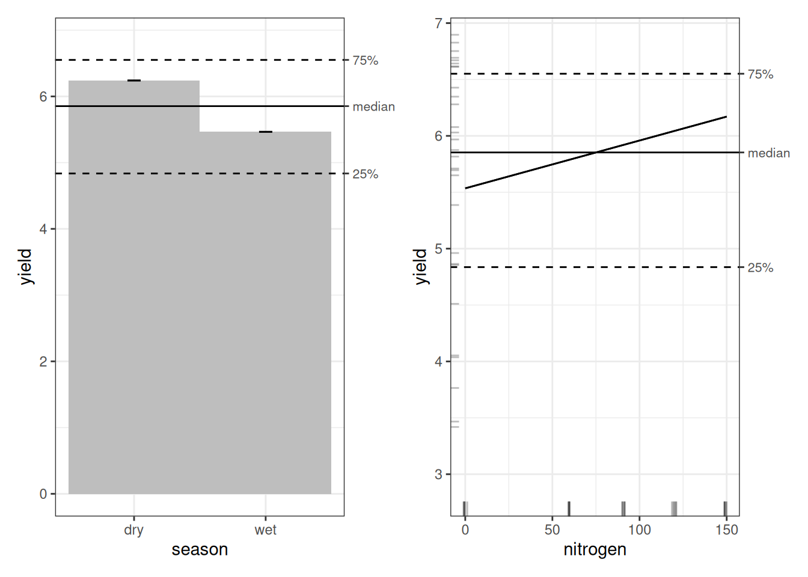
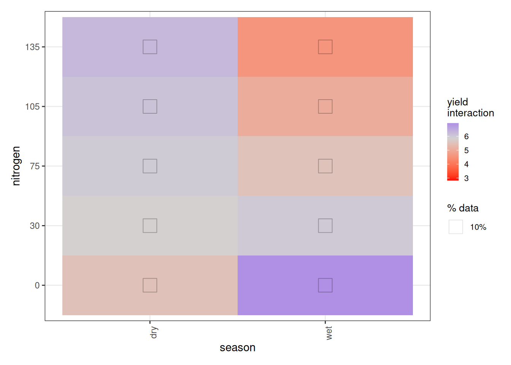
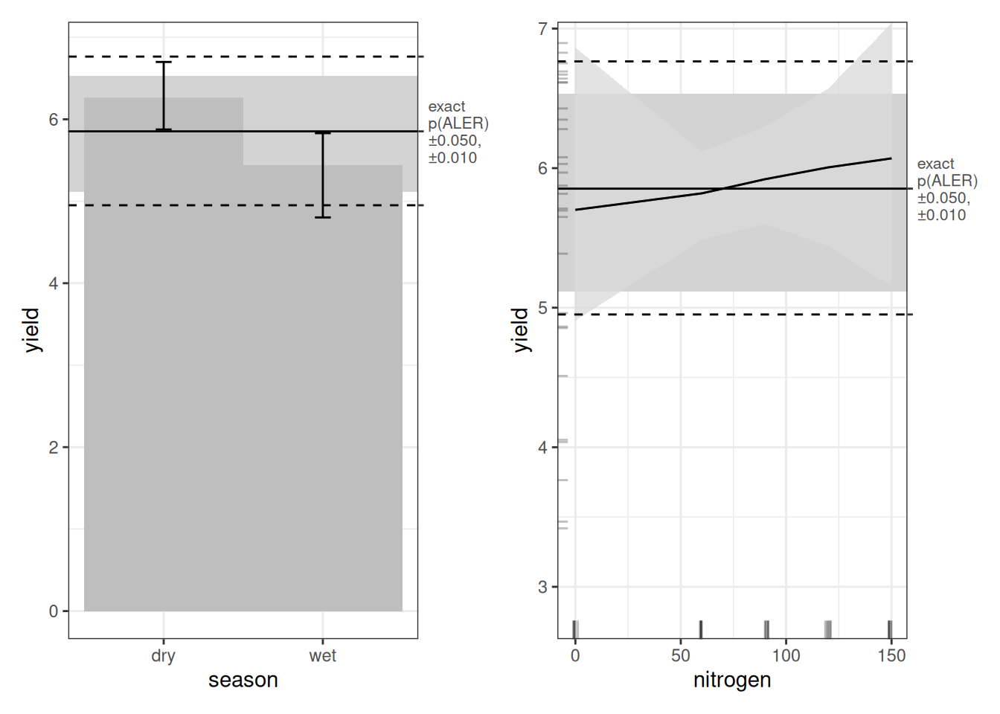
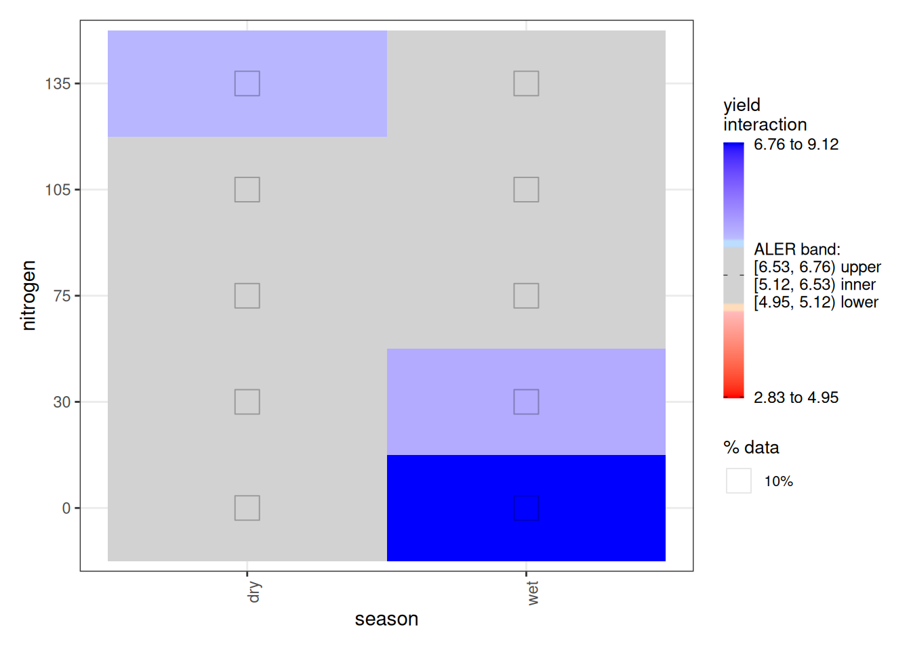
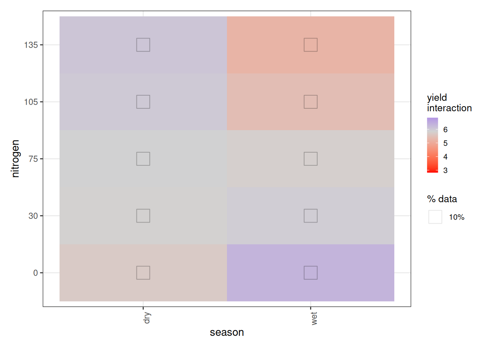
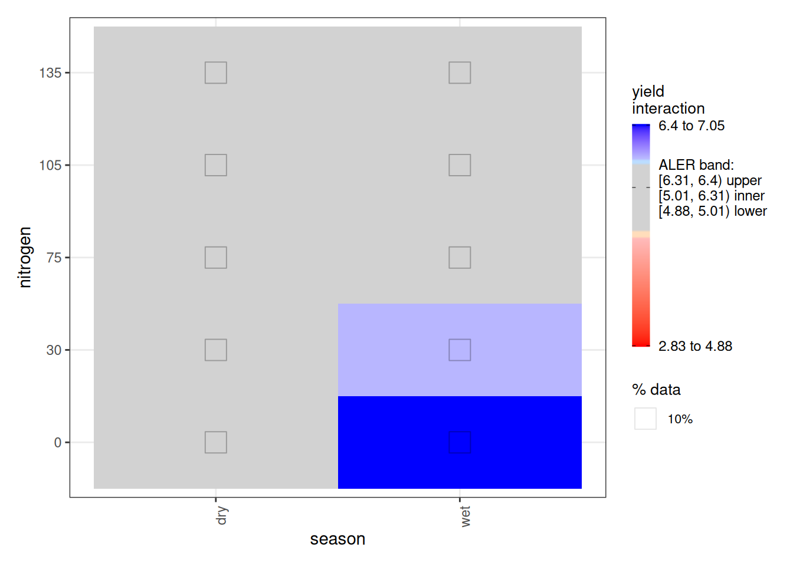
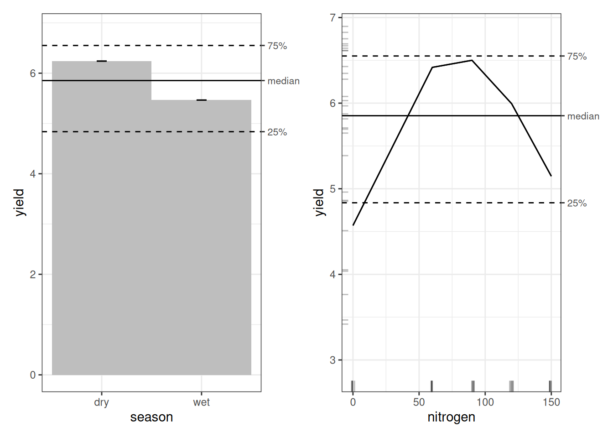
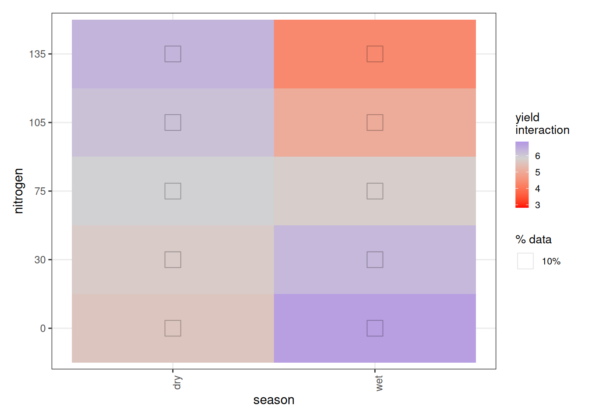
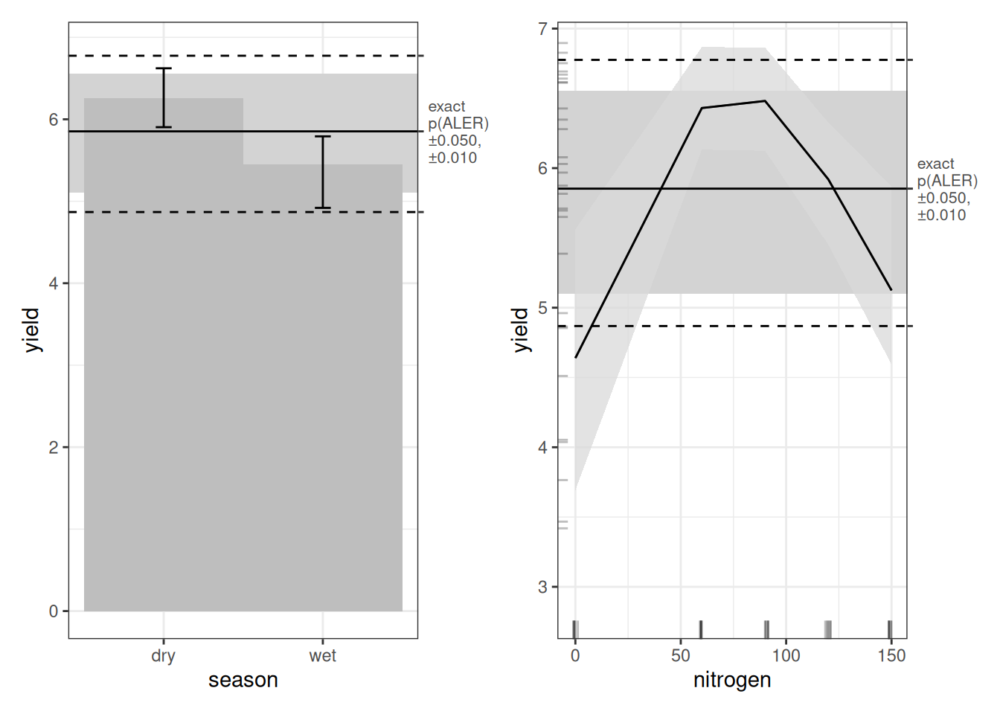
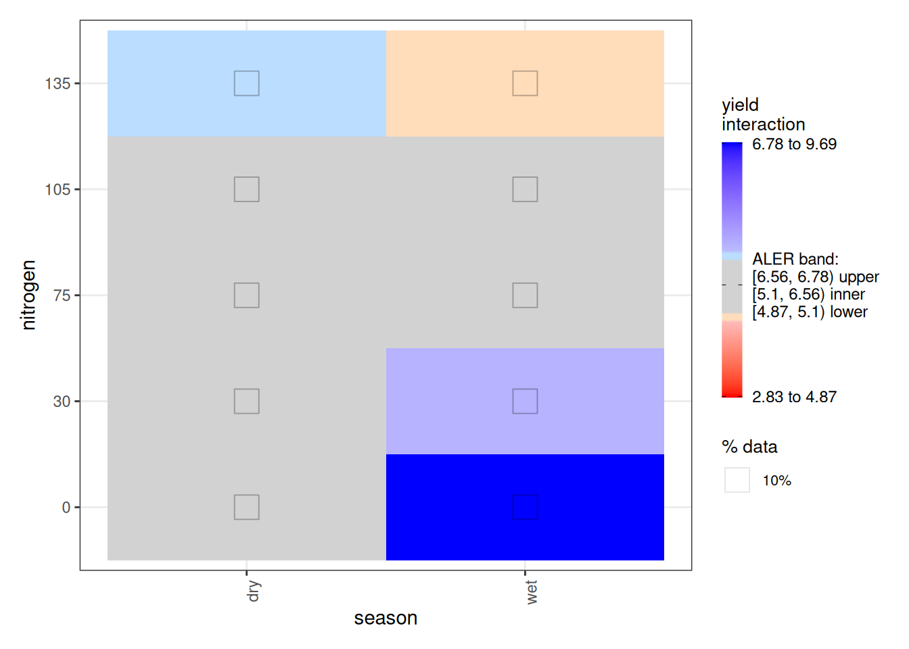

# Analyzing a Small Rice Yield Dataset with ALE-Based Inference

## 1 Introduction

We’re working with a tiny, expensive kind of dataset: the sort you get
when each data point costs fieldwork, fertilizer, and patience. These
rice data come from the International Rice Research Institute (IRRI) and
are discussed in Gomez & Gomez (1984).

Our goal is simple: figure out how rice yield responds to nitrogen
fertilizer in **dry** versus **wet** seasons, and whether the “best”
nitrogen level should differ by season.

We’ll analyze the data with three model families:

1.  **OLS regression** (classic linear regression).
2.  **Random forest** (mostly as a cautionary tale on tiny data).
3.  **Generalized additive model (GAM)**, which is usually the best fit
    for “small data + nonlinearity”.

## 2 Set up R environment

First, let’s set up our R environment. We begin by loading the packages
we’ll use. Two quick notes:

- The dataset comes from the {agridat} package (it doesn’t have to be
  loaded, but it does have to be installed).
- The **{ale}** package is on CRAN, but for a few features used here we
  install the current development version from GitHub (the code shows
  how, via {pak}).

``` r
library(dplyr)  # data manipulation
library(staccuracy)  # performance metrics
library(tictoc)  # performance timing
library(mgcv)  # Generalized Additive Models
library(ranger)  # random forest
library(kableExtra)  # table formatting

# Other packages that must be installed
# Uncomment the following lines as needed.

# # If needed, first install the pak advanced package manager (needed to easily install a package directly from GitHub):
# install.packages('pak')
# 
# pak::pak('agridat')  # agricultural datasets
# 
# # Accumulated Local Effects: ale package
# # Install the development version of ale for this workshop, which is more recent than the current CRAN version.
# pak::pak('tripartio/ale')
library(ale)  # load the ale package only after installing the development version
```

``` r
# For speed, these examples use retrieve_rds() to load precreated objects 
# from an online repository.
# To run the code yourself, execute the code blocks directly.  
serialized_objects_site <- "https://github.com/tripartio/ale/raw/main/download/rice_objects"
```

## 3 Data preparation and description

The data come from IRRI in the Philippines. Unfortunately, the book that
describes it (Gomez & Gomez, 1984) does not give much context
(country/year/site details) beyond this description:

“We give the procedures for analyzing data of experiments over crop
seasons using a fertilizer trial with five nitrogen rates tested on rice
for two seasons, using a RCB design with three replications” (p. 317).

Preparation is straightforward: we pull `gomez.wetdry` and convert it to
a tibble. We also drop the `rep` column because it’s not a usable
replication ID here. It uses labels like R1/R2/R3, but R1 in one row is
not the same experimental block as R1 in another row, so treating it as
a factor would invite nonsense, especially with a dataset this small.

``` r
data('gomez.wetdry', package = 'agridat')

rice <- gomez.wetdry |> 
  as_tibble() |> 
  # rep is a false factor; it should be a unique ID:
  # Each R1 has nothing to do with each other; likewise for R2 or R3.
  select(-rep)

# help('gomez.wetdry', package = 'agridat')
```

We’ll add more commentary later. For now, here’s the full dataset.

``` r
rice |> print(n = 50)
```

    # A tibble: 30 × 3
       season nitrogen yield
       <fct>     <int> <dbl>
     1 dry           0  4.89
     2 dry           0  2.58
     3 dry           0  4.54
     4 dry          60  6.01
     5 dry          60  6.62
     6 dry          60  5.67
     7 dry          90  6.71
     8 dry          90  6.69
     9 dry          90  6.80
    10 dry         120  6.46
    11 dry         120  6.68
    12 dry         120  6.64
    13 dry         150  5.68
    14 dry         150  6.87
    15 dry         150  5.69
    16 wet           0  5.00
    17 wet           0  3.50
    18 wet           0  5.36
    19 wet          60  6.35
    20 wet          60  6.32
    21 wet          60  6.58
    22 wet          90  6.07
    23 wet          90  5.97
    24 wet          90  5.89
    25 wet         120  4.82
    26 wet         120  4.02
    27 wet         120  5.81
    28 wet         150  3.44
    29 wet         150  4.05
    30 wet         150  3.74

After printing the data, we summarize it.

``` r
rice |> summary()
```

     season      nitrogen       yield
     dry:15   Min.   :  0   Min.   :2.577
     wet:15   1st Qu.: 60   1st Qu.:4.836
              Median : 90   Median :5.853
              Mean   : 84   Mean   :5.515
              3rd Qu.:120   3rd Qu.:6.551
              Max.   :150   Max.   :6.868  

``` r
rice$nitrogen |> table()
```

      0  60  90 120 150
      6   6   6   6   6 

Three replications of five nitrogen rates were run in each of the dry
and wet seasons, for a total of 30 plots.

- `season` (factor): wet or dry season.
- `nitrogen` (numeric): five nitrogen fertilizer rates applied to each
  agricultural plot, in kilograms per hectare (kg/ha).
- `yield` (numeric): rice grain yield, in tonnes per hectare (t/ha),
  that is, 1,000 kg/ha.

Notably, the outcome variable, rice `yield` has a mean of 5.5 t/ha and a
mean absolute deviation (mad) of 0.982.

## 4 Model evaluation

Before we train anything, we need to be clear about how we evaluate
models. There are two particular principles of our evaluation approach:
appropriate metrics for practical alignment and for predictive analysis.

### 4.1 Metrics for numeric prediction

Classic statistics leans heavily on R² or adjusted R². These measure
explained variance. That’s fine as far as it goes, but we want to be
more deliberate about our metrics.

Our outcome is a numeric, ratio, continuous variable: yield in t/ha. For
tasks like this, the most appropriate metric is usually **mean absolute
error (MAE)**.

The problem with MAE–and most metrics–is interpretation. Smaller is
better, yes—but how small is good? The standard comparison for MAE is
the mean absolute deviation (MAD). For our dataset, the MAD for rice
`yield` is 0.982. Thus, any “good” model should have an MAE smaller than
that threshold

To simplify such comparisons, we also use **standardized accuracy**
(staccuracy or SA), from the {staccuracy} package. This rescales
performance to a 0–100% range. A value of 100% means perfect prediction.
A value of 50% corresponds to predicting the mean every time. So, for
MAE staccuracy, 50% is the score of the MAD. Any staccuracy above 50%
beats the mean; anything below 50% is worse than simply guessing the
mean. We will report both MAE and standardized accuracy.

### 4.2 Descriptive versus predictive metrics

Descriptive metrics are computed on the full dataset used to train the
model. They tell us how well the model reproduces the data it already
saw. That is useful, but it is still in-sample performance.

Predictive metrics are more realistic. They train the model on part of
the data and evaluate it on data not used in fitting. Common approaches
include cross-validation and bootstrapping. Cross-validation is often
used for very large datasets or slow models. Bootstrapping works well
for small datasets and faster models.

Our dataset is small, so we will use bootstrapping—specifically
full-model bootstrapping. We explain the difference between bootstrap
approaches in [an article on ALE statistics and
inference](https://tripartio.github.io/ale/articles/ale-statistics.html).

Here are the eventual results of our analyses. Note that lower MAE is
better, and higher staccuracy (SA) is better. Descriptive metrics
usually look better than predictive metrics because they tend to
misleadingly overfit the data.

[TABLE]

With evaluation clarified, we can now move on to the models themselves.

## 5 OLS regression

### 5.1 Model training

We start with the most familiar tool in the toolbox: ordinary least
squares (OLS) linear regression.

We fit a model using both predictors, **season** and **nitrogen**, and
we also include their interaction. That means we allow the effect of
nitrogen to differ between wet and dry seasons rather than forcing one
shared slope.

After fitting the model, we print the summary to inspect coefficients,
standard errors, and overall fit.

``` r
lm_rice <- lm(
  yield ~ season + nitrogen + season:nitrogen,
  data = rice
)
sa_lm_rice  <- sa_wmae_mad(rice$yield, predict(lm_rice))  # 0.60739
mae_lm_rice <- mae(rice$yield, predict(lm_rice))  # 0.7719829
summary(lm_rice)
```

    Call:
    lm(formula = yield ~ season + nitrogen + season:nitrogen, data = rice)

    Residuals:
        Min      1Q  Median      3Q     Max
    -2.1507 -0.6644  0.1648  0.8069  1.3039

    Coefficients:
                        Estimate Std. Error t value Pr(>|t|)
    (Intercept)         4.664225   0.497790   9.370 8.08e-10 ***
    seasonwet           0.989486   0.703982   1.406  0.17169
    nitrogen            0.014739   0.005049   2.919  0.00716 **
    seasonwet:nitrogen -0.020999   0.007140  -2.941  0.00679 **
    ---
    Signif. codes:  0 '***' 0.001 '**' 0.01 '*' 0.05 '.' 0.1 ' ' 1

    Residual standard error: 1.009 on 26 degrees of freedom
    Multiple R-squared:  0.3576,    Adjusted R-squared:  0.2835
    F-statistic: 4.824 on 3 and 26 DF,  p-value: 0.008423

Before interpreting the OLS coefficients, we check whether the model is
doing anything useful. The adjusted R² is 0.284 (1.0 would be perfect),
which is… not inspiring, and it’s also not a metric with a clean
“good/bad” cutoff.

In the coefficient table, the season effect is not statistically
significant. Nitrogen is statistically significant (p ⩽ 0.05), but the
estimated slope (0.015) is tiny, and the season × nitrogen interaction
is also significant but tiny at -0.021.

Using our preferred metrics, the OLS model has a descriptive MAE of
0.772 t/ha and standardized accuracy of 60.7%. That staccuracy is better
than coin-flip territory, but these are still *descriptive* metrics and
can look deceptively good on small data.

So we move to ALE to understand what the model is actually implying.

### 5.2 ALE analysis

We start with a single ALE explanation (fast here because we only have
two predictors and one interaction). We’ll focus on ALED (ALE deviation)
as our main effect-size summary. We explain this and other [ALE
statistics in detail in another
article](https://tripartio.github.io/ale/articles/ale-statistics.html).

``` r
# Single ALE description
ale_lm_rice <- ALE(
  lm_rice, 
  x_cols = list(d1 = TRUE, d2 = TRUE),
  data = rice,
  # p_values = pd_lm_rice,
  parallel = 0
)

summary(ale_lm_rice)
```

    # A tibble: 3 × 7
      term             aled aler_min aler_max naled naler_min naler_max
      <chr>           <dbl>    <dbl>    <dbl> <dbl>     <dbl>     <dbl>
    1 season          0.387   -0.387    0.387 13.3      -13.3      13.3
    2 nitrogen        0.153   -0.318    0.318  9.33     -13.3      13.3
    3 season:nitrogen 0.391   -1.04     0.614 14.3      -26.7      23.3

    # A tibble: 6 × 7
      statistic term            estimate conf.low   mean median conf.high
      <ord>     <chr>              <dbl>    <dbl>  <dbl>  <dbl>     <dbl>
    1 aled      season             0.387    0.387  0.387  0.387     0.387
    2 aled      nitrogen           0.153    0.153  0.153  0.153     0.153
    3 aled      season:nitrogen    0.391    0.391  0.391  0.391     0.391
    4 naled     season            13.3     13.3   13.3   13.3      13.3
    5 naled     nitrogen           9.33     9.33   9.33   9.33      9.33
    6 naled     season:nitrogen   14.3     14.3   14.3   14.3      14.3  

    # A tibble: 0 × 0

From the ALE summary, the season ALED effect is about 0.387 t/ha (≈ 387
kg/ha) and that for nitrogen is about 153 kg/ha. The season × nitrogen
interaction ALED is about 391 kg/ha. However, note that without
bootstrapping, these results shouldn’t be considered reliable.

Next we look at the ALE plots. With only three terms, we’ll inspect them
all (in bigger studies, we’d be pickier).

``` r
ale_lm_rice |> 
  plot() |> 
  subset(list(d1 = TRUE))
```



``` r
ale_lm_rice |> 
  plot() |> 
  subset(list(d2 = TRUE))
```



For the ALE analysis of the OLS model, we begin with the statistics
before turning to the plots. Since ALE is run only once here, relying on
p-values alone would not be very informative. We obtain ALED estimates,
which we have already defined elsewhere.

Looking at the plots again, the pattern is consistent: dry-season yield
appears higher than wet-season yield, and the OLS model implies that
more nitrogen increases yield overall. The interaction suggests that
nitrogen may reduce yield in the wet season, but we’ll hold off on
interpreting the interaction plots until we come to the GAM further
down.

However, statistical results (ALE or otherwise) are generally not
reliable until we bootstrap them.Because our dataset is tiny and the
models train quickly, we use full model bootstrapping. There are two
ways to bootstrap ALE. The faster approach resamples only the ALE
calculation data without retraining the model. That approach is
appropriate for very large datasets and very slow models that have
already been validated by cross-validation.

That is not our situation. We have a small dataset and fast models. So
we must retrain the entire model for each bootstrap iteration. By
default, we use 100 bootstrap iterations. For publication, we could
increase that number, but for analysis, 100 iterations are typically
sufficient and lead to the same conclusions. ALE itself is relatively
stable compared to some other interpretability methods.

Before bootstrapping, let’s first generate an ALE p-value distribution.
This is the slowest step in ALE analysis because it relies on simulation
rather than parametric assumptions. Whenever procedures are slow in this
demonstration, the code blocks are commented out and presaved objects
are loaded instead, so the document runs quickly.

We can then use the p-value distribution for the full-model
bootstrapping procedure from the {ale} package, to create a `ModelBoot`
object. We explicitly request ALE for season, nitrogen, and the season ×
nitrogen interaction. Only after this full bootstrap process do the ALE
results become reliable

``` r
# SLOW: uncomment to run yourself; load the saved object for rapid execution

# # p-value distribution
# # Default 1000 iterations for exact p-values
# tic()
# pd_lm_rice <- ALEpDist(lm_rice, rice, parallel = 0)
# toc()  # 542.13 sec elapsed
# # saveRDS(pd_lm_rice, file.choose())

pd_lm_rice <- serialized_objects_site |> 
  file.path("pd_lm_rice.rds") |>
  url() |> 
  readRDS()


# SLOW: uncomment to run yourself; load the saved object for rapid execution

# # Full-model bootstrapped ALE explanation
# # Default 100 bootstrap iterations
# tic()
# mb_lm_rice <- ModelBoot(
#   lm_rice, rice,
#   ale_options = list(x_cols = c('season', 'nitrogen', 'season:nitrogen')),
#   ale_p = pd_lm_rice,
#   parallel = 0
# )
# toc()  # 113.02 sec elapsed
# # saveRDS(mb_lm_rice, file.choose())

mb_lm_rice <- serialized_objects_site |> 
  file.path("mb_lm_rice.rds") |>
  url() |> 
  readRDS()
```

``` r
summary(mb_lm_rice)  # boot_valid SA 48.8%: MAE 0.918
```

    # A tibble: 12 × 7
       name          boot_valid conf.low  median    mean conf.high     sd
       <chr>              <dbl>    <dbl>   <dbl>   <dbl>     <dbl>  <dbl>
     1 r.squared         NA       0.193   0.444   0.449      0.715 0.134
     2 adj.r.squared     NA       0.100   0.380   0.385      0.682 0.150
     3 sigma             NA       0.621   0.907   0.907      1.13  0.137
     4 statistic         NA       2.08    6.92    8.25      21.8   5.34
     5 p.value           NA       0       0.0014  0.0129     0.130 0.0323
     6 df                NA       3       3       3          3     0
     7 df.residual       NA      26      26      26         26     0
     8 nobs              NA      30      30      30         30     0
     9 mae                0.918   0.634  NA      NA          1.45  0.232
    10 sa_mae             0.488  -0.0793 NA      NA          0.649 0.191
    11 rmse               1.14    0.770  NA      NA          2.12  0.354
    12 sa_rmse            0.498   0.0366 NA      NA          0.652 0.176 

    # A tibble: 4 × 6
      term               conf.low  median    mean conf.high std.error
      <chr>                 <dbl>   <dbl>   <dbl>     <dbl>     <dbl>
    1 (Intercept)          3.56    4.68    4.71      6.34      0.697
    2 seasonwet           -0.550   1.16    1.27      4.18      1.20
    3 nitrogen             0.0005  0.0149  0.0148    0.0273    0.007
    4 seasonwet:nitrogen  -0.0483 -0.0236 -0.0236   -0.0063    0.0114

    # A tibble: 3 × 7
      term             aled aler_min aler_max naled naler_min naler_max
      <fct>           <dbl>    <dbl>    <dbl> <dbl>     <dbl>     <dbl>
    1 season          0.405   -0.416    0.421 14.9      -13.4      17.2
    2 nitrogen        0.200   -0.391    0.463  8.69     -13.3      21.5
    3 season:nitrogen 0.409   -1.06     0.793 15.0      -24.2      31.3

    # A tibble: 6 × 8
      statistic term            estimate p.value conf.low median   mean conf.high
      <ord>     <fct>              <dbl>   <dbl>    <dbl>  <dbl>  <dbl>     <dbl>
    1 aled      season             0.405   0.006   0.0483  0.445  0.405     0.860
    2 aled      nitrogen           0.200   0.212   0.0245  0.184  0.200     0.463
    3 aled      season:nitrogen    0.409   0.005   0.113   0.392  0.409     0.789
    4 naled     season            14.9     0.053   0.581  14.9   14.9      33.1
    5 naled     nitrogen           8.69    0.235   0       8.33   8.69     20.7
    6 naled     season:nitrogen   15.0     0.049   1.32   14.6   15.0      28.6  

    # A tibble: 0 × 0

Bootstrapping gives us predictive metrics based on bootstrap validation
on 100 hold-out samples. The OLS model has a predictive MAE of 0.918
t/ha and standardized accuracy of 48.8%. Any staccuracy less than 50%
counts as a “bad” model–it’s worse than simply predicting the mean every
time. So, our OLS model is pretty much useless. At least, we’ve learnt
that we can’t trust it.

This is reinforced by the complete absence of statistically significant
confidence regions–ALE-based inference is telling us that we can’t trust
anything this model says.

``` r
mb_lm_rice |> 
  plot() |> 
  subset(list(d1 = TRUE))
```



``` r
mb_lm_rice |> 
  plot() |> 
  subset(list(d2 = TRUE))
```



Plotting the bootstrapped ALE reinforces our scepticism: all results
fall within the middle grey ALER band, which indicates where random
results live. Although the 2D interaction plot has some regions outside
the ALER band, the statistics above indicate that the bootstrapped
ranges nonetheless overlap the ALER band, which is not shown in this
plot.

## 6 Random forest

Next we analyze the data using a random forest model. Let’s be honest
upfront: random forest is not well suited for a dataset this small. We
include it anyway for demonstration purposes—to show that machine
learning is not automatically the best solution. Model choice should
match the data, not the hype.

We use {ranger}, a fast and easy-to-use random forest implementation in
R. Tree-based models come in three main varieties:

- Single decision trees.
- Random forests build many decision trees on bootstrapped samples and
  average them with bootstrap aggregation (bagging).
- Gradient boosted trees also builds multiple trees, but sequentially,
  each correcting the previous one, though a procedure called boosting.

Gradient boosted trees often perform extremely well, but here we use
{ranger} for random forests because it is fast, simple, and performs
well with default settings.

### 6.1 Model training

Because random forest is stochastic, we set a random seed. Otherwise,
each run would produce slightly different results. Beyond that, we use
the default settings.

``` r
# Precise performance metrics vary slightly for a random forest
rf_rice <- ranger(
  yield ~ ., 
  data = rice,
  seed = 1  # ensure that the same random forest is generated each time
)
sa_rf_rice  <- sa_wmae_mad(rice$yield, predict(rf_rice, rice)$predictions)  # 0.7222866
mae_rf_rice <- mae(rice$yield, predict(rf_rice, rice)$predictions)  # 0.5429936
rf_rice
```

    Ranger result

    Call:
     ranger(yield ~ ., data = rice, seed = 1)

    Type:                             Regression
    Number of trees:                  500
    Sample size:                      30
    Number of independent variables:  2
    Mtry:                             1
    Target node size:                 5
    Variable importance mode:         none
    Splitrule:                        variance
    OOB prediction error (MSE):       0.7410144
    R squared (OOB):                  0.4787994 

The random forest has a descriptive MAE of 0.548 t/ha and standardized
accuracy of 72.1%. Descriptively, this looks much better than OLS. But
descriptive performance is the easy part.

### 6.2 ALE analysis

The {ale} package automatically recognizes the {ranger} package, so
using default settings, it easily creates an ALE explanation.

``` r
# Single ALE description
ale_rf_rice <- ALE(
  rf_rice, 
  x_cols = list(d1 = TRUE, d2 = TRUE),
  data = rice,
  # p_values = pd_rf_rice,
  parallel = 0
)

summary(ale_rf_rice)
```

    # A tibble: 3 × 7
      term             aled aler_min aler_max naled naler_min naler_max
      <chr>           <dbl>    <dbl>    <dbl> <dbl>     <dbl>     <dbl>
    1 season          0.358   -0.358    0.358 13.3      -13.3      13.3
    2 nitrogen        0.255   -0.848    0.409 11.3      -16.7      13.3
    3 season:nitrogen 0.185   -0.543    0.290  7.67     -16.7      13.3

    # A tibble: 6 × 7
      statistic term            estimate conf.low   mean median conf.high
      <ord>     <chr>              <dbl>    <dbl>  <dbl>  <dbl>     <dbl>
    1 aled      season             0.358    0.358  0.358  0.358     0.358
    2 aled      nitrogen           0.255    0.255  0.255  0.255     0.255
    3 aled      season:nitrogen    0.185    0.185  0.185  0.185     0.185
    4 naled     season            13.3     13.3   13.3   13.3      13.3
    5 naled     nitrogen          11.3     11.3   11.3   11.3      11.3
    6 naled     season:nitrogen    7.67     7.67   7.67   7.67      7.67 

    # A tibble: 0 × 0

``` r
ale_rf_rice |> 
  plot() |> 
  subset(list(d1 = TRUE))
```


``` r
ale_rf_rice |> 
  plot() |> 
  subset(list(d2 = TRUE))
```



In the random forest ALE plots, the season effect is very similar to
that of ordinary least squares, but the nitrogen fertilizer effect is
quite different. Here, nitrogen shows an inverted-U pattern (peaking
around 60–90 kg/ha), and the interaction again suggests different
nitrogen behaviour across seasons. Still, we shouldn’t get too excited
until we check predictive stability.

``` r
# SLOW: uncomment to run yourself; load the saved object for rapid execution

# # p-value distribution
# # Default 1000 iterations for exact p-values
# tic()
# pd_rf_rice <- ALEpDist(
#   rf_rice, rice,
#   parallel = 0
# )
# toc()  # 560.64 sec elapsed
# # saveRDS(pd_rf_rice, file.choose())

pd_rf_rice <- serialized_objects_site |> 
  file.path("pd_rf_rice.rds") |>
  url() |> 
  readRDS()


# SLOW: uncomment to run yourself; load the saved object for rapid execution

# # Full-model bootstrapped ALE explanation
# # Default 100 bootstrap iterations
# tic()
# mb_rf_rice <- ModelBoot(
#   rf_rice, rice,
#   ale_options = list(x_cols = c('season', 'nitrogen', 'season:nitrogen')),
#   ale_p = pd_rf_rice,
#   parallel = 0
# )
# toc()  # 70.89 sec elapsed
# # saveRDS(mb_rf_rice, file.choose())

mb_rf_rice <- serialized_objects_site |> 
  file.path("mb_rf_rice.rds") |>
  url() |> 
  readRDS()
```

``` r
summary(mb_rf_rice)  # boot_valid SA 64.6%; MAE 0.6400844
```

    # A tibble: 4 × 7
      name    boot_valid conf.low median  mean conf.high     sd
      <chr>        <dbl>    <dbl>  <dbl> <dbl>     <dbl>  <dbl>
    1 mae          0.641    0.421     NA    NA     0.950 0.141
    2 sa_mae       0.646    0.363     NA    NA     0.744 0.108
    3 rmse         0.807    0.520     NA    NA     1.27  0.209
    4 sa_rmse      0.647    0.404     NA    NA     0.735 0.0804

    # A tibble: 3 × 7
      term             aled aler_min aler_max naled naler_min naler_max
      <fct>           <dbl>    <dbl>    <dbl> <dbl>     <dbl>     <dbl>
    1 season          0.339   -0.349    0.350 13.6      -13.2      14.7
    2 nitrogen        0.256   -0.868    0.433 11.6      -21.8      18.5
    3 season:nitrogen 0.188   -0.523    0.331  8.17     -17.0      14.0

    # A tibble: 6 × 8
      statistic term            estimate p.value conf.low median   mean conf.high
      <ord>     <fct>              <dbl>   <dbl>    <dbl>  <dbl>  <dbl>     <dbl>
    1 aled      season             0.339   0.008   0.0813  0.352  0.339     0.580
    2 aled      nitrogen           0.256   0.054   0.144   0.240  0.256     0.400
    3 aled      season:nitrogen    0.188   0.205   0.0904  0.180  0.188     0.301
    4 naled     season            13.6     0.059   1.59   13.8   13.6      24.7
    5 naled     nitrogen          11.6     0.225   2.88   11.1   11.6      20.7
    6 naled     season:nitrogen    8.17    0.835   2.17    7.67   8.17     15.2  

    # A tibble: 0 × 0

Once we bootstrap, the performance is less impressive than with purely
descriptive metrics. The random forest has a predictive MAE of 0.641
t/ha and standardized accuracy of 64.6%. That said, the staccuracy of
above 50% indicates that this is at least a decent model. However, we
will see that we can do better, as random forests don’t shine best on
small datasets like this.

``` r
mb_rf_rice |> 
  plot() |> 
  subset(list(d1 = TRUE))
```


``` r
mb_rf_rice |> 
  plot() |> 
  subset(list(d2 = TRUE))
```



We’ll hold off deeper interpretation of the random forest plots and
focus our main interpretation on the GAM.

## 7 GAM

Now we move to generalized additive models (GAMs). A GAM sits within the
broader generalized linear model (GLM) family, but unlike standard
linear regression (OLS), it allows nonlinear relationships. Instead of
forcing straight lines, it lets the data determine the shape of the
relationship. When properly configured, GAMs work especially well on
small datasets like ours. They offer flexibility without giving up
structure.

### 7.1 Model training

Appropriately configuring GAMs is as much an art as a science, and so we
won’t get into how we arrived at the specific configuration that we use
here. However, its key structure is straightforward. We model yield as a
function of season, and we include nitrogen through its interaction with
season. That means nitrogen is not entered as a simple main effect;
instead, its relationship with yield is allowed to differ by season. In
this way, nitrogen is fully incorporated into the model. We use the
{mgcv} package for the GAM.

``` r
gam_rice <- gam(
  yield ~ season + ti(nitrogen, by = season, bs = "ps"),
  data = rice,
  # REML is recommended for more accurate estimation, though slightly slower
  method = 'REML'  
)
# workaround a pgkdown bug (probably temporary)
gam_preds <- predict(gam_rice) |> as.numeric() 
sa_gam_rice  <- sa_wmae_mad(rice$yield, gam_preds)  # 0.8015714
mae_gam_rice <- mae(rice$yield, gam_preds)  # 0.3898126
summary(gam_rice)
```

    Family: gaussian
    Link function: identity

    Formula:
    yield ~ season + ti(nitrogen, by = season, bs = "ps")

    Parametric coefficients:
                Estimate Std. Error t value Pr(>|t|)
    (Intercept)   5.9023     0.1556  37.931   <2e-16 ***
    seasonwet    -0.7744     0.2201  -3.519   0.0018 **
    ---
    Signif. codes:  0 '***' 0.001 '**' 0.01 '*' 0.05 '.' 0.1 ' ' 1

    Approximate significance of smooth terms:
                             edf Ref.df     F  p-value
    ti(nitrogen):seasondry 2.141  2.387 16.01 2.07e-05 ***
    ti(nitrogen):seasonwet 2.346  2.636 14.55 4.57e-05 ***
    ---
    Signif. codes:  0 '***' 0.001 '**' 0.01 '*' 0.05 '.' 0.1 ' ' 1

    R-sq.(adj) =  0.745   Deviance explained = 79.3%
    -REML = 30.862  Scale est. = 0.36319   n = 30

We won’t over-interpret the GAM coefficients; the more useful story here
comes from performance and the ALE surfaces.

The adjusted R-squared is 0.745, but we don’t compare that number
directly to OLS or random forest, because different model classes
compute “R-squared” in different ways. MAE and standardized accuracy are
comparable across models, though.

Using our preferred, comparable metrics, the GAM has a descriptive MAE
of 0.39 t/ha and standardized accuracy of 80.2%. So far, this is our
best descriptive performance. We emphasize, though, that only
prescriptive metrics are reliable.

In the parametric part of the GAM summary, season shows a negative shift
going from dry to wet (lower yield in wet), which is statistically
significant. Nitrogen is included via its season-specific smooth
interaction, so its effect isn’t summarized as a single tidy
coefficient.

There is no interpretable coefficient for the interaction between season
and nitrogen. What we see instead is the estimated degrees of freedom
(EDF), which tell us to what extent the interaction is nonlinear. The
statistically significant EDFs confirm nonlinearity, but do not describe
the direction or shape of the effect. GAM requires plots for that
interpretive step.

This is exactly why we turn to ALE. ALE incorporates the full structure
of the model and allows us to visualize and quantify the effect of
nitrogen even though it was not specified as a simple parametric term.

### 7.2 Single ALE on entire dataset

Next, we use ALE to examine the shape of the fitted relationships and
give us model-agnostic statistics.

``` r
# Single ALE description
ale_gam_rice <- ALE(
  gam_rice, 
  x_cols = list(d1 = TRUE, d2 = TRUE),
  data = rice,
  # p_values = pd_gam_rice,
  parallel = 0
)

summary(ale_gam_rice)
```

    # A tibble: 3 × 7
      term             aled aler_min aler_max naled naler_min naler_max
      <chr>           <dbl>    <dbl>    <dbl> <dbl>     <dbl>     <dbl>
    1 season          0.387   -0.387    0.387  13.3     -13.3      13.3
    2 nitrogen        0.400   -1.28     0.648  15.3     -26.7      23.3
    3 season:nitrogen 0.408   -1.16     0.636  15       -26.7      23.3

    # A tibble: 6 × 7
      statistic term            estimate conf.low   mean median conf.high
      <ord>     <chr>              <dbl>    <dbl>  <dbl>  <dbl>     <dbl>
    1 aled      season             0.387    0.387  0.387  0.387     0.387
    2 aled      nitrogen           0.400    0.400  0.400  0.400     0.400
    3 aled      season:nitrogen    0.408    0.408  0.408  0.408     0.408
    4 naled     season            13.3     13.3   13.3   13.3      13.3
    5 naled     nitrogen          15.3     15.3   15.3   15.3      15.3
    6 naled     season:nitrogen   15       15     15     15        15    

    # A tibble: 0 × 0

In the ALE summary, the GAM shows larger ALED effects (roughly 400 kg/ha
scale) for season, nitrogen, and their interaction than the earlier
models. We’ll interpret these more carefully once we look at the plots.

``` r
ale_gam_rice |> 
  plot() |> 
  subset(list(d1 = TRUE))
```



``` r
ale_gam_rice |> 
  plot() |> 
  subset(list(d2 = TRUE))
```



The season main-effect plot is identical to what we saw under OLS, as
can be expected, since GAM treats simple factor variables the same way
OLS does.

Nitrogen is a different story. Under OLS, the effect looked roughly
linear and increasing. Under the GAM, we see something more realistic.
Yield is lowest at zero nitrogen, rises sharply, peaks around 60–75
kg/ha, and then declines at higher levels. At 120 and 150 kg/ha, yield
drops relative to the peak. In other words, we see an inverted U-shape.
This is consistent with what we observed in the {ranger} model.

Now we turn to the nitrogen × season interaction. At first glance, the
plot appears to suggest that less fertilizer gives better yields in the
wet season, while more fertilizer benefits the dry season. That
interpretation would be misleading.

In fact, ALE has a structural quirk when interactions are present. With
no interactions, 1D ALE plots reflect intuitive main effects. But once
interactions exist:

- 1D ALE (main effects) represent the total effect of that variable,
  including all its interaction effects.
- 2D ALE interaction plots represent **only** the additional interaction
  component, after subtracting the composite main effects.

So in our case:

- The season ALE plot reflects the total season effect, including its
  interaction with nitrogen.
- The nitrogen ALE plot reflects the total nitrogen effect, including
  its interaction with season.
- The season × nitrogen plot shows **only** the extra interaction effect
  **beyond** those two main effects.

This means the interaction surface is not saying that more nitrogen
reduces yield in the wet season overall. Instead, given the inverted
U-shape, it tells us that the dry season tolerates higher nitrogen
better, while the wet season declines more sharply past the peak. The
extremes of very low or very high nitrogen behave differently across
seasons once the shared nonlinear pattern is removed.

Admittedly, this decomposition is not especially intuitive. It is a
known limitation of the ALE formulation and an area where interpretation
requires care.

### 7.3 ALE on bootstrapped models

So far, these are preliminary patterns. To assess reliability, we now
generate a p-value distribution and perform full model bootstrapping of
the GAM.

``` r
# SLOW: uncomment to run yourself; load the saved object for rapid execution

# # p-value distribution
# # Default 1000 iterations for exact p-values
# tic()
# pd_gam_rice <- ALEpDist(gam_rice, rice, parallel = 0)
# toc()  # 612.22 sec elapsed
# # saveRDS(pd_gam_rice, file.choose())

pd_gam_rice <- serialized_objects_site |> 
  file.path("pd_gam_rice.rds") |>
  url() |> 
  readRDS()


# SLOW: uncomment to run yourself; load the saved object for rapid execution

# # Full-model bootstrapped ALE explanation
# # Default 100 bootstrap iterations
# tic()
# mb_gam_rice <- ModelBoot(
#   gam_rice, rice,
#   ale_options = list(x_cols = c('season', 'nitrogen', 'season:nitrogen')),
#   ale_p = pd_gam_rice,
#   parallel = 0
# )
# toc()  # 83.5 sec elapsed
# # saveRDS(mb_gam_rice, file.choose())

mb_gam_rice <- serialized_objects_site |> 
  file.path("mb_gam_rice.rds") |>
  url() |> 
  readRDS()
```

``` r
summary(mb_gam_rice)  # boot_valid SA 70.0%; MAE 0.531
```

    # A tibble: 9 × 7
      name          boot_valid conf.low median   mean conf.high     sd
      <chr>              <dbl>    <dbl>  <dbl>  <dbl>     <dbl>  <dbl>
    1 df                NA        5.63   6.57   6.64      7.50  0.478
    2 df.residual       NA       22.5   23.4   23.4      24.4   0.478
    3 nobs              NA       30     30     30        30     0
    4 adj.r.squared     NA        0.691  0.817  0.817     0.953 0.0684
    5 npar              NA       10     10     10        10     0
    6 mae                0.531    0.311 NA     NA         1.21  0.216
    7 sa_mae             0.700    0.295 NA     NA         0.835 0.159
    8 rmse               0.732    0.427 NA     NA         1.88  0.324
    9 sa_rmse            0.673    0.12  NA     NA         0.823 0.171 

    # A tibble: 2 × 6
      term                   conf.low median  mean conf.high std.error
      <chr>                     <dbl>  <dbl> <dbl>     <dbl>     <dbl>
    1 ti(nitrogen):seasondry     1.70   2.19  2.20      2.73     0.261
    2 ti(nitrogen):seasonwet     1.11   2.45  2.44      3.20     0.408

    # A tibble: 3 × 7
      term             aled aler_min aler_max naled naler_min naler_max
      <fct>           <dbl>    <dbl>    <dbl> <dbl>     <dbl>     <dbl>
    1 season          0.394   -0.406    0.409  14.7     -13.5      16.8
    2 nitrogen        0.389   -1.31     0.687  15.6     -28.1      29.7
    3 season:nitrogen 0.418   -1.15     0.769  15.7     -25.4      30.5

    # A tibble: 6 × 8
      statistic term            estimate p.value conf.low median   mean conf.high
      <ord>     <fct>              <dbl>   <dbl>    <dbl>  <dbl>  <dbl>     <dbl>
    1 aled      season             0.394   0       0.0529  0.404  0.394     0.708
    2 aled      nitrogen           0.389   0       0.207   0.382  0.389     0.604
    3 aled      season:nitrogen    0.418   0       0.236   0.404  0.418     0.678
    4 naled     season            14.7     0.006   0.581  14.8   14.7      29.9
    5 naled     nitrogen          15.6     0.003   5.21   14.9   15.6      26.8
    6 naled     season:nitrogen   15.7     0.003   6.76   15.2   15.7      26.4  

    # A tibble: 6 × 8
      term1  x1    term2    x2        aler_band     n   pct     y
      <chr>  <chr> <chr>    <chr>     <ord>     <int> <dbl> <dbl>
    1 season dry   nitrogen [0,60]    overlap       6    20  5.61
    2 season wet   nitrogen [0,60]    overlap       6    20  6.59
    3 season dry   nitrogen (60,120]  overlap       6    20  6.04
    4 season wet   nitrogen (60,120]  overlap       6    20  5.33
    5 season dry   nitrogen (120,150] overlap       3    10  6.35
    6 season wet   nitrogen (120,150] below         3    10  4.44

The GAM has a predictive MAE of 0.531 t/ha and standardized accuracy of
70.1%. While this represents a drop of 10% staccuracy from the
descriptive to the predictive model, as can be expected with such a
small dataset, this nonetheless represents our most accurate model.
Thus, we will interpret these bootstrapped results in earnest, since
it’s the best that we have.

In the bootstrapped ALE results, all three relationships (season and
nitrogen main effects and the season × nitrogen interaction effect) come
out highly significant by p-values (p \< 0.001), with effect sizes
around 400 kg/ha.

Notably, compared to the OLS and random forest results, our more
accurate GAM is the only model to produce statistically significant
confident regions, which it does for the season × nitrogen interaction.
We can better interpret the implications of this when examining the
bootstrapped plots.

``` r
mb_gam_rice |> 
  plot() |> 
  subset(list(d1 = TRUE))
```



``` r
mb_gam_rice |> 
  plot() |> 
  subset(list(d2 = TRUE))
```



One caution: ALE “main effects” include interaction contributions by
design. The season main effect includes the season–nitrogen interaction
(excluding nitrogen-only effects), and the nitrogen main effect includes
the interaction (excluding season-only effects). The 2D interaction
surface is the part **beyond** the two main effects. That’s slightly
awkward, but it’s the standard ALE definition, so we must carefully
interpret results accordingly.

------------------------------------------------------------------------

Let’s look first at the main-effect plots. As with every model,
dry-season yield appears higher than wet-season yield. And as with the
random forest model, we see the inverted U-shape for nitrogen. However,
in both cases, the ALER band is very wide. That tells us uncertainty is
high. The ALER band represents the range of variation that could
plausibly be random. In both main effects, the bootstrap confidence
regions do not clearly exceed that band. In other words, even though the
curves look different, the differences are not beyond what random
fluctuation could produce. With only 30 observations, this is not
surprising. It is not necessarily that the relationships do not exist;
it is more likely that they would be borne out if we had more
replications of this experiment.

Turning to the interaction plot, most of the surface overlaps the ALER
band, which is why much of it appears grey. At the extremes, however,
there are strong indications of structure. In the dry season, the
highest nitrogen level (150 kg/ha) slightly exceeds the ALER band,
suggesting stronger response at high nitrogen. In contrast, in the wet
season, the lowest yields occur at the highest nitrogen levels, and the
strongest yields occur at lower nitrogen–these boundaries exceed the
ALER band of randomness.

The ALE statistics confirm that only the interaction effect meets the
significance criterion under ALE-based inference, based on at least 10%
of the surface falling outside the two-dimensional ALER band. The main
effects remain within the band and therefore are not statistically
significant.

## 8 Discussion

### 8.1 Comparison with Gomez and Gomez (1984)

In Section 8.1.1, Gomez and Gomez (1984) analyze this dataset using a
randomized complete block design and a combined ANOVA over seasons. They
conclude that nitrogen significantly affects yield. The season ×
nitrogen interaction is highly significant. The overall nitrogen
response is quadratic. And the seasonal difference lies mainly in the
linear component of that quadratic curve. In practical terms, they
conclude that yield increases more sharply with nitrogen in the dry
season and compute separate yield-maximizing and profit-maximizing
nitrogen rates for dry and wet seasons. They explicitly recommend
different nitrogen applications by season.

We should note that their modelling approach is not directly comparable
to our initial OLS specification. They imposed a quadratic structure on
nitrogen. That requires prior knowledge of the expected response shape.
We avoided that assumption by using a GAM, which detects nonlinearities
automatically and defaults to linear relationships when appropriate. The
tradeoff is that flexibility reduces classical interpretability. GAM
provides overall model reliability, but not direct parametric validation
of each discovered curve. ALE fills that gap by providing confidence
regions, p-values, and interpretable uncertainty bands.

### 8.2 Explicit Points of Agreement

Our analysis agrees with Gomez and Gomez on several structural
conclusions.

1.  **Nonlinear nitrogen response.** Across models, nitrogen shows an
    inverted U-shape. This matches their finding that the quadratic
    component dominates the nitrogen sum of squares and adequately fits
    the data.

2.  **Season-dependent nitrogen response.** Our ALE interaction surfaces
    indicate that nitrogen behaves differently in wet and dry seasons.
    That aligns with their significant season × nitrogen interaction.

3.  **Stronger nitrogen response in the dry season.** Both the GAM and
    ALE suggest that yield increases more strongly with nitrogen in the
    dry season, especially in the lower to moderate range. This supports
    their interpretation that the linear component differs by season.

Structurally, both analyses describe the same response surface:
nonlinear nitrogen effects with season-specific slopes.

### 8.3 Direct Points of Disagreement

The disagreement lies in inference, not in shape.

1.  **Strength of statistical evidence.** Gomez and Gomez report highly
    significant nitrogen and interaction effects under pooled-error
    ANOVA. Under bootstrap-based ALE inference, our main effects do not
    clearly exceed uncertainty bands, and only parts of the interaction
    surface appear significant. The difference stems from methodology:
    fixed-form ANOVA contrasts versus resampling-based stability
    assessment. With only 30 cases, fragility is expected.

2.  **Strength of recommendation.** Gomez and Gomez compute optimal
    nitrogen rates and recommend season-specific application levels. We
    stop short of firm recommendations because bootstrap uncertainty
    remains large relative to effect size.

Classical ANOVA delivers decisive significance. ALE-based inference with
bootstrap resampling yields more cautious conclusions.

### 8.4 Additional Nuances Beyond Gomez and Gomez

Without contradicting their findings, our analysis adds two
perspectives.

1.  **Predictive validation.** Gomez and Gomez emphasize inferential
    ANOVA significance. We evaluate predictive performance using
    standardized accuracy and MAE. The GAM performs best under bootstrap
    validation, suggesting that flexible nonlinear modelling is well
    suited to this dataset.

2.  **Uncertainty visualization.** ALE and ALER bands explicitly show
    how much variation could plausibly be random. While Gomez and Gomez
    rely on high R² to judge quadratic fit, the bootstrap perspective
    highlights how uncertain those relationships may be in small
    samples.

## 9 Conclusion

From a methodological standpoint, we learn several things:

- With nonlinear structure in small datasets, standard OLS performs
  poorly (SA \< 50%).
- Machine learning models like random forest offer no advantage at this
  scale.
- GAM strikes a balance between flexibility and accuracy. If
  relationships are linear, it collapses to linear regression; if
  nonlinear, it adapts.

Since the GAM achieves the best bootstrap-validated accuracy, we
interpreted that model.

Main effects suggest higher yield in the dry season than in the wet
season, but the difference is not statistically significant under
ALE-based inference. Nitrogen shows an inverted U-shape: lowest yield at
zero nitrogen, peak around 60–75 kg/ha, and decline at higher levels.
However, the main nitrogen effect is not statistically significant under
bootstrap uncertainty.

The interaction shows clearer structure, with the dry season showing
increased yields, despite the inverted-U shape, and the wet season with
a more attenuated inverted-U. This interaction effect, in contrast, is
statistically significant.

Overall:

- Results are broadly consistent across models, but the GAM provides the
  strongest predictive performance.
- Most effects remain statistically fragile, so conclusions should be
  tentative.
- ALE is computationally slower than classical techniques but offers
  superior interpretability relative to many other interpretability
  methods.

## 10 References

Gomez, Kwanchai A., and Arturo A. Gomez. 1984. Statistical Procedures
for Agricultural Research. 2nd ed. Wiley.
https://www.wiley.com/en-us/Statistical+Procedures+for+Agricultural+Research%2C+2nd+Edition-p-9780471870920.
