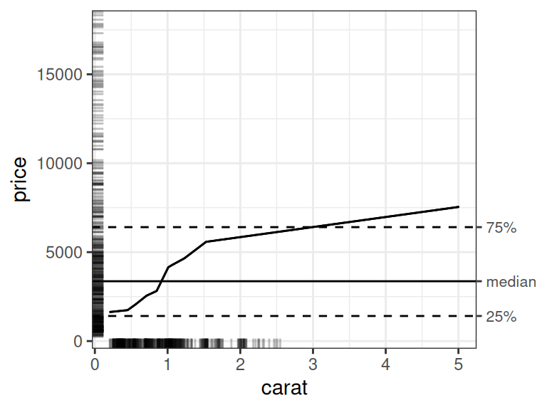
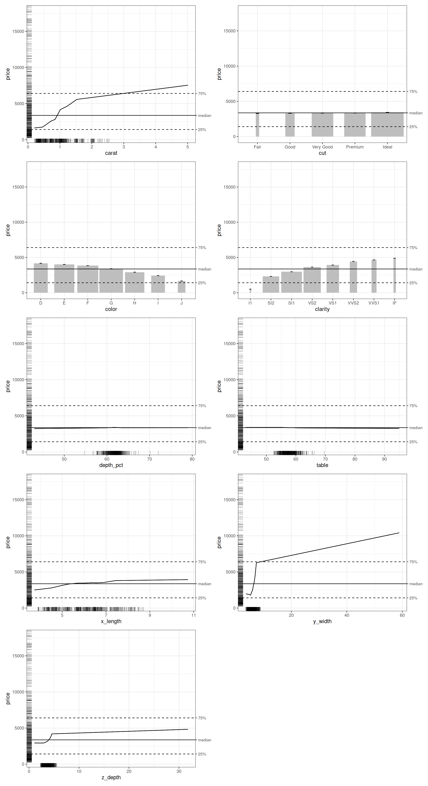
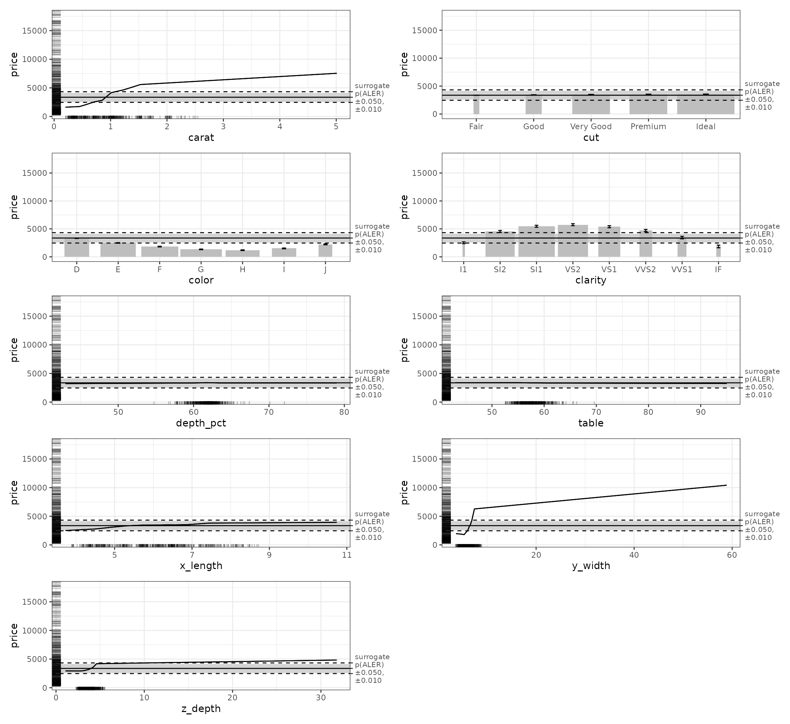
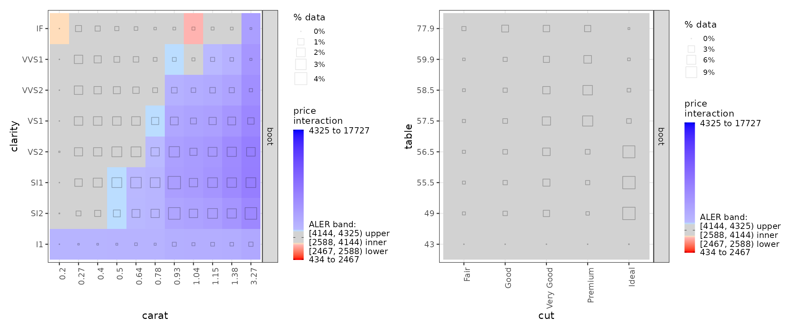
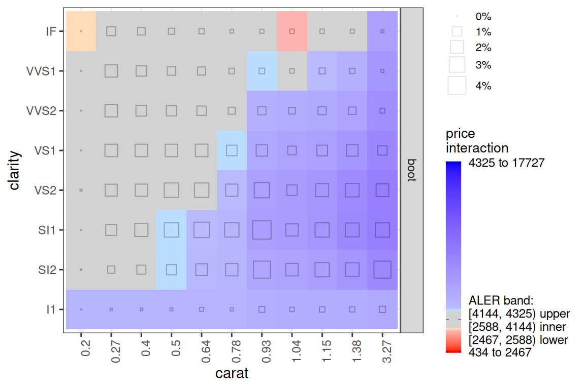
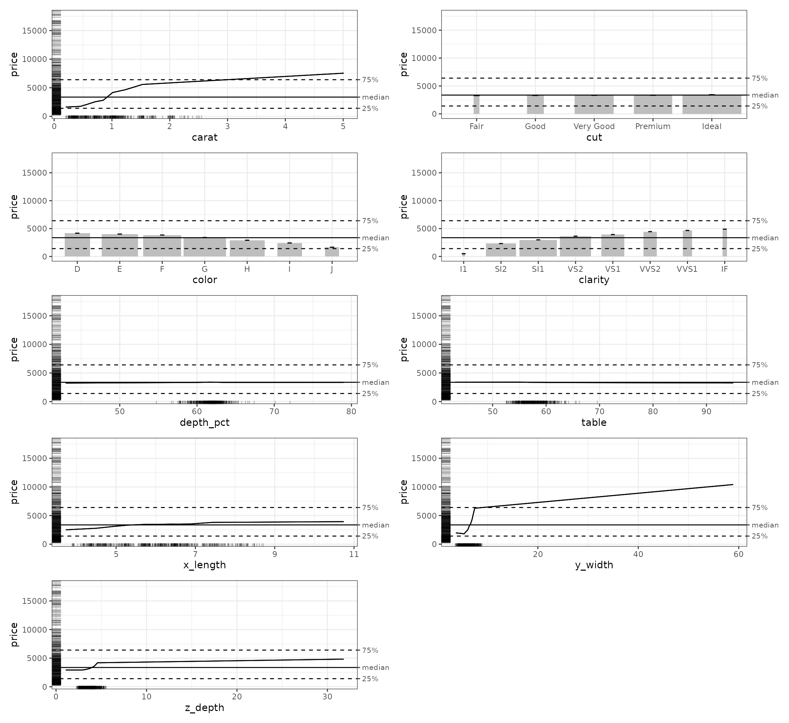

# Introduction to the ale package

Accumulated Local Effects (ALE) were initially developed as a
model-agnostic approach for global explanations of the results of
black-box machine learning algorithms (Apley, Daniel W., and Jingyu Zhu.
‘Visualizing the effects of predictor variables in black box supervised
learning models.’ Journal of the Royal Statistical Society Series B:
Statistical Methodology 82.4 (2020): 1059-1086
<doi:10.1111/rssb.12377>). ALE has at least two primary advantages over
other approaches like partial dependency plots (PDP) and SHapley
Additive exPlanations (SHAP): its values are not affected by the
presence of interactions among variables in a model and its computation
is relatively rapid. This package reimplements the original algorithm
from the [`{ALEPlot}`
package](https://CRAN.r-project.org/package=ALEPlot) and reimplements
the plotting of ALE values. It also extends the original ALE concept to
add bootstrap-based confidence intervals and ALE-based statistics that
can be used for statistical inference.

For more details, see Okoli, Chitu. 2023. “Statistical Inference Using
Machine Learning and Classical Techniques Based on Accumulated Local
Effects (ALE).” arXiv. <doi:10.48550/arXiv.2310.09877>.

This vignette demonstrates the basic functionality of the
[ale](https://github.com/tripartio/ale) package on standard large
datasets used for machine learning. A separate vignette is devoted to
its use on [small
datasets](https://tripartio.github.io/ale/articles/ale-small-datasets.md "ale package for small datasets"),
as is often the case with statistical inference. (How small is small?
That’s a tough question, but as that vignette explains, most datasets of
less than 2000 rows are probably “small” and even many datasets that are
more than 2000 rows are nonetheless “small”.) Other vignettes introduce
[ALE-based statistics for statistical
inference](https://tripartio.github.io/ale/articles/ale-statistics.md)
and show how the [ale](https://github.com/tripartio/ale) package handles
[various datatypes of input
variables](https://tripartio.github.io/ale/articles/ale-x-datatypes.md).

We begin by loading the necessary libraries.

``` r

library(ale)
#> 
#> Attaching package: 'ale'
#> The following object is masked from 'package:base':
#> 
#>     get
library(dplyr)
#> 
#> Attaching package: 'dplyr'
#> The following objects are masked from 'package:stats':
#> 
#>     filter, lag
#> The following objects are masked from 'package:base':
#> 
#>     intersect, setdiff, setequal, union
```

## diamonds dataset

For this introduction, we use the `diamonds` dataset, included with the
[ggplot2](https://ggplot2.tidyverse.org) graphics system. We cleaned the
original version by [removing
duplicates](https://lorentzen.ch/index.php/2021/04/16/a-curious-fact-on-the-diamonds-dataset/ "errors in the diamonds dataset")
and invalid entries where the length (x), width (y), or depth (z) is 0.

``` r

# Clean up some invalid entries
diamonds <- ggplot2::diamonds |> 
  filter(!(x == 0 | y == 0 | z == 0)) |> 
  # https://lorentzen.ch/index.php/2021/04/16/a-curious-fact-on-the-diamonds-dataset/
  distinct(
    price, carat, cut, color, clarity,
    .keep_all = TRUE
  ) |> 
  rename(
    x_length = x,
    y_width = y,
    z_depth = z,
    depth_pct = depth
  )

summary(diamonds)
#>      carat               cut        color       clarity       depth_pct    
#>  Min.   :0.2000   Fair     : 1492   D:4658   SI1    :9857   Min.   :43.00  
#>  1st Qu.:0.5200   Good     : 4173   E:6684   VS2    :8227   1st Qu.:61.00  
#>  Median :0.8500   Very Good: 9714   F:6998   SI2    :7916   Median :61.80  
#>  Mean   :0.9033   Premium  : 9657   G:7815   VS1    :6007   Mean   :61.74  
#>  3rd Qu.:1.1500   Ideal    :14703   H:6443   VVS2   :3463   3rd Qu.:62.60  
#>  Max.   :5.0100                     I:4556   VVS1   :2413   Max.   :79.00  
#>                                     J:2585   (Other):1856                  
#>      table           price          x_length         y_width      
#>  Min.   :43.00   Min.   :  326   Min.   : 3.730   Min.   : 3.680  
#>  1st Qu.:56.00   1st Qu.: 1410   1st Qu.: 5.160   1st Qu.: 5.170  
#>  Median :57.00   Median : 3365   Median : 6.040   Median : 6.040  
#>  Mean   :57.58   Mean   : 4686   Mean   : 6.009   Mean   : 6.012  
#>  3rd Qu.:59.00   3rd Qu.: 6406   3rd Qu.: 6.730   3rd Qu.: 6.720  
#>  Max.   :95.00   Max.   :18823   Max.   :10.740   Max.   :58.900  
#>                                                                   
#>     z_depth      
#>  Min.   : 1.070  
#>  1st Qu.: 3.190  
#>  Median : 3.740  
#>  Mean   : 3.711  
#>  3rd Qu.: 4.150  
#>  Max.   :31.800  
#> 
```

Here is the description of the modified dataset.

| Variable | Description |
|----|----|
| price | price in US dollars (\$326–\$18,823) |
| carat | weight of the diamond (0.2–5.01) |
| cut | quality of the cut (Fair, Good, Very Good, Premium, Ideal) |
| color | diamond color, from D (best) to J (worst) |
| clarity | a measurement of how clear the diamond is (I1 (worst), SI2, SI1, VS2, VS1, VVS2, VVS1, IF (best)) |
| x_length | length in mm (0–10.74) |
| y_width | width in mm (0–58.9) |
| z_depth | depth in mm (0–31.8) |
| depth_pct | total depth percentage = z / mean(x, y) = 2 \* z / (x + y) (43–79) |
| table | width of top of diamond relative to widest point (43–95) |

``` r

str(diamonds)
#> tibble [39,739 × 10] (S3: tbl_df/tbl/data.frame)
#>  $ carat    : num [1:39739] 0.23 0.21 0.23 0.29 0.31 0.24 0.24 0.26 0.22 0.23 ...
#>  $ cut      : Ord.factor w/ 5 levels "Fair"<"Good"<..: 5 4 2 4 2 3 3 3 1 3 ...
#>  $ color    : Ord.factor w/ 7 levels "D"<"E"<"F"<"G"<..: 2 2 2 6 7 7 6 5 2 5 ...
#>  $ clarity  : Ord.factor w/ 8 levels "I1"<"SI2"<"SI1"<..: 2 3 5 4 2 6 7 3 4 5 ...
#>  $ depth_pct: num [1:39739] 61.5 59.8 56.9 62.4 63.3 62.8 62.3 61.9 65.1 59.4 ...
#>  $ table    : num [1:39739] 55 61 65 58 58 57 57 55 61 61 ...
#>  $ price    : int [1:39739] 326 326 327 334 335 336 336 337 337 338 ...
#>  $ x_length : num [1:39739] 3.95 3.89 4.05 4.2 4.34 3.94 3.95 4.07 3.87 4 ...
#>  $ y_width  : num [1:39739] 3.98 3.84 4.07 4.23 4.35 3.96 3.98 4.11 3.78 4.05 ...
#>  $ z_depth  : num [1:39739] 2.43 2.31 2.31 2.63 2.75 2.48 2.47 2.53 2.49 2.39 ...
```

``` r

summary(diamonds$price)
#>    Min. 1st Qu.  Median    Mean 3rd Qu.    Max. 
#>     326    1410    3365    4686    6406   18823
```

Interpretable machine learning (IML) techniques like ALE should be
applied on the same dataset that was used to train the model. An
explanation is an explanation of a trained model and a trained model is
intrinsically linked to the dataset on which it is trained. (When a
dataset is too small to feasibly split into training and test sets, then
the ale package has tools to appropriately handle such [small
datasets](https://tripartio.github.io/ale/articles/ale-small-datasets.md "ale package for small datasets").

## Modelling with a random forest

ALE is a model-agnostic IML approach, that is, it works with any kind of
machine learning model. As such, [ale](https://github.com/tripartio/ale)
works with any R model with the only condition that it can predict
numeric outcomes (such as raw estimates for regression and probabilities
or odds ratios for classification). For this demonstration, we use a
random forest from the [ranger](https://imbs-hl.github.io/ranger/)
package. A random forest combines predictions from multiple decision
trees and can capture nonlinear effects and interactions. The examples
here will work with any statistical or machine learning algorithm that
produces numeric predictions.

We train a random forest to predict diamond prices:

``` r

rf_diamonds <- ranger::ranger(
  price ~ ., diamonds,  # train for IML on full dataset
  mtry = 7,  # number of variables per tree
  min.node.size = 4,  # minimum leaf (terminal node) size
  sample.fraction = 0.465,  # fraction of rows to sample
  # small forest still accurate for a large dataset; 10× faster than 500 trees
  num.trees = 50,
  seed = 0  # keep the random forest consistent
)
rf_diamonds
#> Ranger result
#> 
#> Call:
#>  ranger::ranger(price ~ ., diamonds, mtry = 7, min.node.size = 4,      sample.fraction = 0.465, num.trees = 50, seed = 0) 
#> 
#> Type:                             Regression 
#> Number of trees:                  50 
#> Sample size:                      39739 
#> Number of independent variables:  9 
#> Mtry:                             7 
#> Target node size:                 4 
#> Variable importance mode:         none 
#> Splitrule:                        variance 
#> OOB prediction error (MSE):       377454.3 
#> R squared (OOB):                  0.9785999
```

## Creating an `ALE` object

The core object in the [ale](https://github.com/tripartio/ale) package
is the [S7](https://rconsortium.github.io/S7/) `ALE` object. Its
`effect` property stores the ALE data and, optionally, ALE statistics
and bootstrap data for one or more outcome categories. The first
argument to the
[`ALE()`](https://tripartio.github.io/ale/reference/ALE.md) constructor
is a model object–any R model object that can generate numeric
predictions is acceptable. By default,
[`ALE()`](https://tripartio.github.io/ale/reference/ALE.md) calculates
1D (or “first-order”) ALE for every predictor in the model’s training
data. Ranger models do not retain their training data, so we supply
`data = diamonds` explicitly. The outcome column can be detected from
this model; for models where it cannot be detected, also supply `y_col`.

``` r

# For faster processing, set the number of CPU cores available. See help(ALE).
options(ale.parallel = 2)
```

For faster demonstrations, this vignette uses precreated ALE objects.
For the full experience, you can uncomment the relevant lines in the
code below.

``` r

# For speed, load pre-created objects from the current wip branch.
serialized_objects_site <- "https://github.com/tripartio/ale/raw/wip/download"
```

``` r

# To run the slow code yourself, uncomment and execute the following call.
# ale_rf_diamonds <- ALE(
#   rf_diamonds,
#   data = diamonds
# )

ale_rf_diamonds <- serialized_objects_site |>
  file.path("ale_rf_diamonds.0.5.3.rds") |>
  url() |>
  readRDS()

# Print a statistical summary of the ALE object
summary(ale_rf_diamonds)
```

    #> <ALE> object of a <ranger> model that predicts `price` (a numeric outcome) from a 39739-row by 10-column dataset.
    #> The results were not bootstrapped.
    #> 
    #> Mean ALE statistics [get(object, stats = "estimate")]:
    #> # A tibble: 9 × 9
    #>   term        aled aler_min  aler aler_max  naled naler_min naler naler_max
    #>   <chr>      <dbl>    <dbl> <dbl>    <dbl>  <dbl>     <dbl> <dbl>     <dbl>
    #> 1 carat     1333.   -1734.  5916.   4182.  14.2     -22.8   52.9     30.1  
    #> 2 cut         49.1    -80.0  146.     66.3  0.478    -0.788  1.41     0.626
    #> 3 color      588.   -1709.  2513.    804.   6.12    -22.3   29.8      7.45 
    #> 4 clarity    715.   -2866.  4400.   1534.   7.67    -47.6   62.4     14.8  
    #> 5 depth_pct   24.9   -134.   166.     31.2  0.247    -1.33   1.61     0.284
    #> 6 table       23.4   -113.   146.     32.4  0.235    -1.11   1.40     0.289
    #> 7 x_length   263.    -860.  1430.    569.   2.58     -9.65  14.9      5.21 
    #> 8 y_width   1472.   -1573.  8629.   7056.  14.5     -20.0   58.5     38.4  
    #> 9 z_depth    370.    -441.  1903.   1462.   3.58     -4.39  18.5     14.2  
    #> 
    #> ALE statistic distributions (no p-values requested) [get(object, stats = c("aled", "aler", "naled", "naler"))]:
    #> # A tibble: 36 × 7
    #>    statistic term      estimate conf.low     mean   median conf.high
    #>    <ord>     <chr>        <dbl>    <dbl>    <dbl>    <dbl>     <dbl>
    #>  1 aled      carat     1333.    1333.    1333.    1333.     1333.   
    #>  2 aled      cut         49.1     49.1     49.1     49.1      49.1  
    #>  3 aled      color      588.     588.     588.     588.      588.   
    #>  4 aled      clarity    715.     715.     715.     715.      715.   
    #>  5 aled      depth_pct   24.9     24.9     24.9     24.9      24.9  
    #>  6 aled      table       23.4     23.4     23.4     23.4      23.4  
    #>  7 aled      x_length   263.     263.     263.     263.      263.   
    #>  8 aled      y_width   1472.    1472.    1472.    1472.     1472.   
    #>  9 aled      z_depth    370.     370.     370.     370.      370.   
    #> 10 aler      carat     5916.    5916.    5916.    5916.     5916.   
    #> 11 aler      cut        146.     146.     146.     146.      146.   
    #> 12 aler      color     2513.    2513.    2513.    2513.     2513.   
    #> 13 aler      clarity   4400.    4400.    4400.    4400.     4400.   
    #> 14 aler      depth_pct  166.     166.     166.     166.      166.   
    #> 15 aler      table      146.     146.     146.     146.      146.   
    #> 16 aler      x_length  1430.    1430.    1430.    1430.     1430.   
    #> 17 aler      y_width   8629.    8629.    8629.    8629.     8629.   
    #> 18 aler      z_depth   1903.    1903.    1903.    1903.     1903.   
    #> 19 naled     carat       14.2     14.2     14.2     14.2      14.2  
    #> 20 naled     cut          0.478    0.478    0.478    0.478     0.478
    #> 21 naled     color        6.12     6.12     6.12     6.12      6.12 
    #> 22 naled     clarity      7.67     7.67     7.67     7.67      7.67 
    #> 23 naled     depth_pct    0.247    0.247    0.247    0.247     0.247
    #> 24 naled     table        0.235    0.235    0.235    0.235     0.235
    #> 25 naled     x_length     2.58     2.58     2.58     2.58      2.58 
    #> 26 naled     y_width     14.5     14.5     14.5     14.5      14.5  
    #> 27 naled     z_depth      3.58     3.58     3.58     3.58      3.58 
    #> 28 naler     carat       52.9     52.9     52.9     52.9      52.9  
    #> 29 naler     cut          1.41     1.41     1.41     1.41      1.41 
    #> 30 naler     color       29.8     29.8     29.8     29.8      29.8  
    #> 31 naler     clarity     62.4     62.4     62.4     62.4      62.4  
    #> 32 naler     depth_pct    1.61     1.61     1.61     1.61      1.61 
    #> 33 naler     table        1.40     1.40     1.40     1.40      1.40 
    #> 34 naler     x_length    14.9     14.9     14.9     14.9      14.9  
    #> 35 naler     y_width     58.5     58.5     58.5     58.5      58.5  
    #> 36 naler     z_depth     18.5     18.5     18.5     18.5      18.5  
    #> 
    #> Statistically significant confidence regions [get(object, stats = "conf_sig")]:
    #> ! Confidence regions are meaningless without p-values.
    #> ℹ The ALE statistics were calculated without p-values.
    #> # A tibble: 0 × 0

The [`summary()`](https://rdrr.io/r/base/summary.html) method reports
the model and data represented by the object, followed by its ALE
statistics and statistically significant confidence regions when
available. It returns the `ALE` object invisibly, so it is intended for
inspection rather than data extraction. The default constructor
calculates ALE statistics, although p-values and their confidence
regions are not calculated unless p-values are supplied or generated
during bootstrapping. See the [ALE statistics
vignette](https://tripartio.github.io/ale/articles/ale-statistics.md "ALE-based statistics")
for their interpretation.

Most core functions in the [ale](https://github.com/tripartio/ale)
package support parallel processing. You can enable parallelization
globally with `options(ale.parallel = x)`, where “x” is the number of
CPU cores you want to use. It can also be enabled for specific function
runs with the `parallel` argument. Parallelization is disabled by
default with `parallel = 0`. See the documentation for
[`ALE()`](https://tripartio.github.io/ale/reference/ALE.md) for details.

To access the plot for a specific variable, we must first create an
`ALEPlots` object by calling the
[`plot()`](https://rdrr.io/r/graphics/plot.default.html) method on the
`ALE` object which internally generates `ggplot` objects with the full
flexibility of {ggplot2}:

``` r

# Print a plot by entering its reference
diamonds_plots <- plot(ale_rf_diamonds)
```

To retrieve a specific variable plot, you can use the
[`get()`](https://tripartio.github.io/ale/reference/get.md) method of
the `ALEPlots` object. For example, to access and print the `carat` ALE
plot, we can simply refer to `get(diamonds_plots, 'carat')`:

``` r

# Print a plot by entering its reference
get(diamonds_plots, 'carat')
```



To display all the ALE plots in an `ALEPlots` object, we can simply call
its [`print()`](https://rdrr.io/r/base/print.html) or
[`plot()`](https://rdrr.io/r/graphics/plot.default.html) methods. Behind
the scenes, they use the
[patchwork](https://patchwork.data-imaginist.com) package to arrange
multiple plots in a common plot grid using
[`patchwork::wrap_plots()`](https://patchwork.data-imaginist.com/reference/wrap_plots.html),
so we can pass arguments from that function. For example, we can specify
that we want two plots per row with the `ncol` argument:

``` r

# Print all plots
plot(diamonds_plots, ncol = 2)
```



## Selecting variables and interactions

The `x_cols` argument controls the effects that
[`ALE()`](https://tripartio.github.io/ale/reference/ALE.md) calculates.
Its list syntax can request 1D effects, 2D interactions, or both in the
same object. For example, the following requests every 1D effect and
only the interaction between `carat` and `clarity`:

``` r

ALE(
  rf_diamonds,
  data = diamonds,
  x_cols = list(d1 = TRUE, d2 = "carat:clarity")
)
```

Formula syntax is convenient when selecting particular effects. Terms on
their own request 1D ALE, while terms joined by `:` request 2D ALE:

``` r

ALE(
  rf_diamonds,
  data = diamonds,
  x_cols = ~ carat + cut + clarity + carat:clarity + cut:table
)
```

These formats can be combined with other selection options. See
[`help(resolve_x_cols)`](https://tripartio.github.io/ale/reference/resolve_x_cols.md)
for the complete set of formats, including ways to request all
interactions involving a particular variable and to exclude variables.

## Bootstrapped ALE

One of the key features of the ALE package is bootstrapping of the ALE
results to ensure that the results are reliable, that is, generalizable
to data beyond the sample on which the model was trained. As mentioned
above, this assumes that IML analysis is carried out on a model whose
hyperparameters were determined by cross-validation. When samples are
too small for cross-validation, we provide a different approach by
bootstrapping the entire model with a `ModelBoot` object, explained in
the vignette for [small
datasets](https://tripartio.github.io/ale/articles/ale-small-datasets.md "ale package for small datasets").

Although ALE is faster than most other IML techniques for global
explanation such as partial dependence plots (PDP) and SHAP, it still
requires some time to run. Bootstrapping multiplies much of that time by
the number of bootstrap iterations.

We create bootstrapped ALE data and plots using the `boot_it` argument.
ALE is a relatively stable IML algorithm (compared to others like PDP),
so 100 bootstrap samples should be sufficient for relatively stable
results, especially for model development. Final results could be
confirmed with 1000 bootstrap samples or more, but there should not be
much difference in the results beyond 100 iterations.

``` r

# To run the slow code yourself, uncomment and execute the following call.
# ale_rf_diamonds_boot <- ALE(
#   rf_diamonds,
#   data = diamonds,
#   # Request all 1D effects and two specific 2D interactions.
#   x_cols = list(d1 = TRUE, d2 = c("carat:clarity", "cut:table")),
#   boot_it = 100
# )

ale_rf_diamonds_boot <- serialized_objects_site |>
  file.path("ale_rf_diamonds_boot.0.5.3.rds") |>
  url() |>
  readRDS()

# Bootstrapping produces confidence intervals for the 1D effects
plot(ale_rf_diamonds_boot) |>
  subset(list(d1 = TRUE)) |>
  print(ncol = 2)
```



Compare the bootstrapped confidence intervals with the single
(non-bootstrapped) ALE curves above. The intervals show how much the
estimated effects vary when the training data are resampled while
keeping the fitted forest fixed. Use the bootstrapped results to assess
the reliability of the patterns rather than relying on a single curve.

By default, requesting bootstrapping while retaining ALE statistics also
asks [`ALE()`](https://tripartio.github.io/ale/reference/ALE.md) to
generate fast surrogate p-values. These are useful for exploratory
analysis but should not be used for definitive or published conclusions.
See
[`help(ALEpDist)`](https://tripartio.github.io/ale/reference/ALEpDist.md)
and the [ALE statistics
vignette](https://tripartio.github.io/ale/articles/ale-statistics.md)
for more rigorous options.

## ALE interactions

Another advantage of ALE is that it provides data for 2D interactions
between variables. Because the bootstrapped object contains the selected
`carat:clarity` and `cut:table` interactions as well as all 1D effects,
the same `ALEPlots` object provides both kinds of plots. We can use
[`subset()`](https://rdrr.io/r/base/subset.html) to select just the
interactions for a separate grid:

``` r

ale_rf_diamonds_boot |>
  plot() |>
  subset(list(d2 = TRUE)) |>
  print(ncol = 2)
```



The [`get()`](https://tripartio.github.io/ale/reference/get.md) method
accepts either a character term or standard R formula notation:

``` r

ale_rf_diamonds_boot |>
  plot() |>
  get("carat:clarity")
```



The interaction plot shows the joint effect beyond the separate 1D
effects. Grey values fall in the middle range of ALE values; colours
away from grey indicate an additional joint effect. The sizes of the
squares indicate the relative percentage of actual data in each
interaction intersection, helping us assess where the data support the
estimated interaction.

Note that ALE interactions are very particular: an ALE interaction means
that two variables have a composite effect over and above their separate
independent effects. Two predictors can each have strong one-way effects
without their combination having an additional interaction effect.

## Custom prediction functions

[`ALE()`](https://tripartio.github.io/ale/reference/ALE.md) normally
calls a model’s prediction method and handles ranger’s prediction format
automatically. To demonstrate a custom `pred_fun`, we explicitly call
ranger’s prediction method and extract its numeric predictions. The
function must accept `object`, `newdata`, and `type`, and return a
numeric vector or matrix. Explicitly invoking ranger’s method also makes
this custom function available during parallel processing:

``` r

custom_predict <- function(object, newdata, type = 'response') {
  ranger:::predict.ranger( # must explicitly invoke ranger for parallelization to work
    object = object,
    data = newdata,
    type = type
  )$predictions
}

# To run the slow code yourself, uncomment and execute the following call.
# ale_rf_diamonds_custom <- ALE(
#   rf_diamonds,
#   data = diamonds,
#   pred_fun = custom_predict
# )

ale_rf_diamonds_custom <- serialized_objects_site |>
  file.path("ale_rf_diamonds_custom.0.5.3.rds") |>
  url() |>
  readRDS()

plot(ale_rf_diamonds_custom) |>
  print(ncol = 2)
```



A custom function is especially useful for model classes whose
prediction method has a non-standard signature or returns a structured
object.

## Retrieving ALE data and statistics

Plots are useful for interpretation, but the
[`get()`](https://tripartio.github.io/ale/reference/get.md) method
retrieves the underlying data for further analysis. To demonstrate all
of its principal outputs, we create a smaller selection of 1D and 2D
effects, run ten bootstrap iterations, and retain the
otherwise-discarded iteration-level data with `output_boot_data = TRUE`:

``` r

# To run the slow code yourself, uncomment and execute the following call.
# ale_diamonds_with_boot_data <- ALE(
#   rf_diamonds,
#   data = diamonds,
#   x_cols = ~ carat + cut + clarity + carat:clarity + cut:table,
#   output_boot_data = TRUE,
#   boot_it = 10
# )

ale_diamonds_with_boot_data <- serialized_objects_site |>
  file.path("ale_rf_diamonds_with_boot_data.0.5.3.rds") |>
  url() |>
  readRDS()
```

By default, [`get()`](https://tripartio.github.io/ale/reference/get.md)
returns ALE data. A formula can limit the result to selected 1D and 2D
terms:

``` r

get(ale_diamonds_with_boot_data, ~ carat + cut:table)
#> $d1
#> $d1$carat
#> # A tibble: 11 × 7
#>    carat.ceil    .n    .y .y_lo .y_mean .y_median .y_hi
#>         <dbl> <int> <dbl> <dbl>   <dbl>     <dbl> <dbl>
#>  1       0.2      7 1631. 1631.   1631.     1631. 1631.
#>  2       0.34  4038 1691. 1689.   1691.     1691. 1694.
#>  3       0.45  3940 1739. 1736.   1739.     1739. 1742.
#>  4       0.56  4214 2063. 2059.   2063.     2063. 2068.
#>  5       0.71  4410 2549. 2545.   2549.     2549. 2553.
#>  6       0.85  3315 2818. 2812.   2818.     2818. 2824.
#>  7       1.01  5489 4145. 4129.   4145.     4146. 4159.
#>  8       1.07  2681 4290. 4275.   4290.     4295. 4307.
#>  9       1.23  3916 4647. 4628.   4647.     4649. 4667.
#> 10       1.53  3832 5578. 5560.   5578.     5579. 5595.
#> 11       5.01  3897 7546. 7526.   7546.     7547. 7570.
#> 
#> 
#> $d2
#> $d2$`cut:table`
#> # A tibble: 40 × 8
#>    cut.bin   table.ceil    .n    .y .y_lo .y_mean .y_median .y_hi
#>    <ord>          <dbl> <int> <dbl> <dbl>   <dbl>     <dbl> <dbl>
#>  1 Fair              43     0 3361. 3361.   3361.     3361. 3361.
#>  2 Good              43     0 3362. 3362.   3362.     3362. 3362.
#>  3 Very Good         43     0 3365. 3365.   3365.     3365. 3365.
#>  4 Premium           43     0 3366. 3366.   3366.     3366. 3366.
#>  5 Ideal             43     1 3364. 3364.   3364.     3364. 3364.
#>  6 Fair              55   200 3362. 3359.   3362.     3362. 3366.
#>  7 Good              55   490 3366. 3362.   3366.     3367. 3370.
#>  8 Very Good         55  1106 3371. 3365.   3371.     3372. 3375.
#>  9 Premium           55   266 3375. 3367.   3375.     3376. 3378.
#> 10 Ideal             55  4669 3375. 3368.   3375.     3375. 3378.
#> # ℹ 30 more rows
```

Because this object was constructed with `output_boot_data = TRUE`, the
raw results from individual bootstrap iterations are also available:

``` r

get(ale_diamonds_with_boot_data, what = "boot_data")
#> $d1
#> $d1$carat
#> # A tibble: 121 × 6
#>      .it carat .y_composite    .n .y_distinct    .y
#>    <dbl> <dbl>        <dbl> <dbl>       <dbl> <dbl>
#>  1     0  0.2         1631.     7       1631. 1631.
#>  2     0  0.34        1691.  4038       1691. 1691.
#>  3     0  0.45        1739.  3940       1739. 1739.
#>  4     0  0.56        2064.  4214       2064. 2064.
#>  5     0  0.71        2550.  4410       2550. 2550.
#>  6     0  0.85        2820.  3315       2820. 2820.
#>  7     0  1.01        4152.  5489       4152. 4152.
#>  8     0  1.07        4295.  2681       4295. 4295.
#>  9     0  1.23        4650.  3916       4650. 4650.
#> 10     0  1.53        5581.  3832       5581. 5581.
#> # ℹ 111 more rows
#> 
#> $d1$cut
#> # A tibble: 55 × 6
#>      .it cut       .y_composite    .n .y_distinct    .y
#>    <dbl> <fct>            <dbl> <dbl>       <dbl> <dbl>
#>  1     0 Fair             3285.  1492       3285. 3285.
#>  2     0 Good             3304.  4173       3304. 3304.
#>  3     0 Very Good        3331.  9714       3331. 3331.
#>  4     0 Premium          3337.  9657       3337. 3337.
#>  5     0 Ideal            3431. 14703       3431. 3431.
#>  6     1 Fair             3360.  1492       3360. 3360.
#>  7     1 Good             3441.  4173       3441. 3441.
#>  8     1 Very Good        3503.  9714       3503. 3503.
#>  9     1 Premium          3540.  9657       3540. 3540.
#> 10     1 Ideal            3565. 14703       3565. 3565.
#> # ℹ 45 more rows
#> 
#> $d1$clarity
#> # A tibble: 88 × 6
#>      .it clarity .y_composite    .n .y_distinct    .y
#>    <dbl> <fct>          <dbl> <dbl>       <dbl> <dbl>
#>  1     0 I1              499.   704        499.  499.
#>  2     0 SI2            2313.  7916       2313. 2313.
#>  3     0 SI1            2974.  9857       2974. 2974.
#>  4     0 VS2            3632.  8227       3632. 3632.
#>  5     0 VS1            3927.  6007       3927. 3927.
#>  6     0 VVS2           4443.  3463       4443. 4443.
#>  7     0 VVS1           4660.  2413       4660. 4660.
#>  8     0 IF             4899.  1152       4899. 4899.
#>  9     1 I1             2483.   704       2483. 2483.
#> 10     1 SI2            4560.  7916       4560. 4560.
#> # ℹ 78 more rows
#> 
#> 
#> $d2
#> $d2$`carat:clarity`
#> # A tibble: 968 × 7
#>      .it carat clarity .y_composite    .n .y_distinct    .y
#>    <dbl> <dbl> <fct>          <dbl> <dbl>       <dbl> <dbl>
#>  1     0  0.2  I1             4911.     0       4911. 4911.
#>  2     0  0.34 I1             4911.    10       4824. 4824.
#>  3     0  0.45 I1             4911.    14       4736. 4736.
#>  4     0  0.56 I1             4911.    21       4545. 4545.
#>  5     0  0.71 I1             4911.    50       4295. 4295.
#>  6     0  0.85 I1             4911.    27       4130. 4130.
#>  7     0  1.01 I1             4911.   136       3237. 3237.
#>  8     0  1.07 I1             4911.    70       3125. 3125.
#>  9     0  1.23 I1             4911.   114       2811. 2811.
#> 10     0  1.53 I1             4911.   102       2226. 2226.
#> # ℹ 958 more rows
#> 
#> $d2$`cut:table`
#> # A tibble: 440 × 7
#>      .it cut       table .y_composite    .n .y_distinct    .y
#>    <dbl> <fct>     <dbl>        <dbl> <dbl>       <dbl> <dbl>
#>  1     0 Fair         43        3361.     0       3361. 3361.
#>  2     0 Good         43        3361.     0       3362. 3362.
#>  3     0 Very Good    43        3361.     0       3365. 3365.
#>  4     0 Premium      43        3361.     0       3366. 3366.
#>  5     0 Ideal        43        3361.     1       3364. 3364.
#>  6     0 Fair         55        3361.   200       3360. 3360.
#>  7     0 Good         55        3361.   490       3361. 3361.
#>  8     0 Very Good    55        3361.  1106       3364. 3364.
#>  9     0 Premium      55        3361.   266       3365. 3365.
#> 10     0 Ideal        55        3364.  4669       3366. 3366.
#> # ℹ 430 more rows
```

The `stats` argument retrieves different summaries of the effects:

``` r

# Estimates for every available statistic
get(ale_diamonds_with_boot_data, stats = "estimate")
#> $d1
#> # A tibble: 3 × 9
#>   term     aled aler_min  aler aler_max naled naler_min naler naler_max
#>   <chr>   <dbl>    <dbl> <dbl>    <dbl> <dbl>     <dbl> <dbl>     <dbl>
#> 1 carat   1330. -1734.   5915.    4181. 14.2   -22.8    52.9      30.1 
#> 2 cut      160.    -1.06  203.     202.  1.42   -0.0143  1.79      1.77
#> 3 clarity 1741. -1505.   3891.    2386. 16.3   -19.0    40.3      21.3 
#> 
#> $d2
#> # A tibble: 2 × 9
#>   term          aled aler_min   aler aler_max   naled naler_min  naler naler_max
#>   <chr>        <dbl>    <dbl>  <dbl>    <dbl>   <dbl>     <dbl>  <dbl>     <dbl>
#> 1 carat:clar… 1.80e3  -1171.  6524.    5353.  14.5      -14.2   48.2      33.9  
#> 2 cut:table   8.56e0    -18.7   32.7     14.1  0.0914    -0.210  0.344     0.135

# Complete results for selected statistics
get(ale_diamonds_with_boot_data, stats = c("aled", "naler"))
#> $d1
#> # A tibble: 6 × 8
#>   statistic estimate p.value term    conf.low    mean  median conf.high
#>   <chr>        <dbl>   <dbl> <chr>      <dbl>   <dbl>   <dbl>     <dbl>
#> 1 aled       1330.      0    carat    1323.   1330.   1330.     1339.  
#> 2 naler        52.9     0    carat      52.9    52.9    52.9      53.0 
#> 3 aled        160.      0    cut       156.    160.    160.      164.  
#> 4 naler         1.79    0.77 cut         1.75    1.79    1.79      1.83
#> 5 aled       1741.      0    clarity  1600.   1741.   1737.     1868.  
#> 6 naler        40.3     0    clarity    39.1    40.3    39.9      42.4 
#> 
#> $d2
#> # A tibble: 4 × 8
#>   statistic estimate p.value term          conf.low     mean   median conf.high
#>   <chr>        <dbl>   <dbl> <chr>            <dbl>    <dbl>    <dbl>     <dbl>
#> 1 aled      1797.       0    carat:clarity 1748.    1797.    1803.     1846.   
#> 2 naler       48.2      0    carat:clarity   45.8     48.2     48.1      49.8  
#> 3 aled         8.56     0.88 cut:table        5.76     8.56     8.48     12.9  
#> 4 naler        0.344    0.95 cut:table        0.277    0.344    0.367     0.396

# Complete results for all available statistics
get(ale_diamonds_with_boot_data, stats = "all")
#> $d1
#> # A tibble: 24 × 8
#>    statistic estimate p.value term  conf.low     mean   median conf.high
#>    <chr>        <dbl>   <dbl> <chr>    <dbl>    <dbl>    <dbl>     <dbl>
#>  1 aled       1330.      0    carat  1323.    1330.    1330.     1339.  
#>  2 aler_min  -1734.      0    carat -1734.   -1734.   -1734.    -1734.  
#>  3 aler       5915.      0    carat  5895.    5915.    5913.     5939.  
#>  4 aler_max   4181.      0    carat  4161.    4181.    4179.     4205.  
#>  5 naled        14.2     0    carat    14.2     14.2     14.2      14.3 
#>  6 naler_min   -22.8     0    carat   -22.8    -22.8    -22.8     -22.8 
#>  7 naler        52.9     0    carat    52.9     52.9     52.9      53.0 
#>  8 naler_max    30.1     0    carat    30.1     30.1     30.1      30.2 
#>  9 aled        160.      0    cut     156.     160.     160.      164.  
#> 10 aler_min     -1.06    0.99 cut      -6.27    -1.06    -1.14      2.94
#> # ℹ 14 more rows
#> 
#> $d2
#> # A tibble: 16 × 8
#>    statistic   estimate p.value term        conf.low     mean   median conf.high
#>    <chr>          <dbl>   <dbl> <chr>          <dbl>    <dbl>    <dbl>     <dbl>
#>  1 aled       1797.        0    carat:clar…  1.75e+3  1.80e+3  1.80e+3  1846.   
#>  2 aler_min  -1171.        0    carat:clar… -1.31e+3 -1.17e+3 -1.16e+3 -1000.   
#>  3 aler       6524.        0    carat:clar…  6.39e+3  6.52e+3  6.53e+3  6643.   
#>  4 aler_max   5353.        0    carat:clar…  5.24e+3  5.35e+3  5.35e+3  5474.   
#>  5 naled        14.5       0    carat:clar…  1.42e+1  1.45e+1  1.45e+1    14.8  
#>  6 naler_min   -14.2       0    carat:clar… -1.62e+1 -1.42e+1 -1.42e+1   -11.7  
#>  7 naler        48.2       0    carat:clar…  4.58e+1  4.82e+1  4.81e+1    49.8  
#>  8 naler_max    33.9       0    carat:clar…  3.36e+1  3.39e+1  3.39e+1    34.3  
#>  9 aled          8.56      0.88 cut:table    5.76e+0  8.56e+0  8.48e+0    12.9  
#> 10 aler_min    -18.7       0.95 cut:table   -2.60e+1 -1.87e+1 -1.96e+1   -11.5  
#> 11 aler         32.7       0.96 cut:table    2.52e+1  3.27e+1  3.50e+1    38.8  
#> 12 aler_max     14.1       0.97 cut:table    1.07e+1  1.41e+1  1.41e+1    16.9  
#> 13 naled         0.0914    0.87 cut:table    6.11e-2  9.14e-2  8.95e-2     0.138
#> 14 naler_min    -0.210     0.95 cut:table   -2.77e-1 -2.10e-1 -2.21e-1    -0.138
#> 15 naler         0.344     0.95 cut:table    2.77e-1  3.44e-1  3.67e-1     0.396
#> 16 naler_max     0.135     0.94 cut:table    9.54e-2  1.35e-1  1.38e-1     0.156

# All confidence regions, or only statistically significant regions
get(ale_diamonds_with_boot_data, stats = "conf_regions")
#> ! Note that confidence regions are not reliable with fewer than 100 bootstrap
#>   iterations or p-values based on fewer than 100 random iterations.
#> ℹ There are 10 bootstrap iterations.
#> ℹ p-values are based on 100 iterations.
#> $d1
#> # A tibble: 16 × 12
#>    term    x     start_x end_x x_span_pct     n   pct     y start_y end_y  trend
#>    <chr>   <chr>   <dbl> <dbl>      <dbl> <int> <dbl> <dbl>   <dbl> <dbl>  <dbl>
#>  1 carat   NA       0.2   0.71      10.6  16609 41.8    NA    1631. 2549.  0.501
#>  2 carat   NA       0.85  1.01       3.33  8804 22.2    NA    2818. 4145.  2.31 
#>  3 carat   NA       1.07  5.01      81.9  14326 36.1    NA    4290. 7546.  0.230
#>  4 cut     Fair    NA    NA         NA     1492  3.75 3357.     NA    NA  NA    
#>  5 cut     Good    NA    NA         NA     4173 10.5  3430.     NA    NA  NA    
#>  6 cut     Very…   NA    NA         NA     9714 24.4  3489.     NA    NA  NA    
#>  7 cut     Prem…   NA    NA         NA     9657 24.3  3522.     NA    NA  NA    
#>  8 cut     Ideal   NA    NA         NA    14703 37.0  3555.     NA    NA  NA    
#>  9 clarity I1      NA    NA         NA      704  1.77 2342.     NA    NA  NA    
#> 10 clarity SI2     NA    NA         NA     7916 19.9  4347.     NA    NA  NA    
#> 11 clarity SI1     NA    NA         NA     9857 24.8  5241.     NA    NA  NA    
#> 12 clarity VS2     NA    NA         NA     8227 20.7  5558.     NA    NA  NA    
#> 13 clarity VS1     NA    NA         NA     6007 15.1  5259.     NA    NA  NA    
#> 14 clarity VVS2    NA    NA         NA     3463  8.71 4696.     NA    NA  NA    
#> 15 clarity VVS1    NA    NA         NA     2413  6.07 3547.     NA    NA  NA    
#> 16 clarity IF      NA    NA         NA     1152  2.90 2136.     NA    NA  NA    
#> # ℹ 1 more variable: aler_band <ord>
#> 
#> $d2
#> # A tibble: 47 × 8
#>    term1 x1          term2   x2    aler_band     n    pct     y
#>    <chr> <chr>       <chr>   <chr> <ord>     <int>  <dbl> <dbl>
#>  1 carat [0.2,0.71]  clarity I1    above        95 0.239  4901.
#>  2 carat (0.71,1.07] clarity I1    above        27 0.0679 4899.
#>  3 carat (0.71,1.07] clarity I1    overlap     206 0.518  5001.
#>  4 carat (1.07,5.01] clarity I1    overlap     376 0.946  5140.
#>  5 carat [0.2,0.71]  clarity SI2   overlap    1697 4.27   4088.
#>  6 carat (0.71,1.07] clarity SI2   overlap    2894 7.28   5457.
#>  7 carat (1.07,5.01] clarity SI2   overlap    1881 4.73   6631.
#>  8 carat (1.07,5.01] clarity SI2   above      1444 3.63   7921.
#>  9 carat [0.2,0.71]  clarity SI1   overlap    3572 8.99   4023.
#> 10 carat (0.71,1.07] clarity SI1   overlap     994 2.50   4635.
#> # ℹ 37 more rows
get(ale_diamonds_with_boot_data, stats = "conf_sig")
#> ! Note that confidence regions are not reliable with fewer than 100 bootstrap
#>   iterations or p-values based on fewer than 100 random iterations.
#> ℹ There are 10 bootstrap iterations.
#> ℹ p-values are based on 100 iterations.
#> $d1
#> # A tibble: 11 × 12
#>    term    x     start_x end_x x_span_pct     n   pct     y start_y end_y  trend
#>    <chr>   <chr>   <dbl> <dbl>      <dbl> <int> <dbl> <dbl>   <dbl> <dbl>  <dbl>
#>  1 carat   NA       0.2   0.71      10.6  16609 41.8    NA    1631. 2549.  0.501
#>  2 carat   NA       0.85  1.01       3.33  8804 22.2    NA    2818. 4145.  2.31 
#>  3 carat   NA       1.07  5.01      81.9  14326 36.1    NA    4290. 7546.  0.230
#>  4 clarity I1      NA    NA         NA      704  1.77 2342.     NA    NA  NA    
#>  5 clarity SI2     NA    NA         NA     7916 19.9  4347.     NA    NA  NA    
#>  6 clarity SI1     NA    NA         NA     9857 24.8  5241.     NA    NA  NA    
#>  7 clarity VS2     NA    NA         NA     8227 20.7  5558.     NA    NA  NA    
#>  8 clarity VS1     NA    NA         NA     6007 15.1  5259.     NA    NA  NA    
#>  9 clarity VVS2    NA    NA         NA     3463  8.71 4696.     NA    NA  NA    
#> 10 clarity VVS1    NA    NA         NA     2413  6.07 3547.     NA    NA  NA    
#> 11 clarity IF      NA    NA         NA     1152  2.90 2136.     NA    NA  NA    
#> # ℹ 1 more variable: aler_band <ord>
#> 
#> $d2
#> # A tibble: 32 × 8
#>    term1 x1          term2   x2    aler_band     n    pct     y
#>    <chr> <chr>       <chr>   <chr> <ord>     <int>  <dbl> <dbl>
#>  1 carat [0.2,0.71]  clarity I1    above        95 0.239  4901.
#>  2 carat (0.71,1.07] clarity I1    above        27 0.0679 4899.
#>  3 carat (0.71,1.07] clarity I1    overlap     206 0.518  5001.
#>  4 carat (1.07,5.01] clarity I1    overlap     376 0.946  5140.
#>  5 carat [0.2,0.71]  clarity SI2   overlap    1697 4.27   4088.
#>  6 carat (0.71,1.07] clarity SI2   overlap    2894 7.28   5457.
#>  7 carat (1.07,5.01] clarity SI2   overlap    1881 4.73   6631.
#>  8 carat (1.07,5.01] clarity SI2   above      1444 3.63   7921.
#>  9 carat [0.2,0.71]  clarity SI1   overlap    3572 8.99   4023.
#> 10 carat (0.71,1.07] clarity SI1   overlap     994 2.50   4635.
#> # ℹ 22 more rows
```

These calls return data rather than plots: `"estimate"` provides a
compact overview, named statistics return their estimates and
inferential details, and the confidence-region options identify portions
of an ALE curve or surface that exceed the relevant threshold. See
[`help("get-ALE-method")`](https://tripartio.github.io/ale/reference/get-ALE-method.md)
for the precise return structures and the [ALE statistics
vignette](https://tripartio.github.io/ale/articles/ale-statistics.md)
before drawing inferential conclusions.

## Where to go next

This introduction has covered the main
[`ALE()`](https://tripartio.github.io/ale/reference/ALE.md) workflow:
default effects, selected 1D and 2D terms, bootstrapping, custom
prediction functions, plotting, and data extraction. The other vignettes
cover [ALE-based statistical
inference](https://tripartio.github.io/ale/articles/ale-statistics.md),
[different predictor
datatypes](https://tripartio.github.io/ale/articles/ale-x-datatypes.md),
and [small datasets and full-model
bootstrapping](https://tripartio.github.io/ale/articles/ale-small-datasets.md).
For exhaustive argument and selection details, see
[`help(ALE)`](https://tripartio.github.io/ale/reference/ALE.md),
[`help(resolve_x_cols)`](https://tripartio.github.io/ale/reference/resolve_x_cols.md),
and
[`help("get-ALE-method")`](https://tripartio.github.io/ale/reference/get-ALE-method.md).
