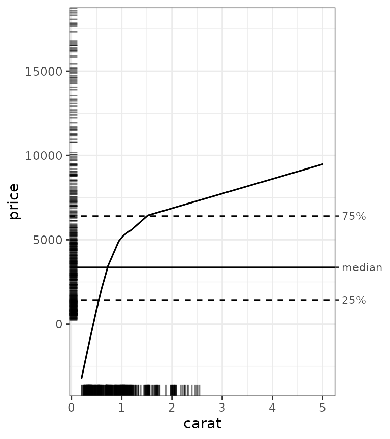
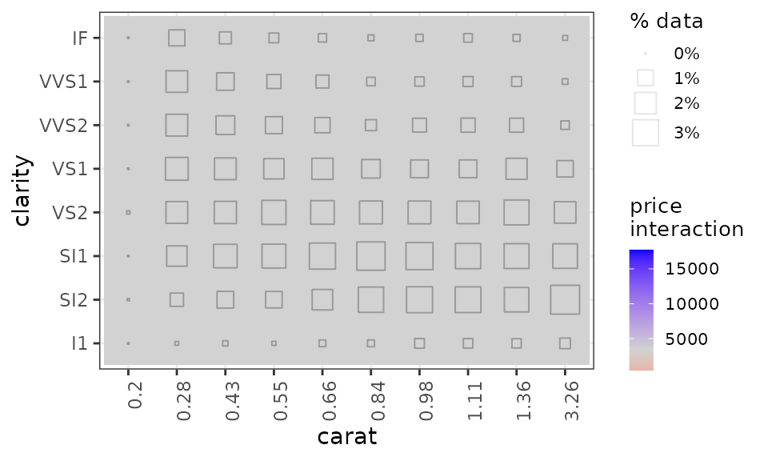

# Introduction to the ale package

Accumulated Local Effects (ALE) were initially developed as a
model-agnostic approach for global explanations of the results of
black-box machine learning algorithms (Apley, Daniel W., and Jingyu Zhu.
‘Visualizing the effects of predictor variables in black box supervised
learning models.’ Journal of the Royal Statistical Society Series B:
Statistical Methodology 82.4 (2020): 1059-1086
<doi:10.1111/rssb.12377>). ALE has at least two primary advantages over
other approaches like partial dependency plots (PDP) and SHapley
Additive exPlanations (SHAP): its values are not affected by the
presence of interactions among variables in a model and its computation
is relatively rapid. This package reimplements the original algorithm
from the [`{ALEPlot}`
package](https://CRAN.r-project.org/package=ALEPlot) and reimplements
the plotting of ALE values. It also extends the original ALE concept to
add bootstrap-based confidence intervals and ALE-based statistics that
can be used for statistical inference.

For more details, see Okoli, Chitu. 2023. “Statistical Inference Using
Machine Learning and Classical Techniques Based on Accumulated Local
Effects (ALE).” arXiv. <doi:10.48550/arXiv.2310.09877>.

This vignette demonstrates the basic functionality of the
[ale](https://github.com/tripartio/ale) package on standard large
datasets used for machine learning. A separate vignette is devoted to
its use on [small
datasets](https://tripartio.github.io/ale/articles/ale-small-datasets.md "ale package for small datasets"),
as is often the case with statistical inference. (How small is small?
That’s a tough question, but as that vignette explains, most datasets of
less than 2000 rows are probably “small” and even many datasets that are
more than 2000 rows are nonetheless “small”.) Other vignettes introduce
[ALE-based statistics for statistical
inference](https://tripartio.github.io/ale/articles/ale-statistics.md)
and show how the [ale](https://github.com/tripartio/ale) package handles
[various datatypes of input
variables](https://tripartio.github.io/ale/articles/ale-x-datatypes.md).

We begin by loading the necessary libraries.

``` r
library(ale)
#> 
#> Attaching package: 'ale'
#> The following object is masked from 'package:base':
#> 
#>     get
library(dplyr)
#> 
#> Attaching package: 'dplyr'
#> The following objects are masked from 'package:stats':
#> 
#>     filter, lag
#> The following objects are masked from 'package:base':
#> 
#>     intersect, setdiff, setequal, union
```

## diamonds dataset

For this introduction, we use the `diamonds` dataset, included with the
[ggplot2](https://ggplot2.tidyverse.org) graphics system. We cleaned the
original version by [removing
duplicates](https://lorentzen.ch/index.php/2021/04/16/a-curious-fact-on-the-diamonds-dataset/ "errors in the diamonds dataset")
and invalid entries where the length (x), width (y), or depth (z) is 0.

``` r
# Clean up some invalid entries
diamonds <- ggplot2::diamonds |> 
  filter(!(x == 0 | y == 0 | z == 0)) |> 
  # https://lorentzen.ch/index.php/2021/04/16/a-curious-fact-on-the-diamonds-dataset/
  distinct(
    price, carat, cut, color, clarity,
    .keep_all = TRUE
  ) |> 
  rename(
    x_length = x,
    y_width = y,
    z_depth = z,
    depth_pct = depth
  )

summary(diamonds)
#>      carat               cut        color       clarity       depth_pct    
#>  Min.   :0.2000   Fair     : 1492   D:4658   SI1    :9857   Min.   :43.00  
#>  1st Qu.:0.5200   Good     : 4173   E:6684   VS2    :8227   1st Qu.:61.00  
#>  Median :0.8500   Very Good: 9714   F:6998   SI2    :7916   Median :61.80  
#>  Mean   :0.9033   Premium  : 9657   G:7815   VS1    :6007   Mean   :61.74  
#>  3rd Qu.:1.1500   Ideal    :14703   H:6443   VVS2   :3463   3rd Qu.:62.60  
#>  Max.   :5.0100                     I:4556   VVS1   :2413   Max.   :79.00  
#>                                     J:2585   (Other):1856                  
#>      table           price          x_length         y_width      
#>  Min.   :43.00   Min.   :  326   Min.   : 3.730   Min.   : 3.680  
#>  1st Qu.:56.00   1st Qu.: 1410   1st Qu.: 5.160   1st Qu.: 5.170  
#>  Median :57.00   Median : 3365   Median : 6.040   Median : 6.040  
#>  Mean   :57.58   Mean   : 4686   Mean   : 6.009   Mean   : 6.012  
#>  3rd Qu.:59.00   3rd Qu.: 6406   3rd Qu.: 6.730   3rd Qu.: 6.720  
#>  Max.   :95.00   Max.   :18823   Max.   :10.740   Max.   :58.900  
#>                                                                   
#>     z_depth      
#>  Min.   : 1.070  
#>  1st Qu.: 3.190  
#>  Median : 3.740  
#>  Mean   : 3.711  
#>  3rd Qu.: 4.150  
#>  Max.   :31.800  
#> 
```

Here is the description of the modified dataset.

| Variable  | Description                                                                                       |
|-----------|---------------------------------------------------------------------------------------------------|
| price     | price in US dollars (\$326–\$18,823)                                                              |
| carat     | weight of the diamond (0.2–5.01)                                                                  |
| cut       | quality of the cut (Fair, Good, Very Good, Premium, Ideal)                                        |
| color     | diamond color, from D (best) to J (worst)                                                         |
| clarity   | a measurement of how clear the diamond is (I1 (worst), SI2, SI1, VS2, VS1, VVS2, VVS1, IF (best)) |
| x_length  | length in mm (0–10.74)                                                                            |
| y_width   | width in mm (0–58.9)                                                                              |
| z_depth   | depth in mm (0–31.8)                                                                              |
| depth_pct | total depth percentage = z / mean(x, y) = 2 \* z / (x + y) (43–79)                                |
| table     | width of top of diamond relative to widest point (43–95)                                          |

``` r
str(diamonds)
#> tibble [39,739 × 10] (S3: tbl_df/tbl/data.frame)
#>  $ carat    : num [1:39739] 0.23 0.21 0.23 0.29 0.31 0.24 0.24 0.26 0.22 0.23 ...
#>  $ cut      : Ord.factor w/ 5 levels "Fair"<"Good"<..: 5 4 2 4 2 3 3 3 1 3 ...
#>  $ color    : Ord.factor w/ 7 levels "D"<"E"<"F"<"G"<..: 2 2 2 6 7 7 6 5 2 5 ...
#>  $ clarity  : Ord.factor w/ 8 levels "I1"<"SI2"<"SI1"<..: 2 3 5 4 2 6 7 3 4 5 ...
#>  $ depth_pct: num [1:39739] 61.5 59.8 56.9 62.4 63.3 62.8 62.3 61.9 65.1 59.4 ...
#>  $ table    : num [1:39739] 55 61 65 58 58 57 57 55 61 61 ...
#>  $ price    : int [1:39739] 326 326 327 334 335 336 336 337 337 338 ...
#>  $ x_length : num [1:39739] 3.95 3.89 4.05 4.2 4.34 3.94 3.95 4.07 3.87 4 ...
#>  $ y_width  : num [1:39739] 3.98 3.84 4.07 4.23 4.35 3.96 3.98 4.11 3.78 4.05 ...
#>  $ z_depth  : num [1:39739] 2.43 2.31 2.31 2.63 2.75 2.48 2.47 2.53 2.49 2.39 ...
```

``` r
summary(diamonds$price)
#>    Min. 1st Qu.  Median    Mean 3rd Qu.    Max. 
#>     326    1410    3365    4686    6406   18823
```

Interpretable machine learning (IML) techniques like ALE should be
applied on the same dataset that was used to train the model. An
explanation is an explanation of a trained model and a trained model is
intrinsically linked to the dataset on which it is trained. (When a
dataset is too small to feasibly split into training and test sets, then
the ale package has tools to appropriately handle such [small
datasets](https://tripartio.github.io/ale/articles/ale-small-datasets.md "ale package for small datasets").

## Modelling with generalized additive models (GAM)

ALE is a model-agnostic IML approach, that is, it works with any kind of
machine learning model. As such, [ale](https://github.com/tripartio/ale)
works with any R model with the only condition that it can predict
numeric outcomes (such as raw estimates for regression and probabilities
or odds ratios for classification). For this demonstration, we will use
generalized additive models (GAM), a relatively fast algorithm that
models data more flexibly than ordinary least squares regression. It is
beyond our scope here to explain how GAM works (you can learn more with
[Noam Ross’s excellent
tutorial](https://noamross.github.io/gams-in-r-course/chapter1/ "Tutorial on GAM")),
but the examples here will work with any statistical or machine learning
algorithm.

We train a GAM model to predict diamond prices:

``` r
# Create a GAM model with flexible curves to predict diamond prices.
# Smooth all numeric variables and include all other variables.
gam_diamonds <- mgcv::gam(
  price ~ s(carat) + s(depth_pct) + s(table) + s(x_length) + s(y_width) + s(z_depth) +
    cut + color + clarity,
  data = diamonds
  )
summary(gam_diamonds)
#> 
#> Family: gaussian 
#> Link function: identity 
#> 
#> Formula:
#> price ~ s(carat) + s(depth_pct) + s(table) + s(x_length) + s(y_width) + 
#>     s(z_depth) + cut + color + clarity
#> 
#> Parametric coefficients:
#>              Estimate Std. Error  t value Pr(>|t|)    
#> (Intercept)  4436.199     13.315  333.165  < 2e-16 ***
#> cut.L         263.124     39.117    6.727 1.76e-11 ***
#> cut.Q           1.792     27.558    0.065 0.948151    
#> cut.C          74.074     20.169    3.673 0.000240 ***
#> cut^4          27.694     14.373    1.927 0.054004 .  
#> color.L     -2152.488     18.996 -113.313  < 2e-16 ***
#> color.Q      -704.604     17.385  -40.528  < 2e-16 ***
#> color.C       -66.839     16.366   -4.084 4.43e-05 ***
#> color^4        80.376     15.289    5.257 1.47e-07 ***
#> color^5      -110.164     14.484   -7.606 2.89e-14 ***
#> color^6       -49.565     13.464   -3.681 0.000232 ***
#> clarity.L    4111.691     33.499  122.742  < 2e-16 ***
#> clarity.Q   -1539.959     31.211  -49.341  < 2e-16 ***
#> clarity.C     762.680     27.013   28.234  < 2e-16 ***
#> clarity^4    -232.214     21.977  -10.566  < 2e-16 ***
#> clarity^5     193.854     18.324   10.579  < 2e-16 ***
#> clarity^6      46.812     16.172    2.895 0.003799 ** 
#> clarity^7     132.621     14.274    9.291  < 2e-16 ***
#> ---
#> Signif. codes:  0 '***' 0.001 '**' 0.01 '*' 0.05 '.' 0.1 ' ' 1
#> 
#> Approximate significance of smooth terms:
#>                edf Ref.df       F  p-value    
#> s(carat)     8.695  8.949  37.027  < 2e-16 ***
#> s(depth_pct) 7.606  8.429   6.758  < 2e-16 ***
#> s(table)     5.759  6.856   3.682 0.000736 ***
#> s(x_length)  8.078  8.527  60.936  < 2e-16 ***
#> s(y_width)   7.477  8.144 211.202  < 2e-16 ***
#> s(z_depth)   9.000  9.000  16.266  < 2e-16 ***
#> ---
#> Signif. codes:  0 '***' 0.001 '**' 0.01 '*' 0.05 '.' 0.1 ' ' 1
#> 
#> R-sq.(adj) =  0.929   Deviance explained = 92.9%
#> GCV = 1.2602e+06  Scale est. = 1.2581e+06  n = 39739
```

## `ALE` object for ALE data

The core object in the [ale](https://github.com/tripartio/ale) package
is the [S7](https://rconsortium.github.io/S7/) `ALE` object. `effect`
stores the ALE data and, optionally, ALE statistics and bootstrap data
for one or more categories. The first argument to the
[`ALE()`](https://tripartio.github.io/ale/reference/ALE.md) constructor
is a model object–any R model object that can generate numeric
predictions is acceptable. By default, it generates 1D (or “first
order”) ALE on all the variables in the dataset that was used to train
the model, if the dataset is included in the model object. If not, the
dataset can be specified with the `data` argument. It can optionally
create ALE only for specified variables and interactions using the
`x_cols` argument. To change these options (e.g., to calculate ALE for
only a subset of variables; to output the data only or to use a custom,
non-standard predict function for the model), see details in the help
file for the object:
[`help(ALE)`](https://tripartio.github.io/ale/reference/ALE.md). In this
introduction, we only demonstrate The basics of retrieving and plotting
ALE data. For details on ALE statistics see [the dedicated
vignette](https://tripartio.github.io/ale/articles/ale-statistics.md "ALE-based statistics")
on that topic.

For faster demonstrations, this vignette uses precreated ALE objects.
For the full experience, you can uncomment the relevant lines in the
code below.

``` r
# Simple ALE without bootstrapping

# For speed, these examples use retrieve_rds() to load pre-created objects 
# from an online repository.
# To run the code yourself, execute the code blocks directly.  
serialized_objects_site <- "https://github.com/tripartio/ale/raw/main/download"

# Create ALE data
ale_gam_diamonds <- retrieve_rds(
  # For speed, load a pre-created object by default.
  c(serialized_objects_site, 'ale_gam_diamonds.0.5.2.rds'),
  {
    # To run the code yourself, execute this code block directly.
    # For standard models like mgcv::gam that store their data,
    # there is no need to specify the data argument.
    ALE(gam_diamonds)
  }
)
# saveRDS(ale_gam_diamonds, file.choose())
```

By default, most core functions in the
[ale](https://github.com/tripartio/ale) package use parallel processing.
If your computer has problems with this, you can disable parallelization
with the argument `parallel = 0`.

To access the plot for a specific variable, we must first create an
`ALEPlots` object by calling the
[`plot()`](https://rdrr.io/r/graphics/plot.default.html) method on the
`ALE` object which internally generates `ggplot` objects with the full
flexibility of {ggplot2}:

``` r
# Print a plot by entering its reference
diamonds_plots <- plot(ale_gam_diamonds)
#> Warning in annotate(geom = "label", x = y_summary["max"], y =
#> which(estimates$aler_max == : Ignoring unknown parameters: `label.size`
```

To retrieve a specific variable plot, you can use the
[`get()`](https://tripartio.github.io/ale/reference/get.md) method of
the `ALEPlots` object. For example, to access and print the `carat` ALE
plot, we can simply refer to `get(diamonds_plots, 'carat')`:

``` r
# Print a plot by entering its reference
get(diamonds_plots, 'carat')
```



To display all the ALE plots in an `ALEPlots` object, we can simply call
its [`print()`](https://rdrr.io/r/base/print.html) or
[`plot()`](https://rdrr.io/r/graphics/plot.default.html) methods. Behind
the scenes, they use the
[patchwork](https://patchwork.data-imaginist.com) package to arrange
multiple plots in a common plot grid using
[`patchwork::wrap_plots()`](https://patchwork.data-imaginist.com/reference/wrap_plots.html),
so we can pass arguments from that function. For example, we can specify
that we want two plots per row with the `ncol` argument:

``` r
# Print all plots
plot(diamonds_plots, ncol = 2)
```


## Bootstrapped ALE

One of the key features of the ALE package is bootstrapping of the ALE
results to ensure that the results are reliable, that is, generalizable
to data beyond the sample on which the model was trained. As mentioned
above, this assumes that IML analysis is carried out on a model whose
hyperparameters were determined by cross-validation. When samples are
too small for cross-validation, we provide a different approach by
bootstrapping the entire model with a `ModelBoot` object, explained in
the vignette for [small
datasets](https://tripartio.github.io/ale/articles/ale-small-datasets.md "ale package for small datasets").

Although ALE is faster than most other IML techniques for global
explanation such as partial dependence plots (PDP) and SHAP, it still
requires some time to run. Bootstrapping multiplies much of that time by
the number of bootstrap iterations.

We create bootstrapped ALE data and plots using the `boot_it` argument.
ALE is a relatively stable IML algorithm (compared to others like PDP),
so 100 bootstrap samples should be sufficient for relatively stable
results, especially for model development. Final results could be
confirmed with 1000 bootstrap samples or more, but there should not be
much difference in the results beyond 100 iterations.

``` r

ale_gam_diamonds_boot <- retrieve_rds(
  # For speed, load a pre-created object by default.
  c(serialized_objects_site, 'ale_gam_diamonds_boot.0.5.2.rds'),
  {
    # To run the code yourself, execute this code block directly.
    # For standard models like mgcv::gam that store their data,
    # there is no need to specify the data argument.
    ALE(
      gam_diamonds,
      boot_it = 100
    )
  }
)
# saveRDS(ale_gam_diamonds_boot, file.choose())

# Bootstrapping produces confidence intervals
plot(ale_gam_diamonds_boot) |> 
  print(ncol = 2)
#> Warning in annotate(geom = "label", x = y_summary["max"], y =
#> which(estimates$aler_max == : Ignoring unknown parameters: `label.size`
```


In this case, the bootstrapped results are mostly similar to single
(non-bootstrapped) ALE results. In principle, we should always bootstrap
the results and trust only in bootstrapped results. The most unusual
result is that values of `x_length` (the length of the diamond) from 6.2
mm or so and higher are associated with lower diamond prices. When we
compare this with the `y_width` value (width of the diamond), we suspect
that when both the length and width (that is, the size) of a diamond
become increasingly large, the price increases so much more rapidly with
the width than with the length that the width has an inordinately high
effect that is tempered by a decreased effect of the length at those
high values. This would be worth further exploration for real analysis,
but here we are just introducing the key features of the package.

## ALE interactions

Another advantage of ALE is that it provides data for 2D interactions
between variables. This is also implemented with the
[`ALE()`](https://tripartio.github.io/ale/reference/ALE.md) constructor.
When the `d2` element of the `x_cols` list argument is set to `TRUE`,
[`ALE()`](https://tripartio.github.io/ale/reference/ALE.md) generates
ALE data on all possible 2D interactions from the input dataset. To
change the default options (e.g., to calculate interactions for only
certain pairs of variables), see details in the help file for the
object: [`help(ALE)`](https://tripartio.github.io/ale/reference/ALE.md).

``` r
# ALE two-way interactions

ale_2D_gam_diamonds <- retrieve_rds(
  # For speed, load a pre-created object by default.
  c(serialized_objects_site, 'ale_2D_gam_diamonds.0.5.2.rds'),
  {
    # To run the code yourself, execute this code block directly.
    ALE(
      gam_diamonds,
      x_cols = list(d2 = TRUE)
    )
  }
)
# saveRDS(ale_2D_gam_diamonds, file.choose())
```

The [`plot()`](https://rdrr.io/r/graphics/plot.default.html) method
similarly creates 2D ALE plots from the `ALE` object. The
[`subset()`](https://rdrr.io/r/base/subset.html) method of `ALEPlots`
extracts a new `ALEPlots` object with only the selected variables or
interaction terms:

``` r
diamonds_2D_plots <- plot(ale_2D_gam_diamonds)

diamonds_2D_plots |>
  # Select all 2D interactions that involve 'carat'
  subset(list(d2_all = 'carat')) |> 
  print(ncol = 2)
```


Because we are printing all plots together, some of them might appear
vertically distorted because each plot is forced to be of the same
height. For more fine-tuned presentation, we would need to refer to a
specific plot. The `ale` package supports the standard R formula
notation for specifying variables. For example, we can print the
interaction plot between carat and depth by referring to it thus:
`get(diamonds_2D_plots, ~ carat:clarity)`.

``` r
get(diamonds_2D_plots, ~ carat:clarity)
```



This is not the best dataset to use to illustrate ALE interactions
because there are none here. This is expressed in the graphs by the ALE
y values all being grey, the middle range of data. In the plots, the
darker squares indicate the relative percentage of actual data in each
interaction intersection. So, there is very little actual data for 0.2
carats; there is much more higher carat ranges.

Note that ALE interactions are very particular: an ALE interaction means
that two variables have a composite effect over and above their separate
independent effects. So, of course `x_length` and `y_width` both have
effects on the price, as the one-way ALE plots show, but their
interaction has no additional composite effect.
