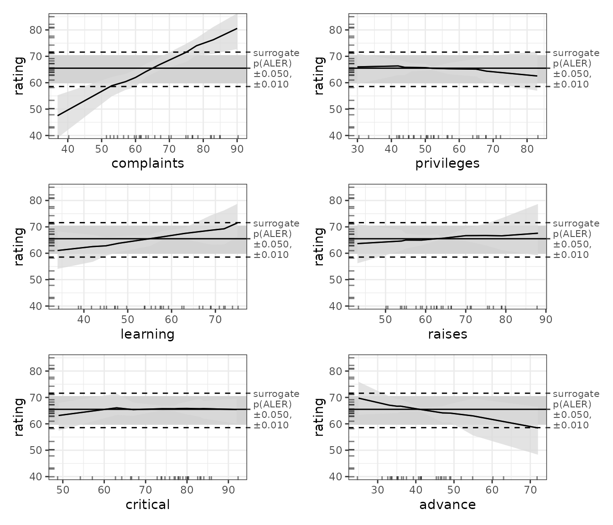

# Analyzing small datasets (fewer than 2000 rows) with ALE

This vignette demonstrates using the
[ale](https://github.com/tripartio/ale) package on small datasets, as is
often the case with statistical inference. You should first read the
[introductory
vignette](https://tripartio.github.io/ale/articles/ale-intro.md "Introduction to the ale package")
that explains general functionality of the package; this vignette goes
beyond those details to discuss issues unique to small datasets.

### What is a “small” dataset?

An obvious question is, “How small is ‘small’?” This is a very complex
question and it is way beyond the scope of this vignette to try to
answer it rigorously. But we can simply say that the key issue at stake
is that applying the training-test split that is common in machine
learning is a crucial technique for increasing the generalizability of
data analysis. So, the question becomes focused to, “How small is too
small for a training-test split for machine learning analysis?” The rule
of thumb I am familiar with is that machine learning requires at least
200 rows of data for each predictor variable. So, for example, if you
have five input variables, you would need at least 1000 rows of data.
But note that this does not refer to the size of the entire dataset but
to the minimum size of the training subset. So, if you carry out an
80-20 split on the full dataset (that is, 80% training set), then you
would need at least 1000 rows for the training set and another 250 rows
for the test set, for a minimum of 1250 rows. (And if you carry out
hyperparameter tuning with cross validation on that training set, then
you need even more data.) If you see where this is headed, you might
quickly realize **that most datasets of less than 2000 rows are probably
“small”**. You can see that even many datasets that are more than 2000
rows are nonetheless “small”, and so probably need the techniques
mentioned in this vignette.

We begin by loading the necessary libraries.

``` r
library(ale)
#> 
#> Attaching package: 'ale'
#> The following object is masked from 'package:base':
#> 
#>     get
```

### attitude dataset

For this analysis, we use the `attitude` dataset, built-in with R: “From
a survey of the clerical employees of a large financial organization,
the data are aggregated from the questionnaires of the approximately 35
employees for each of 30 (randomly selected) departments.” The numbers
give the percent proportion of favourable responses to seven questions
in each department. Since we’re talking about “small” datasets, we
figure that we might as well demonstrate principles with extremely small
examples.

#### Format

A data frame with 30 observations on 7 variables. The first column are
the short names from the reference, the second one the variable names in
the data frame:

|        | Variable   | Type    | Description                       |
|--------|------------|---------|-----------------------------------|
| Y      | rating     | numeric | Overall rating                    |
| X\[1\] | complaints | numeric | Handling of employee complaints   |
| X\[2\] | privileges | numeric | Does not allow special privileges |
| X\[3\] | learning   | numeric | Opportunity to learn              |
| X\[4\] | raises     | numeric | Raises based on performance       |
| X\[5\] | critical   | numeric | Too critical                      |
| X\[6\] | advance    | numeric | Advancement                       |

#### Source

Chatterjee, S. and Price, B. (1977) *Regression Analysis by Example*.
New York: Wiley. (Section 3.7, p.68ff of 2nd ed.(1991).)

``` r
str(attitude)
#> 'data.frame':    30 obs. of  7 variables:
#>  $ rating    : num  43 63 71 61 81 43 58 71 72 67 ...
#>  $ complaints: num  51 64 70 63 78 55 67 75 82 61 ...
#>  $ privileges: num  30 51 68 45 56 49 42 50 72 45 ...
#>  $ learning  : num  39 54 69 47 66 44 56 55 67 47 ...
#>  $ raises    : num  61 63 76 54 71 54 66 70 71 62 ...
#>  $ critical  : num  92 73 86 84 83 49 68 66 83 80 ...
#>  $ advance   : num  45 47 48 35 47 34 35 41 31 41 ...
```

``` r
summary(attitude)
#>      rating        complaints     privileges       learning         raises     
#>  Min.   :40.00   Min.   :37.0   Min.   :30.00   Min.   :34.00   Min.   :43.00  
#>  1st Qu.:58.75   1st Qu.:58.5   1st Qu.:45.00   1st Qu.:47.00   1st Qu.:58.25  
#>  Median :65.50   Median :65.0   Median :51.50   Median :56.50   Median :63.50  
#>  Mean   :64.63   Mean   :66.6   Mean   :53.13   Mean   :56.37   Mean   :64.63  
#>  3rd Qu.:71.75   3rd Qu.:77.0   3rd Qu.:62.50   3rd Qu.:66.75   3rd Qu.:71.00  
#>  Max.   :85.00   Max.   :90.0   Max.   :83.00   Max.   :75.00   Max.   :88.00  
#>     critical        advance     
#>  Min.   :49.00   Min.   :25.00  
#>  1st Qu.:69.25   1st Qu.:35.00  
#>  Median :77.50   Median :41.00  
#>  Mean   :74.77   Mean   :42.93  
#>  3rd Qu.:80.00   3rd Qu.:47.75  
#>  Max.   :92.00   Max.   :72.00
```

We first run ALE analysis on this dataset as if it were a valid regular
dataset, even though it is too small for a proper training-test split.
This is a small-scale demonstration mainly to demonstrate that
[ale](https://github.com/tripartio/ale) package is valid for analyzing
even small datasets, not just the large datasets typically used for
machine learning.

### ALE for ordinary least squares regression (multiple linear regression)

Ordinary least squares (OLS) regression is the most generic multivariate
statistical technique. Thus, we use it as a baseline illustration to
help motivate the value of ALE for interpreting the analysis of small
data samples.

We train an OLS model to predict average rating:

``` r
lm_attitude <- lm(rating ~ ., data = attitude)

summary(lm_attitude)
#> 
#> Call:
#> lm(formula = rating ~ ., data = attitude)
#> 
#> Residuals:
#>      Min       1Q   Median       3Q      Max 
#> -10.9418  -4.3555   0.3158   5.5425  11.5990 
#> 
#> Coefficients:
#>             Estimate Std. Error t value Pr(>|t|)    
#> (Intercept) 10.78708   11.58926   0.931 0.361634    
#> complaints   0.61319    0.16098   3.809 0.000903 ***
#> privileges  -0.07305    0.13572  -0.538 0.595594    
#> learning     0.32033    0.16852   1.901 0.069925 .  
#> raises       0.08173    0.22148   0.369 0.715480    
#> critical     0.03838    0.14700   0.261 0.796334    
#> advance     -0.21706    0.17821  -1.218 0.235577    
#> ---
#> Signif. codes:  0 '***' 0.001 '**' 0.01 '*' 0.05 '.' 0.1 ' ' 1
#> 
#> Residual standard error: 7.068 on 23 degrees of freedom
#> Multiple R-squared:  0.7326, Adjusted R-squared:  0.6628 
#> F-statistic:  10.5 on 6 and 23 DF,  p-value: 1.24e-05
```

At the very least, the [ale](https://github.com/tripartio/ale) package
is useful for visualizing the effects of model variables. Note that for
now, we run [`ALE()`](https://tripartio.github.io/ale/reference/ALE.md)
with no bootstrapping (the default) because small samples require a
special bootstrap approach, as explained below. For now, all we are
doing is using ALE to accurately visualize what the model estimates.

``` r

# For speed, these examples use retrieve_rds() to load pre-created objects 
# from an online repository.
# To run the code yourself, execute the code blocks directly.  
serialized_objects_site <- "https://github.com/tripartio/ale/raw/main/download"

ale_lm_attitude_simple <- retrieve_rds(
  # For speed, load a pre-created object by default.
  c(serialized_objects_site, 'ale_lm_attitude_simple.0.5.2.rds'),
  {
    # To run the code yourself, execute this code block directly.
    # For standard models like lm that store their data,
    # there is no need to specify the data argument.
    ALE(lm_attitude)
  }
)
# saveRDS(ale_lm_attitude_simple, file.choose())

# Print all plots
plot(ale_lm_attitude_simple) |> 
  print(ncol = 2)
#> Warning in annotate(geom = "label", x = y_summary["max"], y =
#> which(estimates$aler_max == : Ignoring unknown parameters: `label.size`
```


This visualization confirms what we see in the model coefficients above:
complaints have a strong positive effect on ratings and learning has a
more moderate effect. However, the ALE indicates a stronger effect of
advance than the regression coefficients suggest. The other variables
have relatively little effect on ratings. We will see shortly that
proper bootstrapping of the model can shed some light on the
discrepancies.

### Full model bootstrapping

We have referred frequently to the importance of bootstrapping. None of
our model results, with or without ALE, should be considered reliable
without being bootstrapped. For large datasets whose models have been
properly trained and evaluated on separate subsets before ALE analysis,
an `ALE` object can bootstrap the ALE results of the model trained on
the full dataset. However, when a dataset is too small to be subdivided
into training and test sets, then the entire model should be
bootstrapped, not just the ALE data from a single trained model. That
is, multiple models should be trained, one on each bootstrap sample. The
reliable results are the average results of all the bootstrap models,
however many there are.

The `ModelBoot` object automatically carries out full-model
bootstrapping suitable for relatively smaller datasets. Specifically,
it:

- Creates multiple bootstrap samples (default 100; the user can specify
  any number);
- Creates a model on each bootstrap sample;
- Calculates model overall statistics, variable coefficients, and ALE
  values for each model on each bootstrap sample;
- Calculates the mean, median, and lower and upper confidence intervals
  for each of those values across all bootstrap samples.

The constructor for [S7](https://rconsortium.github.io/S7/) `ModelBoot`
object requires a model object as its first argument–any R model object
that can generate numeric predictions. The second argument is the
dataset. For objects that follow standard R modelling conventions,
[`ModelBoot()`](https://tripartio.github.io/ale/reference/ModelBoot.md)
should be able to automatically recognize and parse the model object, so
the data object is often optional. So, here is the creation of a
`ModelBoot` object:

``` r
mb_lm_attitude <- retrieve_rds(
  # For speed, load a pre-created object by default.
  c(serialized_objects_site, 'mb_lm_attitude.0.5.2.rds'),
  {
    # To run the code yourself, execute this code block directly.
    # For standard models like lm that store their data,
    # there is no need to specify the data argument.
    ModelBoot(lm_attitude) # 100 bootstrap iterations by default
  }
)
# saveRDS(mb_lm_attitude, file.choose())
```

By default, a `ModelBoot` object creates 100 bootstrap samples of the
provided dataset and creates 100 + 1 models on the data (one for each
bootstrap sample and then once for the original dataset). (However, so
that this illustration runs faster, we demonstrate it here with only 10
iterations.) Beyond ALE data, it also provides bootstrapped overall
model statistics (provided through
[`broom::glance()`](https://generics.r-lib.org/reference/glance.html))
and bootstrapped model coefficients (provided through
[`broom::tidy()`](https://generics.r-lib.org/reference/tidy.html)). Any
of the default options for
[`broom::glance()`](https://generics.r-lib.org/reference/glance.html),
[`broom::tidy()`](https://generics.r-lib.org/reference/tidy.html), and
[`ALE()`](https://tripartio.github.io/ale/reference/ALE.md) can be
customized, along with defaults for the `ModelBoot` constructor, such as
the number of bootstrap iterations. You can consult the help file for
these details with
[`help(ModelBoot)`](https://tripartio.github.io/ale/reference/ModelBoot.md).

A `ModelBoot` has the following properties (depending on values
requested in the `output` argument:

- `model_stats`: bootstrapped results from
  [`broom::glance()`](https://generics.r-lib.org/reference/glance.html)
- `model_coefs`: bootstrapped results from
  [`broom::tidy()`](https://generics.r-lib.org/reference/tidy.html)
- `ale`: bootstrapped ALE data and plots
- `boot_data`: full bootstrap data (not returned by default)

Here are the bootstrapped overall model statistics:

``` r
mb_lm_attitude@model_stats
#> # A tibble: 12 × 7
#>    name          boot_valid conf.low       median       mean conf.high       sd
#>    <chr>              <dbl>    <dbl>        <dbl>      <dbl>     <dbl>    <dbl>
#>  1 r.squared         NA      6.12e-1  0.788        0.767      0.877    0.0726  
#>  2 adj.r.squared     NA      5.11e-1  0.733        0.706      0.845    0.0915  
#>  3 sigma             NA      4.59e+0  6.27         6.25       7.55     0.823   
#>  4 statistic         NA      6.05e+0 14.2         14.3       27.3      5.86    
#>  5 p.value           NA      2.35e-9  0.000000983  0.0000730  0.000651 0.000261
#>  6 df                NA      6   e+0  6            6          6        0       
#>  7 df.residual       NA      2.3 e+1 23           23         23        0       
#>  8 nobs              NA      3   e+1 30           30         30        0       
#>  9 mae                6.77   5.35e+0 NA           NA         10.8      1.57    
#> 10 sa_mae             0.629  3.17e-1 NA           NA          0.745    0.117   
#> 11 rmse               8.09   6.16e+0 NA           NA         12.9      1.82    
#> 12 sa_rmse            0.661  4.34e-1 NA           NA          0.759    0.0944
```

Here are the bootstrapped model coefficients:

``` r
mb_lm_attitude@model_coefs
#> # A tibble: 7 × 6
#>   term        conf.low  median    mean conf.high std.error
#>   <chr>          <dbl>   <dbl>   <dbl>     <dbl>     <dbl>
#> 1 (Intercept)  -17.8   11.2    11.7       44.8      15.4  
#> 2 complaints     0.347  0.648   0.632      0.903     0.141
#> 3 privileges    -0.321 -0.0912 -0.0689     0.269     0.162
#> 4 learning      -0.110  0.272   0.260      0.624     0.196
#> 5 raises        -0.225  0.0958  0.114      0.508     0.203
#> 6 critical      -0.366  0.0397  0.0190     0.320     0.194
#> 7 advance       -0.683 -0.197  -0.205      0.193     0.219
```

Here we can visualize the results of the ALE plots.

``` r
plot(mb_lm_attitude) |> 
  print(ncol = 2)
#> Warning in annotate(geom = "label", x = y_summary["max"], y =
#> which(estimates$aler_max == : Ignoring unknown parameters: `label.size`
```



To draw formal conclusions from this analysis, we need a more formal
statistical framework based on ALE, which is what we describe in the
vignette on [ALE-based statistics for statistical
inference](https://tripartio.github.io/ale/articles/ale-statistics.md).
However, we can generally infer that:

- Complaints that were handled at below around 55% led to below-average
  overall ratings; complaints that were handled above around 72% are
  associated with above-average overall ratings.
- The 95% bootstrapped confidence intervals of every other variable
  fully overlap almost the entirety of the median. Thus, despite the
  general trends of some of the data (in particular learning’s positive
  trend and advance’s negative trend), the data does not seem to support
  claims that any other factor had a convincingly meaningful effect on
  ratings.

Although this is a basic demonstration, it readily shows how crucial
proper bootstrapping is to make meaningful inferences from data
analysis.

### ALE for generalized additive models (GAM)

A major limitation of OLS regression is that it models all relationships
between the x variables and y as straight lines. But it is unlikely that
all relationships are truly linear. OLS cannot accurately capture
non-linear relationships.

Because the samples here are relatively small, we will use generalized
additive models (GAM) for the modelling. To grossly oversimplify things,
GAM is an extension of statistical regression analysis that lets the
model fit flexible patterns in the data instead of being restricted to
the best-fitting straight line. It is an [ideal approach for samples
that are too small for machine
learning](https://noamross.github.io/gams-in-r-course/chapter1/ "Tutorial on GAM; introduction explains why GAM should be used")
because it provides flexible curves unlike ordinary least squares
regression yet will not overfit excessively as would most machine
learning techniques when working with such small samples.

With GAM, the variables that we want to become flexible need to be
wrapped in the `s` (smooth) function, e.g., `s(complaints)`. For this
example, we will smooth all our numerical input variables:

``` r
gam_attitude <- mgcv::gam(
  rating ~ complaints + privileges + s(learning) +
    raises + s(critical) + advance,
  data = attitude)
summary(gam_attitude)
#> 
#> Family: gaussian 
#> Link function: identity 
#> 
#> Formula:
#> rating ~ complaints + privileges + s(learning) + raises + s(critical) + 
#>     advance
#> 
#> Parametric coefficients:
#>             Estimate Std. Error t value Pr(>|t|)    
#> (Intercept) 36.97245   11.60967   3.185 0.004501 ** 
#> complaints   0.60933    0.13297   4.582 0.000165 ***
#> privileges  -0.12662    0.11432  -1.108 0.280715    
#> raises       0.06222    0.18900   0.329 0.745314    
#> advance     -0.23790    0.14807  -1.607 0.123198    
#> ---
#> Signif. codes:  0 '***' 0.001 '**' 0.01 '*' 0.05 '.' 0.1 ' ' 1
#> 
#> Approximate significance of smooth terms:
#>               edf Ref.df     F p-value  
#> s(learning) 1.923  2.369 3.761  0.0312 *
#> s(critical) 2.296  2.862 3.272  0.0565 .
#> ---
#> Signif. codes:  0 '***' 0.001 '**' 0.01 '*' 0.05 '.' 0.1 ' ' 1
#> 
#> R-sq.(adj) =  0.776   Deviance explained = 83.9%
#> GCV = 47.947  Scale est. = 33.213    n = 30
```

By comparing the adjusted R² of the OLS model (0.663) with that of the
GAM model (0.776), we can readily see that the GAM model provides a
superior fit to the data.

To understand which variables were responsible for this relationship,
the results for the smooth terms in GAM are not readily interpretable.
They need to be visualized for effective interpretation—ALE is perfect
for such purposes.

``` r
ale_gam_attitude_simple <- retrieve_rds(
  # For speed, load a pre-created object by default.
  c(serialized_objects_site, 'ale_gam_attitude_simple.0.5.2.rds'),
  {
    # To run the code yourself, execute this code block directly.
    # For standard models like mgcv::gam that store their data,
    # there is no need to specify the data argument.
    ALE(gam_attitude)
  }
)
# saveRDS(ale_gam_attitude_simple, file.choose())

plot(ale_gam_attitude_simple) |> 
  print(ncol = 2)
#> Warning in annotate(geom = "label", x = y_summary["max"], y =
#> which(estimates$aler_max == : Ignoring unknown parameters: `label.size`
```


Compared to the OLS results above, the GAM results provide quite a
surprise concerning the shape of the effect of employees’ perceptions
that their department is too critical–it seems that both low criticism
and very high criticism negatively affect ratings. However, before
trying to interpret these results, we must remember that results that
are not bootstrapped are simply not reliable. So, let us see what
bootstrapping will give us.

``` r
mb_gam_attitude <- retrieve_rds(
  # For speed, load a pre-created object by default.
  c(serialized_objects_site, 'mb_gam_attitude.0.5.2.rds'),
  {
    # To run the code yourself, execute this code block directly.
    # For standard models like mgcv::gam that store their data,
    # there is no need to specify the data argument.
    ModelBoot(gam_attitude) # 100 bootstrap iterations by default
  }
)
# saveRDS(mb_gam_attitude, file.choose())

mb_gam_attitude@model_stats
#> # A tibble: 9 × 7
#>   name          boot_valid conf.low median   mean conf.high      sd
#>   <chr>              <dbl>    <dbl>  <dbl>  <dbl>     <dbl>   <dbl>
#> 1 df                NA        8.36  17.0   15.8      21.0    4.08  
#> 2 df.residual       NA        9.00  13.0   14.2      21.6    4.08  
#> 3 nobs              NA       30     30     30        30      0     
#> 4 adj.r.squared     NA        0.746  1.000  0.945     1      0.0832
#> 5 npar              NA       23     23     23        23      0     
#> 6 mae               12.9      4.50  NA     NA        62.6   15.0   
#> 7 sa_mae             0.307   -2.00  NA     NA         0.769  0.772 
#> 8 rmse              16.3      5.51  NA     NA        79.4   19.5   
#> 9 sa_rmse            0.332   -2.08  NA     NA         0.786  0.754
```

``` r
mb_gam_attitude@model_coefs
#> # A tibble: 2 × 6
#>   term        conf.low median  mean conf.high std.error
#>   <chr>          <dbl>  <dbl> <dbl>     <dbl>     <dbl>
#> 1 s(learning)     1.00   7.94  6.10      9.00      3.12
#> 2 s(critical)     1.74   4.34  4.69      8.96      2.24
```

``` r
plot(mb_gam_attitude) |> 
  print(ncol = 2)
#> Warning in annotate(geom = "label", x = y_summary["max"], y =
#> which(estimates$aler_max == : Ignoring unknown parameters: `label.size`
```


The bootstrapped GAM results tell a rather different story from the OLS
results. In this case, the bootstrap confidence bands of all the
variables (even of complaints) fully overlap with the median. Even the
average slopes have vanished from all variables except for complaint,
where it remains positive, yet insignificant because of the wide
confidence interval.

So, what should we conclude? First, it is tempting to retain the OLS
results because they tell a more interesting story. But we consider that
this would be irresponsible since the GAM model is clearly superior in
terms of adjusted R²: it is the model that far more reliably tells us
what is really going on. And what does it tell us?

- There seems to be a positive effect of handled complaints on ratings
  (the higher the percentage of complaints that are handled, the higher
  the average rating), but the data does not allow us to be sufficiently
  certain to generalize these results.
- There is insufficient evidence that any of the other variables have
  any effect at all.

No doubt, the inconclusive results are because the dataset is so small
(only 30 rows). A dataset even double that size might show significant
effects at least for complaints, if not for other variables.

## `model_call_string` argument for non-standard models

The
[`ModelBoot()`](https://tripartio.github.io/ale/reference/ModelBoot.md)
constructor accesses the model object and internally modifies it to
retrain the model on bootstrapped datasets. It should be able to
automatically manipulate most R model objects that are used for
statistical analysis. However, if an object does not follow standard
conventions for R model objects,
[`ModelBoot()`](https://tripartio.github.io/ale/reference/ModelBoot.md)
might not be able to manipulate it. If so, the function will fail early
with an appropriate error message. In that case, the user must specify
the `model_call_string` argument with a character string of the full
call for the model with `boot_data` as the data argument for the call.
(`boot_data` is a placeholder for the bootstrap datasets that the
[`ModelBoot()`](https://tripartio.github.io/ale/reference/ModelBoot.md)
constructor will internally work with.)

To show how this works, let’s pretend that the
[`mgcv::gam`](https://rdrr.io/pkg/mgcv/man/gam.html) object needs such
special treatment. To construct, the `model_call_string`, we must first
execute the model and make sure that it works. We did that earlier but
we repeat it here for this demonstration

``` r
gam_attitude_again <- mgcv::gam(
  rating ~ complaints + privileges + s(learning) +
    raises + s(critical) + advance,
  data = attitude)
summary(gam_attitude_again)
#> 
#> Family: gaussian 
#> Link function: identity 
#> 
#> Formula:
#> rating ~ complaints + privileges + s(learning) + raises + s(critical) + 
#>     advance
#> 
#> Parametric coefficients:
#>             Estimate Std. Error t value Pr(>|t|)    
#> (Intercept) 36.97245   11.60967   3.185 0.004501 ** 
#> complaints   0.60933    0.13297   4.582 0.000165 ***
#> privileges  -0.12662    0.11432  -1.108 0.280715    
#> raises       0.06222    0.18900   0.329 0.745314    
#> advance     -0.23790    0.14807  -1.607 0.123198    
#> ---
#> Signif. codes:  0 '***' 0.001 '**' 0.01 '*' 0.05 '.' 0.1 ' ' 1
#> 
#> Approximate significance of smooth terms:
#>               edf Ref.df     F p-value  
#> s(learning) 1.923  2.369 3.761  0.0312 *
#> s(critical) 2.296  2.862 3.272  0.0565 .
#> ---
#> Signif. codes:  0 '***' 0.001 '**' 0.01 '*' 0.05 '.' 0.1 ' ' 1
#> 
#> R-sq.(adj) =  0.776   Deviance explained = 83.9%
#> GCV = 47.947  Scale est. = 33.213    n = 30
```

Once we’re sure that the model call works, then the `model_call_string`
is constructed with three simple steps:

1.  Wrap the entire call (everything to the right of the assignment
    operator `<-`) in quotes.
2.  Replace the dataset in the data argument with `boot_data`.
3.  Pass the quoted string to
    [`ModelBoot()`](https://tripartio.github.io/ale/reference/ModelBoot.md)
    as the `model_call_string` argument (the argument must be explicitly
    named).

So, here is the form for constructing a `ModelBoot` for a non-standard
model object type:

``` r

mb_gam_attitude_non_standard <- retrieve_rds(
  # For speed, load a pre-created object by default.
  c(serialized_objects_site, 'mb_gam_attitude_non_standard.0.5.2.rds'),
  {
    # To run the code yourself, execute this code block directly.
    # For standard models like mgcv::gam that store their data,
    # there is no need to specify the data argument.
    # 100 bootstrap iterations by default.
    ModelBoot(
      gam_attitude_again,
      model_call_string = 'mgcv::gam(
        rating ~ complaints + privileges + s(learning) +
          raises + s(critical) + advance,
        data = boot_data)'
    )
  }
)
# saveRDS(mb_gam_attitude_non_standard, file.choose())

mb_gam_attitude_non_standard@model_stats
#> # A tibble: 9 × 7
#>   name          boot_valid conf.low median   mean conf.high      sd
#>   <chr>              <dbl>    <dbl>  <dbl>  <dbl>     <dbl>   <dbl>
#> 1 df                NA        8.36  17.0   15.8      21.0    4.08  
#> 2 df.residual       NA        9.00  13.0   14.2      21.6    4.08  
#> 3 nobs              NA       30     30     30        30      0     
#> 4 adj.r.squared     NA        0.746  1.000  0.945     1      0.0832
#> 5 npar              NA       23     23     23        23      0     
#> 6 mae               12.9      4.50  NA     NA        62.6   15.0   
#> 7 sa_mae             0.307   -2.00  NA     NA         0.769  0.772 
#> 8 rmse              16.3      5.51  NA     NA        79.4   19.5   
#> 9 sa_rmse            0.332   -2.08  NA     NA         0.786  0.754
```

Everything else works as usual.
