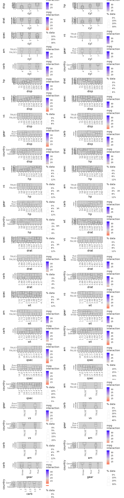
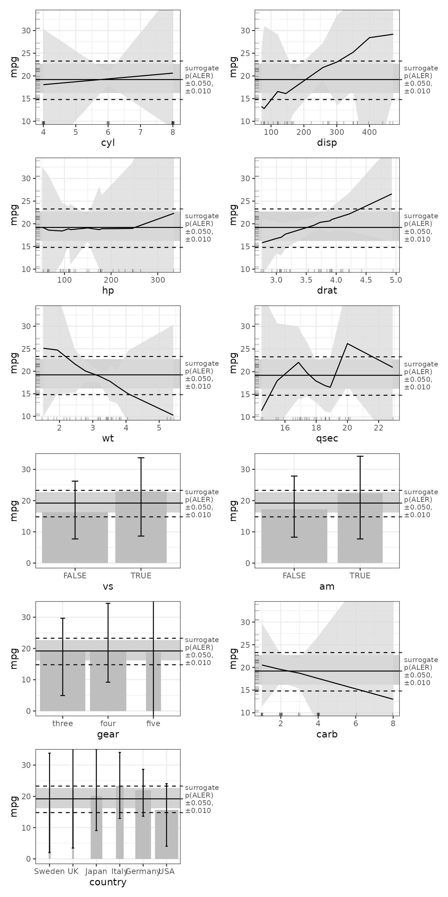

# ale package handling of various input datatypes

This vignette demonstrates how [ale](https://github.com/tripartio/ale)
works for various input datatypes. You should first read the
[introductory
vignette](https://tripartio.github.io/ale/articles/ale-intro.md "Introduction to the ale package")
that explains general functionality of the package; this vignette is a
demonstration of specific functionality.

We begin by loading the necessary libraries.

``` r
library(ale)
#> 
#> Attaching package: 'ale'
#> The following object is masked from 'package:base':
#> 
#>     get
library(dplyr)
#> 
#> Attaching package: 'dplyr'
#> The following objects are masked from 'package:stats':
#> 
#>     filter, lag
#> The following objects are masked from 'package:base':
#> 
#>     intersect, setdiff, setequal, union
```

## `var_cars`: modified `mtcars` dataset (Motor Trend Car Road Tests)

For this demonstration, we use a modified version of the built-in
`mtcars` dataset so that it has binary (logical), categorical (factor,
that is, non-ordered categories), ordinal (ordered factor), discrete
interval (integer), and continuous interval (numeric or double) values.
This modified version, called `var_cars`, will let us test all the
different basic variations of x variables. For the factor, it adds the
country of the car manufacturer.

The data is a tibble with 32 observations on 12 variables:

| Variable | Format  | Description                              |
|----------|---------|------------------------------------------|
| mpg      | double  | Miles/(US) gallon                        |
| cyl      | integer | Number of cylinders                      |
| disp     | double  | Displacement (cu.in.)                    |
| hp       | double  | Gross horsepower                         |
| drat     | double  | Rear axle ratio                          |
| wt       | double  | Weight (1000 lbs)                        |
| qsec     | double  | 1/4 mile time                            |
| vs       | logical | Engine (0 = V-shaped, 1 = straight)      |
| am       | logical | Transmission (0 = automatic, 1 = manual) |
| gear     | ordered | Number of forward gears                  |
| carb     | integer | Number of carburetors                    |
| country  | factor  | Country of car manufacturer              |

``` r
print(var_cars)
#> # A tibble: 32 × 14
#>    model         mpg   cyl  disp    hp  drat    wt  qsec vs    am    gear   carb
#>    <chr>       <dbl> <int> <dbl> <dbl> <dbl> <dbl> <dbl> <lgl> <lgl> <ord> <int>
#>  1 Mazda RX4    21       6  160    110  3.9   2.62  16.5 FALSE TRUE  four      4
#>  2 Mazda RX4 …  21       6  160    110  3.9   2.88  17.0 FALSE TRUE  four      4
#>  3 Datsun 710   22.8     4  108     93  3.85  2.32  18.6 TRUE  TRUE  four      1
#>  4 Hornet 4 D…  21.4     6  258    110  3.08  3.22  19.4 TRUE  FALSE three     1
#>  5 Hornet Spo…  18.7     8  360    175  3.15  3.44  17.0 FALSE FALSE three     2
#>  6 Valiant      18.1     6  225    105  2.76  3.46  20.2 TRUE  FALSE three     1
#>  7 Duster 360   14.3     8  360    245  3.21  3.57  15.8 FALSE FALSE three     4
#>  8 Merc 240D    24.4     4  147.    62  3.69  3.19  20   TRUE  FALSE four      2
#>  9 Merc 230     22.8     4  141.    95  3.92  3.15  22.9 TRUE  FALSE four      2
#> 10 Merc 280     19.2     6  168.   123  3.92  3.44  18.3 TRUE  FALSE four      4
#> # ℹ 22 more rows
#> # ℹ 2 more variables: country <fct>, continent <fct>
```

``` r
summary(var_cars)
#>     model                mpg             cyl             disp      
#>  Length:32          Min.   :10.40   Min.   :4.000   Min.   : 71.1  
#>  Class :character   1st Qu.:15.43   1st Qu.:4.000   1st Qu.:120.8  
#>  Mode  :character   Median :19.20   Median :6.000   Median :196.3  
#>                     Mean   :20.09   Mean   :6.188   Mean   :230.7  
#>                     3rd Qu.:22.80   3rd Qu.:8.000   3rd Qu.:326.0  
#>                     Max.   :33.90   Max.   :8.000   Max.   :472.0  
#>        hp             drat             wt             qsec      
#>  Min.   : 52.0   Min.   :2.760   Min.   :1.513   Min.   :14.50  
#>  1st Qu.: 96.5   1st Qu.:3.080   1st Qu.:2.581   1st Qu.:16.89  
#>  Median :123.0   Median :3.695   Median :3.325   Median :17.71  
#>  Mean   :146.7   Mean   :3.597   Mean   :3.217   Mean   :17.85  
#>  3rd Qu.:180.0   3rd Qu.:3.920   3rd Qu.:3.610   3rd Qu.:18.90  
#>  Max.   :335.0   Max.   :4.930   Max.   :5.424   Max.   :22.90  
#>      vs              am             gear         carb          country  
#>  Mode :logical   Mode :logical   three:15   Min.   :1.000   Germany: 8  
#>  FALSE:18        FALSE:19        four :12   1st Qu.:2.000   Italy  : 4  
#>  TRUE :14        TRUE :13        five : 5   Median :2.000   Japan  : 6  
#>                                             Mean   :2.812   Sweden : 1  
#>                                             3rd Qu.:4.000   UK     : 1  
#>                                             Max.   :8.000   USA    :12  
#>          continent 
#>  Asia         : 6  
#>  Europe       :14  
#>  North America:12  
#>                    
#>                    
#> 
```

## Modelling with ALE and GAM

With GAM, only numeric variables can be smoothed, not binary or
categorical ones. However, smoothing does not always help improve the
model since some variables are not related to the outcome and some that
are related actually do have a simple linear relationship. To keep this
demonstration simple, we have done some earlier analysis (not shown
here) that determines where smoothing is worthwhile on the modified
`var_cars` dataset, so only some of the numeric variables are smoothed.
Our goal here is not to demonstrate the best modelling procedure but
rather to demonstrate the flexibility of the
[ale](https://github.com/tripartio/ale) package.

``` r
gam_cars <- mgcv::gam(
  mpg ~ cyl + disp + hp + drat + wt + s(qsec) +
    vs + am + gear + carb + country,
  data = var_cars
)
summary(gam_cars)
#> 
#> Family: gaussian 
#> Link function: identity 
#> 
#> Formula:
#> mpg ~ cyl + disp + hp + drat + wt + s(qsec) + vs + am + gear + 
#>     carb + country
#> 
#> Parametric coefficients:
#>               Estimate Std. Error t value Pr(>|t|)   
#> (Intercept)   -7.84775   12.47080  -0.629  0.54628   
#> cyl            1.66078    1.09449   1.517  0.16671   
#> disp           0.06627    0.01861   3.561  0.00710 **
#> hp            -0.01241    0.02502  -0.496  0.63305   
#> drat           4.54975    1.48971   3.054  0.01526 * 
#> wt            -5.03737    1.53979  -3.271  0.01095 * 
#> vsTRUE        12.45630    3.62342   3.438  0.00852 **
#> amTRUE         8.77813    2.67611   3.280  0.01080 * 
#> gear.L         0.53111    3.03337   0.175  0.86525   
#> gear.Q         0.57129    1.18201   0.483  0.64150   
#> carb          -0.34479    0.78600  -0.439  0.67223   
#> countryItaly  -0.08633    2.22316  -0.039  0.96995   
#> countryJapan  -3.31948    2.22723  -1.490  0.17353   
#> countrySweden -3.83437    2.74934  -1.395  0.19973   
#> countryUK     -7.24222    3.81985  -1.896  0.09365 . 
#> countryUSA    -7.69317    2.37998  -3.232  0.01162 * 
#> ---
#> Signif. codes:  0 '***' 0.001 '**' 0.01 '*' 0.05 '.' 0.1 ' ' 1
#> 
#> Approximate significance of smooth terms:
#>           edf Ref.df     F p-value  
#> s(qsec) 7.797  8.641 5.975  0.0101 *
#> ---
#> Signif. codes:  0 '***' 0.001 '**' 0.01 '*' 0.05 '.' 0.1 ' ' 1
#> 
#> R-sq.(adj) =  0.955   Deviance explained = 98.8%
#> GCV = 6.4263  Scale est. = 1.6474    n = 32
```

Now we generate ALE data from the `gam_cars` GAM model and plot it.

``` r
# For faster processing, you can enable parallel processing: set the number of CPU cores available. See help(ALE) for details.
options(ale.parallel = 2)
```

``` r
# For speed, these examples use retrieve_rds() to load pre-created objects 
# from an online repository.
# To run the code yourself, execute the code blocks directly.  
serialized_objects_site <- "https://github.com/tripartio/ale/raw/main/download"
```

``` r
# # To run the slow code yourself, uncomment and execute this code block directly.
# # For models like mgcv::gam that store their data,
# # there is no need to specify the data argument.
# ale_cars_1D <- ALE(gam_cars)

ale_cars_1D <- retrieve_rds(
  # For speed, load a pre-created object by default.
  c(serialized_objects_site, 'ale_cars_1D.0.5.2.rds'),
  {
  }
)
# saveRDS(ale_cars_1D, file.choose())

# Print all plots
plot(ale_cars_1D) |> 
  print(ncol = 2)
```


We can see that
[`ALE()`](https://tripartio.github.io/ale/reference/ALE.md) has no
trouble modelling any of the datatypes in our sample (logical, factor,
ordered, integer, or double). It plots line charts for the numeric
predictors and column charts for everything else.

The numeric predictors have rug plots that indicate in which ranges of
the x (predictor) and y (`mpg`) values data actually exists in the
dataset. This helps us to not over-interpret regions where data is
sparse. Since column charts are on a discrete scale, they cannot display
rug plots. Instead, the percentage of data represented by each column is
displayed.

We can also generate and plot the ALE data for all two-way interactions.

``` r
# # # To run the slow code yourself, uncomment and execute this code block directly.
# # For models like mgcv::gam that store their data,
# # there is no need to specify the data argument.
# ale_cars_2D <- ALE(
#   gam_cars,
#   x_cols = list(d2 = TRUE)
# )

ale_cars_2D <- serialized_objects_site |> 
  file.path('ale_cars_2D.0.5.2.rds') |>
  url() |> 
  readRDS()

# Print plots
plot(ale_cars_2D) |> 
  print(
    ncol = 2, 
    # By default, at most 20 plots are printed. Set max_print to increase this limit
    max_print = 100
  )
```



There are no interactions in this model but the point of this
demonstration is to show that the `ale` package can handle 2D
interactions between just about any pair of interaction types:
numeric-numeric, ordinal-binary, categorical-ordinal, etc.

Finally, as explained in the vignette on modelling with [small
datasets](https://tripartio.github.io/ale/articles/ale-small-datasets.md "ale package for small datasets"),
a more appropriate modelling workflow would require bootstrapping the
entire model, not just the ALE data. So, let’s do that now.

``` r
# # To run the slow code yourself, uncomment and execute this code block directly.
# # For models like mgcv::gam that store their data,
# # there is no need to specify the data argument.
# mb_cars <- ModelBoot(gam_cars) # 100 bootstrap iterations by default

mb_cars <- serialized_objects_site |> 
  file.path('mb_cars.0.5.2.rds') |>
  url() |> 
  readRDS()

plot(mb_cars) |> 
  print(ncol = 2)
```



(By default, a `ModelBoot` object creates 100 bootstrap samples but, so
that this illustration runs faster, we demonstrate it here with only 10
iterations.)

With such a small dataset, the bootstrap confidence interval always
overlap the median, indicating that this dataset cannot support any
claims that any of its variables has a meaningful effect on fuel
efficiency (mpg). Considering that the average bootstrapped ALE values
suggest various intriguing patterns, the problem is no doubt that the
dataset is too small–if more data were collected and analyzed, some of
the patterns would probably be confirmed.
